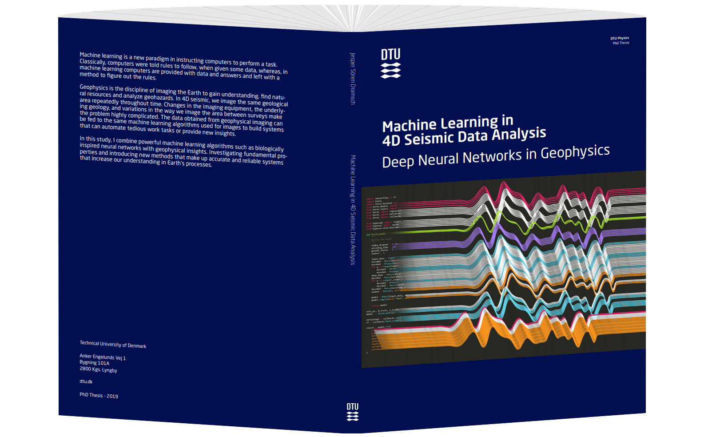

# Machine Learning in 4D Seismic Data Analysis
_Jesper S Dramsch[Orcid](https://orcid.org/0000-0001-8273-905X)_

This repository generate the submitted PDF version of the thesis in [thesis.pdf](Dramsch_PhD_Thesis.pdf). This readme lists the chapters and the location of code to reproduce the [chapters](#Chapters-with-code) in the thesis. 

## Popular Science Summary
Machine learning is a new paradigm in instructing computers to perform a task. Classically, computers were told rules to follow, when given some data, whereas, in machine learning computers are provided with data and answers and left with a method to figure out the rules. Recently these methods have become increasingly powerful in identifying images, which enabled image search and self-driving cars.

Geophysics is the discipline of imaging the Earth to gain understanding, find natural resources and analyze geohazards. In 4D seismic, we image the same geological area repeatedly throughout time. Changes in the imaging equipment, the underlying geology, and variations in the way we image the area between surveys make the problem highly complicated. The data obtained from geophysical imaging can be fed to the same machine learning algorithms used for images to build systems that can automate tedious work tasks or provide new insights. 

In this study, I combine powerful machine learning algorithms such as biologically inspired neural networks with geophysical insights. At the core of geophysics lie signal processing knowledge, which we can investigate in neural networks itself, shedding light on the internal properties of these networks. Moreover, incorporating physical knowledge in neural networks directly, bears promise to gain accurate and reliable systems that increase our understanding in Earth’s processes.

This thesis investigates the fundamental properties of neural networks in geophysical applications. These include re-using trained neural networks that are excellent at identifying images and applying them to identify rock layers and geological events in geophysical images. This thesis does a deep dive to evaluate whether the theory of including specific information from seismic data, which is known to be very beneficial in classical approaches in neural networks improves the performance. We show that smaller networks that incorporate this complex-valued information perform better than their real-valued equivalent, decreasing computational cost.

In addition to this fundamental work, this thesis contains two applications of machine learning to real-world problems. The first, being that the geophysical data over hydrocarbon fields contains a plethora of information from different effects. In this application we develop a network that incorporates basic physical relationships of the geophysical input data to separate the effects of changes in pressure and saturation of water and gas in a thin reservoir in the UK North Sea. The second application introduces a novel algorithm that evaluates a problem that is usually approached in a one-dimensional view and extends it to a three-dimensional algorithm. This method corrects for the slight changes of the imaged subsurface between surveys. In addition to extending the problem to three dimensions, the method provides uncertainty values for the geophysicist to evaluate. Moreover, this algorithm works unsupervised, which means that we do not have to provide the machine learning system with information on how to align the images. Instead, we apply a mathematical constraint that ensures that the algorithm does not cross geological layers, a simple yet powerful limitation to guides the algorithm to develop physically and geologically sensible matching patterns.

## Chapters with code

### 4: Data Preparation and Analysis
#### 4.3 Gaussian Mixture Models for Robust Unsupervised Scanning-Electron Microscopy Image Segmentation of North Sea Chalk
   

> [Dramsch, J. S.](https://orcid.org/0000-0001-8273-905X), [Amour, F.](https://orcid.org/0000-0003-0242-6569), & [Lüthje, M.](https://orcid.org/0000-0003-2715-1653) (2018, November). Gaussian Mixture Models for Robust Unsupervised Scanning-Electron Microscopy Image Segmentation of North Sea Chalk. In First EAGE/PESGB Workshop Machine Learning.

- Github: https://github.com/JesperDramsch/backscatter-sem-segmentation

### 5: Foundations of Deep Learning for Seismic Data Analysis
#### Complex-valued neural networks for machine learning on non-stationary physical data
  

> Preprint: [Dramsch, J. S.](https://orcid.org/0000-0001-8273-905X), [Lüthje, M.](https://orcid.org/0000-0003-2715-1653), & [Christensen, A. N.](https://orcid.org/0000-0002-3668-3128) (2019). Complex-valued neural networks for machine learning on non-stationary physical data. arXiv preprint arXiv:[1905.12321](https://arxiv.org/abs/1905.12321).

- Github: https://github.com/JesperDramsch/Complex-CNN-Seismic

#### Information Theory Considerations in Patch-based Training of Deep Neural Networks on Seismic Time-Series
  

> [Dramsch, J. S.](https://orcid.org/0000-0001-8273-905X), & [Lüthje, M.](https://orcid.org/0000-0003-2715-1653). (2018, November). Information Theory Considerations in Patch-based Training of Deep Neural Networks on Seismic Time-Series. In First EAGE/PESGB Workshop Machine Learning.

- Github: https://github.com/JesperDramsch/windowing-seismic-for-deep-learning

#### Deep learning seismic facies on state of the art CNN architectures
   

> [Dramsch, J. S.](https://orcid.org/0000-0001-8273-905X), & [Lüthje, M.](https://orcid.org/0000-0003-2715-1653) (2018). Deep-learning seismic facies on state-of-the-art CNN architectures. In SEG Technical Program Expanded Abstracts 2018 [(pp. 2036-2040)](https://dramsch.net/assets/files/SEG_expanded_abstract_2018___Deep_learning_seismic_facies_on_state_of_the_art_CNN_architectures.pdf). Society of Exploration Geophysicists.

- Github: https://github.com/JesperDramsch/segam18

### 6: Deep Neural Networks for 4D Seismic Inversion
#### Including Physics in Deep Learning – An Example from 4D Seismic Pressure Saturation Inversion
 

> [Dramsch, J. S.](https://orcid.org/0000-0001-8273-905X), Corte, G., Amini, H., [MacBeth, C.](https://orcid.org/0000-0001-8593-3456), & [Lüthje, M.](https://orcid.org/0000-0003-2715-1653). (2019). Including Physics in Deep Learning--An example from 4D seismic pressure saturation inversion. arXiv preprint arXiv:1904.02254.

#### Deep Learning Application for 4D Pressure Saturation Inversion Compared to Bayesian Inversion on North Sea Data
  

> [Dramsch, J. S.](https://orcid.org/0000-0001-8273-905X), Corte, G., Amini, H., [Lüthje, M.](https://orcid.org/0000-0003-2715-1653), & [MacBeth, C.](https://orcid.org/0000-0001-8593-3456). (2019, April). Deep Learning Application for 4D Pressure Saturation Inversion Compared to Bayesian Inversion on North Sea Data. In Second EAGE Workshop Practical Reservoir Monitoring 2019.

### 7: Deep Convolutional Networks for 4D Time Shift Extraction
  

> [Dramsch, J. S.](https://orcid.org/0000-0001-8273-905X), [Christensen, A. N.](https://orcid.org/0000-0002-3668-3128), [MacBeth, C.](https://orcid.org/0000-0001-8593-3456), & [Lüthje, M.](https://orcid.org/0000-0003-2715-1653). (2019, October 31). Deep Unsupervised 4D Seismic 3D Time-Shift Estimation with Convolutional Neural Networks. https://doi.org/10.31223/osf.io/82bnj
- Github: https://github.com/JesperDramsch/voxelmorph-seismic

### Appendix C Software Manual: Keras Complex
    

- Github: https://github.com/JesperDramsch/keras-complex
