# CHAPTER 3: Synopsis

The following chapters are comprised of four journal papers that are
supplemented with two conference papers and four workshop papers, of
which all are peer-reviewed or submitted to peer-reviewed journals. I
combine several papers into topical chapters for conciseness. This
thesis follows a data science workflow, starting with exploratory data
analysis to gain insight to the specific geology and 4D seismic. I go
on to present groundwork on machine learning and data processing on 4D
seismic data of the Danish North Sea. Based on this groundwork, I
developed a method for 4D seismic inversion and a novel unsupervised
3D time-shift extraction method for 4D seismic. This chapter
summarizes these papers and places them in the appropriate context for
the thesis.

Data Preparation
----------------

In [Chapter 4](#_bookmark148) I include one published journal paper
(Aabø et al., [2020)](#_bookmark242), one published conference paper
(Aabø et al., [2017)](#_bookmark241), and one published workshop paper
(Dramsch et al., [2018a](#_bookmark314)). The published conference
paper with the title "Correlation of Fractures From Core, Borehole
Images and Seismic Data in a Chalk Reservoir in the Danish North Sea"
(Aabø et al., [2017](#_bookmark241)) contains preliminary work
contributing to and extended in the journal paper "An integrated
workflow for fracture characterization in chalk reservoirs, applied to
the Kraka Field" (Aabø et al., [2020)](#_bookmark242). Whereas, the
workshop paper with the title "Gaussian Mixture Models For Robust
Unsupervised Scanning-Electron Microscopy Image Segmentation Of North
Sea Chalk" (Dramsch et al., [2018a](#_bookmark314)) is an independent
study of backscatter scanning-electron microscopy data on chalk thin
slices.

The data for this thesis was acquired in the Danish North Sea. The
main hydrocarbon reservoirs in the Danish Central Graben area consist
of chalk, a sedimentologically dis- tinct feature in the seismic data.
The chalk layer is high in porosity (20-35%), however, very low in
permeability 3 mD to less than 1 mD. In Aabø et al.
[(2017](#_bookmark241)) we presented an integrated fracture study of
the Ekofisk chalk Kraka field in the South Central Graben. Within this
preliminary study, we performed a localized fracture study along one
well- bore to compare fracture measurements from core, well logs and
seismic data. Initial analysis of the seismic data showed a maximum
vertical resolution of \~40 m, which did not yield sufficient results
for comparative study.

[Figure 3.1](#_bookmark112) contains several post-stack seismic
attributes to enhance lineaments within the seismic cubes. While the
variance and structural cubes yielded some initial promise the
following image processing workflow yielded the best results. These
were geared to-

**Figure 3.1:** Comparison of seismic data, variance, and ant-track time slice to
enhance fractures in images (modified from Aabø et al.,
[2020)](#_bookmark242).

wards enhancing vertically coherent structures. This was achieved by a
workflow includ- ing colorspace transformations and ant-tracking,
which is a search algorithm leveraging biologically inspired software
agents.

Normally, images are shown in Red-Green-Blue
([RGB](#_bookmark231)) colorspace, however, these can be transformed into other space, such as,
Cyan-Magenta-Yellow-blacK ([CMYK](#_bookmark194)) and
Hue-Saturation-Value ([HSV](#_bookmark213)). The [HSV](#_bookmark213)
colorspace is commonly used in image analysis to detect edges on the
gradient of the saturation values. Therefore, it serves as a good
target colorspace for image processing. To achieve this, the bit-depth
of post- stack seismic data (8 / 16 bit) has to be increased,
considering that natural images displayed on modern monitors contain
3̃2 million colors with a bit-depth of 24 bit for color representation.
This is achieved by replicating the seismic cubes with a static
timeshift to create an [RGB](#_bookmark231) representation (Laake,
[2014)](#_bookmark403). In our case a small shift below 3 ms to avoid
loss of small-scale fractures and avoid smearing yielded the best
results.

Consequently, after a colorspace transformation to
[HSV](#_bookmark213), the biologically inspired ant-track algorithm
was applied to the saturation gradient volume. The ant-tracking
algorithm implements unsupervised software-agents that search the
vicinity in a 3D volume to find spatially coherent features (Dorigo,
[1992)](#_bookmark308). The software agents can be instructed to be
more or less aggressive in their search, which provides a trade-off
between better fault vertical enhancement or nuance of the smaller
fractures. The workflow for fault extraction is shown in [Figure
3.2](#_bookmark117).

Joint interpretation of the seismic and ant-track volumes yielded a
focused seismic interpretation along the well-bore, where Borehole
Imaging ([BHI](#_bookmark190)) data were available for comparison
(after the interpretation to avoid bias). These match the independent
interpretation of the well data closely in orientation and
distribution of fractures. It is likely that these represent fracture
corridors, small faults or damage zones in the chalk. This preliminary
study was able to show that seismic provides a valuable method for
mapping the size, orientation and connectivity of fracture zones away
from the well.

Following this initial study, the seismic interpretation was extended
for to regional fault systems and [BHI](#_bookmark190) to several
wells for Aabø et al. [(2020](#_bookmark242)) presented in [Section
4.2](#an-integrated-approach-to-fracture-characterization-of-the-kraka-field).

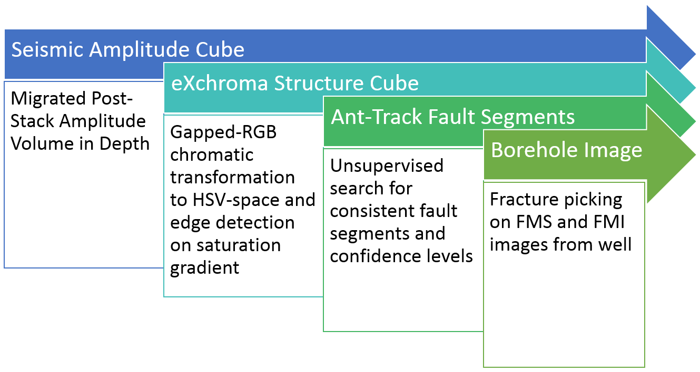

**Figure 3.2:** Workflow to identify fractures in post-stack seismic data to prepare
for comparison to [BHI](#_bookmark190) analysis.

The analysis of ant-tracked attribute volumes, allowed us to relate
structural trends below the resolution of amplitude seismic to
features at different scales. This interpreta- tion suggests that the
fracture pattern is more complex than previously suggested. We propose
that fracture generation and propagation in the field is in part
controlled by the regional maximum horizontal stress from the seismic
interpretation in addition to the halokinesis in the South Central
Graben.

The seismic analysis was correlated with the fracture analysis from
[BHI](#_bookmark190) data and core analysis in multiple wells. The
fracture analysis was particularly dependent on the
Terzaghi-correction (Terzaghi, [1965](#_bookmark524)) to obtain the
in-situ fracture orientation. This work identified two main fracture
trends in the Danian Ekofisk reservoir. The main fracture set strikes
sub-parallel to the regional NE/NNE maximum horizontal stress present
on all horizontal/deviated wellbores and core. The vertical fracture
distribution of the Kraka Field studied in a single well, due to
availability. Within this single well the NE/NNE fracture distribution
was continuous. This main NNE/NE fracture trend was traced from well
scale to ant-tracked scale bridgeing the scale-gap. Regional
large-scale faults interpreted on the raw amplitude seismic are
present in the ant-tracked cube, trending NE, which indicates that the
NNE trend is representative for smaller-scale lineations, with a
Northern deviation on regional scales.

Further research into the porosity and sedimentology of the
chalk reservoirs con- ducted on microscoping
scales focused on identifying porosity using Backscatter Scanning-
Electron Microscopy [(BSEM](#_bookmark192)) in [Section
4.3](#gaussian-mixture-models-for-robust-unsupervised-scanning-electron-microscopy-image-segmentation-of-north-sea-chalk),
which comprises the third paper in this chapter (Dramsch et al.,
[2018a)](#_bookmark314). Identifying the grain size and orientation of
the oolites is usually a manual work-intensive task,
ideal for computer vision tasks, considering the good contrast of
light-grey to white oolites and the black background. Unfortu- nately,
training data was not available, so unsupervised clustering was
appropriate to find the optimal boundary of the grains. Gaussian
Mixture Models learnt a two-fold representation that separated the
background well from the rock. Any single-valued de- cision boundary
will be non-smooth, which can be alleviated by morphological
filtering. Smooth boundaries are essential for chalk grains, as the
perimeter of the oolites can be used to calculate the specific surface
of chalk. The optimal boundary of chalk grains could then be used to
generate training data for more sophisticated machine learning
systems.

In the first study of this chapter (Aabø et al.,
[2017](#_bookmark241)) we applied an image processing workflow to
enhance the vertical resolution of seismic data. Consequently, The
data was transformed to deploy a biologically inspired software
algorithm to enhance and identify lineaments for better
interpretation. This work was essential in enabling a localized pilot
study to relate localized features from well-scale
[BHI](#_bookmark190) to enhanced seismic-scale, verifying the seismic
image analysis. This pilot study fed into a larger study (Aabø et al.,
[2020)](#_bookmark242), where a fracture study from core and
[BHI](#_bookmark190) was related to both the enhanced ant-tracked
volume and a regional fault interpretation, updating the understanding
of the fracture generation in the Salt Dome Process in the Danish
South Central Graben area. The third study solved a manual process
using an unsupervised image analysis tool paired with strong data
science principles, providing a novel reliable tool to geologists in
[BSEM](#_bookmark192) analysis.

Foundational Research
---------------------

The foundational research in this thesis includes publications on Deep
Learning and 4D seismic in [Chapter 5](#_bookmark157). These
publications apply a signal processing-approach to both 4D seismic and
Machine Learning. I include a paper that takes a tutorial-view of
dynamic time-warping a 4D seismic time shift analysis tool and
introduces a novel constraint to improve performance of the algorithm.
I then go on to present a possible source of misclassification in
neural networks on non-stationary physical data such as seismics. I
further investigate a possible solution to the aliasing problem of
Convolutional Neural Networks for seismic, including complex-valued
operations withing the network. I further investigate the assumption
that massive interpreted datasets have to be available for successful
training of Deep Neural Networks and present a working solution for
smaller datasets.

Dramsch et al. [(2019a](#_bookmark315)) presents a tutorial of Dynamic
Time Warping [(DTW)](#_bookmark201). [DTW](#_bookmark201) is a
powerful signal processing tool introduced to 4D seismic analysis by
(Hale, [2013a](#_bookmark350)) on synthetic data. 4D seismic data
relies on alignment of the seismic volumes. This enables interpreters
to compare the amplitudes differences of the data. Due to the
capability of [DTW](#_bookmark201) to match arbitrary time-series, it
is applicable to 4D time shifts, seismic-well ties, well-to-well ties,
and seismic pre- and post-stack migration (Luo et al.,
[2014)](#_bookmark422). [DTW](#_bookmark201) is known to be computationally slow and
expensive, while extracting poor matches on seismic field data. This
tutorial paper goes into detail of the [DTW](#_bookmark201) algorithm,
exploring similarity measures, optimization, and constraints
interactively through reproducible implementation in Python.

The [DTW](#_bookmark201) algorithm, represented in [Algorithm
1](#_bookmark127), relies on calculating a distance matrix sample-wise
between two traces. This is the first avenue of optimization we
explore in this paper. The commonly used *L*~1~ norm to calculate the
distance norm is shown to perform worst out-of-the-box calculating *b
a* . Alternatively, the euclidean distance or *L*~2~ norm can be used,
which modifies the calculation to (*b a*)2. The difference between
*L*~1~ and *L*~2~ is significant in the sense that the *L*~1~ norm is
not differentiable or convex, however it scales linearly for outliers.
The *L*~2~ norm converges fast close to zero, however the error
"explodes" for outliers. We introduce a constraint used in convex
optimization, which combines the advantages of the *L*~1~ norm and
*L*~2~ norm, namely the Huber loss:

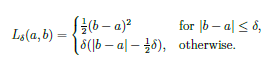

which is convex for small values, scales linearly for outliers and is
differentiable for all values of R, with *δ* being a scaling factor.

Additionally, the search space on the cumulative distance matrix can
be constrained to both increase performance and avoid non-optimal
solutions. The different contraint strategies are presented in [Figure
3.3](#_bookmark126). The Itakura parallelogram (Itakura,
[1975](#_bookmark378)) in [Figure 3.3(a)](#bookmark123) describes a
parallelogram that that has the largest width agress the diag- onal of
the matrix, providing the most flexibility for the
[DTW](#_bookmark201) algorithm in the center parts of the seismic
traces. The Sakoe-Chiba disc (Sakoe et al., [1978](#_bookmark497))
follows a different strategy, which provides a constant maximum warp
path. This strategy in [Figure 3.3(b)](#bookmark124) introduces a
global maximum time shift. Contrary to these two global constraints,
we

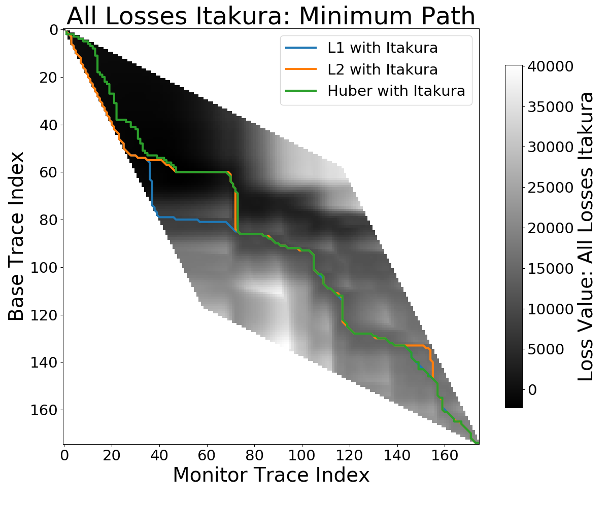
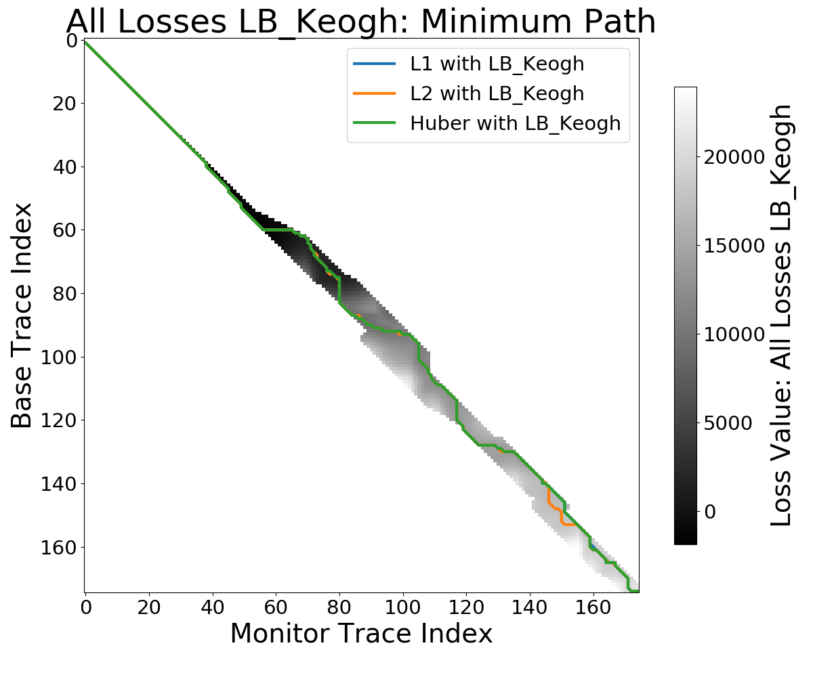
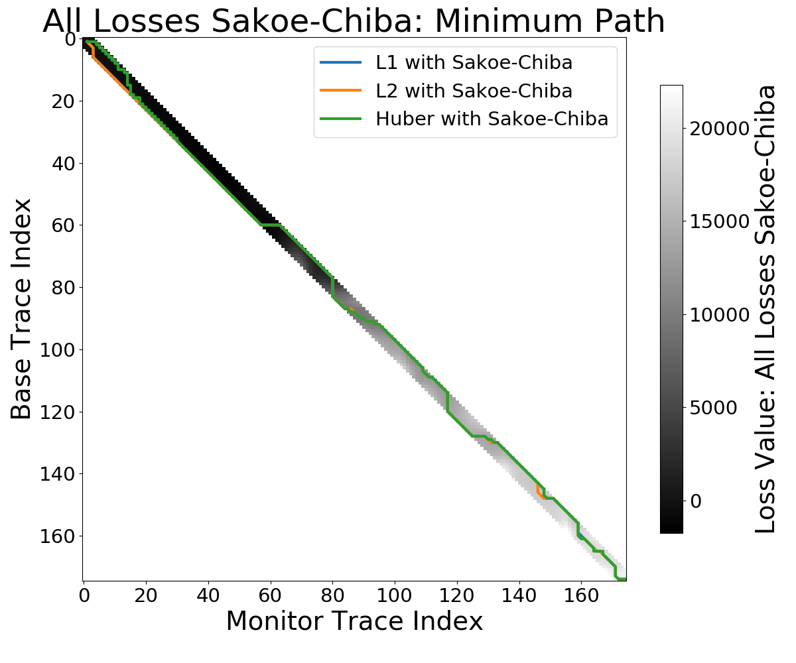

**(a)**  Itakura ([1975](#_bookmark378)) Parallelogram
**(b)**  Sakoe et al. ([1978](#_bookmark497)) Disc 
**(c)**  LB\_Envelope (Keogh et al., [2005](#_bookmark388))

**Figure 3.3:** Minimum path for constraint
masks for cumulative cost in [DTW](#_bookmark201). Images show the
optimum path for different loss functions *L*~1~, *L*~2~, and Huber
loss (from Dramsch et al., [2019a](#_bookmark315)).

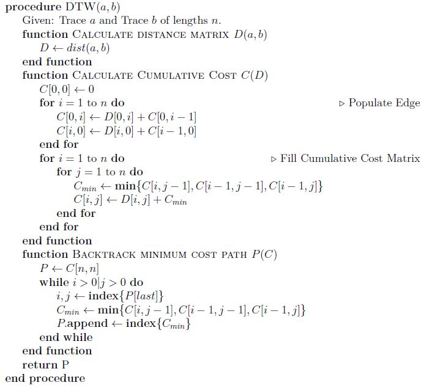

**Algorithm 1:** Dynamic Time Warping
algorithm consists of calculating the element- wise distance matrix,
cumulative cost and then find the optimal path in the cumulative cost
matrix.

introduce the LB\_Keogh (Keogh et al., [2005](#_bookmark388)) constraint in the paper. This lower bounding
method provides a mathematical lower bound for the
[DTW](#_bookmark201) algorithm. We use this lower bound to constrain
the warp path, which provides larger variability to high am- plitude
areas, where cycle-skipping can occur, presented in [Figure 3.3(c)](#_bookmark125). The results of combining the Huber loss with the LB\_Keogh constraint are presented in [Figure 3.4](#_bookmark129).

**Figure 3.4:** Time shifts and warped traces (from Dramsch et al., [2019a)](#_bookmark315).

In the workshop paper "Information Theory Considerations In
Patch-Based Training Of Deep Neural Networks On Seismic Time-Series"
(Dramsch et al., [2018d](#_bookmark322)) the insight from applying the
LB\_Keogh constraint was transferable to [CNN](#_bookmark193)s.
[CNN](#_bookmark193)s apply a windowed convolution to the input data.
Windowed areas of non-stationary physical data can be offset from the
usually baselevel of an amplitude of zero. In the case of seismic
data, traces tend to be zero-centered. In the case of a simple
activation of a single neuron in a [NN](#_bookmark225) with *σ*(*w x*
+ *b*) (cf. [Section 2.2.2](#neural-networks-nns)), this equates to a
bias of *b* = 0. Seismic data contains sections that fall within the
range of most patches, where the reflection response is entirely
offset from zero, which equates to a mean-shift within the network.
This paper served as a preliminary study for Dramsch et al.
[(2019g)](#_bookmark323), which explores a solution for this property
of patch-based training in [CNN](#_bookmark193)s that deteriorates the
generalization.

Neural Networks apply real-valued transformations on the data,
discarding phase information entirely. [Figure 3.5](#_bookmark130)
shows the spectra of the full trace in green as a back- ground, with
two selected cutouts of different sizes overlaid. It is clear that
both windows show a sufficiently good reconstruction of the original
amplitude spectrum, except for the offset at the low frequencies. The
slope of the phase spectrum is reconstructed somewhat by the larger
window, but non can reconstruct the notch. Many deterministic signals
contain significant information in the phase of the signal. Discarding
the phase

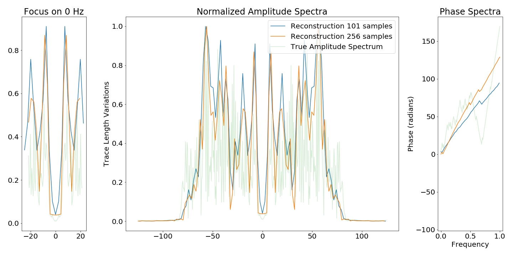

**Figure 3.5:** Normalized spectra of windows of trace with "offset" zero. Aliasing of
the low frequencies is visible.Phase information not reconstructed
from windowed data, slope depending on the window size. Data tapered
before [FFT](#_bookmark206) (from Dramsch et al.,
[2018d)](#_bookmark322).

information leads to low-frequency aliasing analogous to the
Nyquist-Shannon theorem for high frequencies.

In the paper "Complex-valued neural networks for machine learning on
non-stationary physical data" (Dramsch et al., [2019g](#_bookmark323))
I explore complex-valued deep convolutional net- works to leverage
non-linear feature maps and show that in non-stationary data, the
phase content improves generalization of [CNNs](#_bookmark193).
Furthermore, complex-valued networks result in a smaller network with
better performance compared to a larger real-valued network. In this
study I implemented a deep convolutional AutoEncoder to compress 2D
slices from a 3D seismic cube to evaluate the reconstruction error.
There is a dif- ference of network implementations, where
complex-valued neurons are represented as two feature maps, one for
the real component and complex component each. Therefore, matching the
networks proved to be a complicated task, which led me to build four
different architectures that get progressively bigger and compare the
results.

The work in "Complex-valued neural networks for machine learning on
non-stationary physical data" (Dramsch et al., [2019g](#_bookmark323))
was in part based on reconstruction to test lossy compression and
reconstruction of seismic data. Another reason to implement an unsu-
pervised method was the limited availability of realiable
interpretations of seismic data. Defining a decision boundary for
seismic interpretation is only in the beginning stages of research,
which leads us to the decision to inspect reconstructed seismic
numerically as signal analysis is
well-explored in seismic data processing. Therefore, analysing the
result in the Frequency-Wavenumber [(FK)-domai](#_bookmark204)n was
possible and gave additional insight to the denoising effect of the
[AE](#_bookmark185).

Nevertheless, some interpretations are available openly and companies
often have a plethora of interpretations and re-interpretations of
seismic data, making automatic seismic interpretation a topic of
interest as evidenced by [Table B.1](#_bookmark180). However, Deep
Neural Networks are notorious for needing large numbers of diverse
annotated samples. That is often prohibitive to geoscience
applications of Machine Learning. In "Deep- learning seismic facies on
state-of-the-art CNN architectures" (Dramsch et al.,
[2018c](#_bookmark321)) we show that state-of-the-arts Convolutional
Neural Networks pre-trained on ImageNet can be transferred to perform
Automatic Seismic Interpretation. [Figure 3.6](#_bookmark134) shows
the results of a fully trained network compared to a pre-trained
network. The pre-trained network decreases both training time and data
requirements significantly, while not compromising accuracy. A
pre-trained network with diverse generalizable learned filters seems
to alleviate some limitations of smaller non-diverse data sets used in
the fine- tuning process.

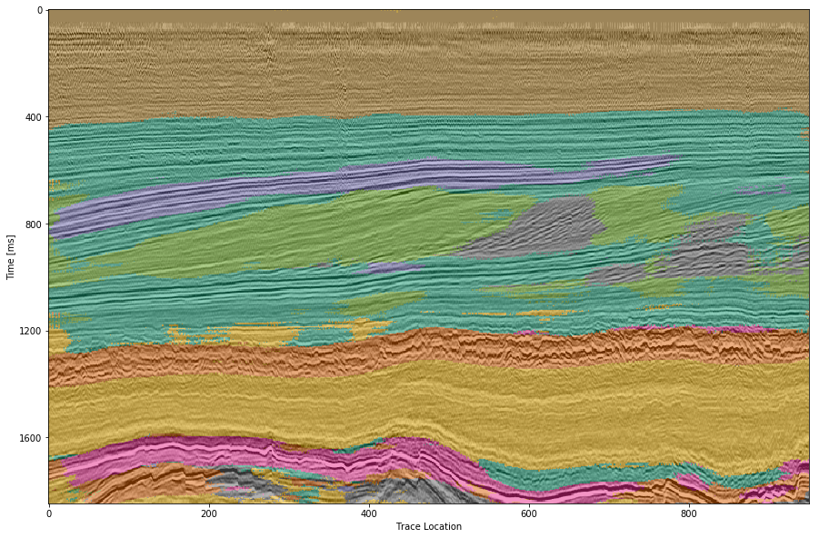
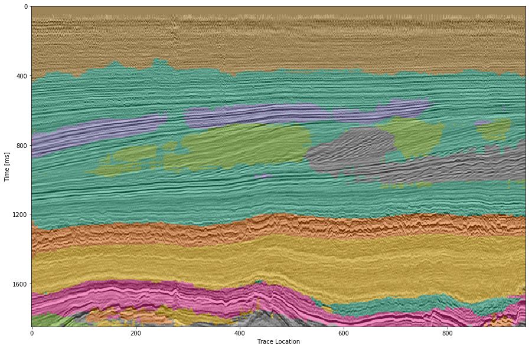

**(a)** Waldeland CNN trained from scratch **(b)** Pre-trained VGG-16

**Figure 3.6:** Automatic Seismic Interpretation on two networks, trained from scratch and fine-tuned on
pre-trained VGG-16 architecture. The pre-trained net- work generating
a more consistent seismic interpretation, however showing an overall
deficiency in diverse training data (from Dramsch et al.,
[2018c)](#_bookmark321).

This chapter summarizes the foundational work conducted to enable the
develop- ments of concrete applications of Deep Learning in
geophysics. These foundations touch on signal processing fundamentals
in 4D seismic exploring metrics and constraints, then introducing a
new constraint for Dynamic Time Warping in 4D seismics. The work in
Deep Neural Networks includes an investigation into aliasing of
patch-based training of Convolutional Neural Networks and including
phase information in complex-valued neu- ral networks. Finally,
leading to an exploration of transfer learning for efficient training
of deep learning models in Automatic Seismic Interpretation.

Machine Learning in 4D Seismic Inversion
----------------------------------------

A primary application of Machine Learning is building regression
models. These regres- sions are suited for application in physical
inversion problems, considering the value of priors in non-unique
solution spaces. This chapter consists of two workshop papers that
illuminate a [DL](#_bookmark198) solution approach from a network
architecture analysis in the paper titled "Including Physics in Deep
Learning -- An Example from 4D Seismic Pressure Saturation Inversion"
(Dramsch et al., [2019e](#_bookmark319)) and a data perspective in the
paper titled "Deep Learning Application for 4D Pressure Saturation
Inversion Compared to Bayesian Inversion on North Sea Data" (Dramsch
et al., [2019d](#_bookmark317)).

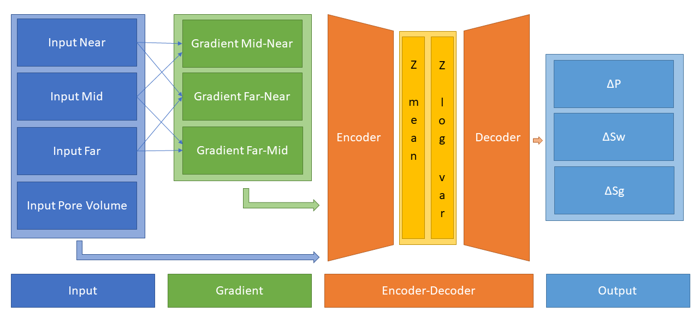

**Figure 3.7:** Architecture includes
automatic physics-based gradient calculation of in- put seismic and an
variational encoder-decoder architecture to invert seis- mic data for
pressure and saturation changes (from Dramsch et al.,
[2019e)](#_bookmark319).

Traditionally, 4D seismic Qantitative Interpretation
([QI](#_bookmark228)) often relies on priors to reduce variance in the
face of uncertainty. The inversion problem in this chapter is a
pressure-saturation inversion from seismic amplitude difference maps
in the Schiehallion field. The Schiehallion field is a stacked
turbidite reservoir in the UK North Sea, which makes it very
heterogeneous and compartmentalized. The T31 sandstone reservoir has
the most lateral extent with the thickness ranging from 5 m to 30 m.
The small thickness of the reservoir layer results in the entire
reservoir being contained in a single trough of a seismic wavelet,
which leads us to treat the network as a 2D map instead of a 3D
problem. The data available consists of simulation and field data with
several timesteps of seismic data in near-, mid-, and far-angle
stacks, and pore volumes, as well as, pressure changes and saturation
changes for water and gas from simulation.

In Dramsch et al. [(2019e](#_bookmark319)) we present a novel network
structure that explicitly includes AVO gradient calculation within the
network as physical knowledge, shown in [Figure 3.7](#_bookmark137).
The network architecture was chosen to follow an encoder-decoder
architecture as a forcing function for information distillation.
Additionally, the bottleneck layer implements a variational encoding
layer to be less susceptible to noisy input. The network explicitly
includes AVO gradient calculation in the network architecture,
considering it is physical knowledge we know will stabilize pressure
and saturation change separation. Including basic physics knowledge
leads to the network learning residual information, essentially
defining another forcing function for the networks learning process.

The initial phase was carried out on simulation data with a train test
split, leaving a full 4D time step as validation set. Neural
Architecture Search was applied to the
network to determine depth and width of the architecture, using a Tree
of Parzen Es- timator ([TPE](#_bookmark239)) hyper-parameter search
(Bergstra et al., [2015)](#_bookmark262). Afterwards, to transfer the
network to field data, the input of the network was combined with
additive Gaussian noise (Bishop, [1995](#_bookmark269)) to train the
network for noisy field data input. This was a manual process of
estimating good noise levels.

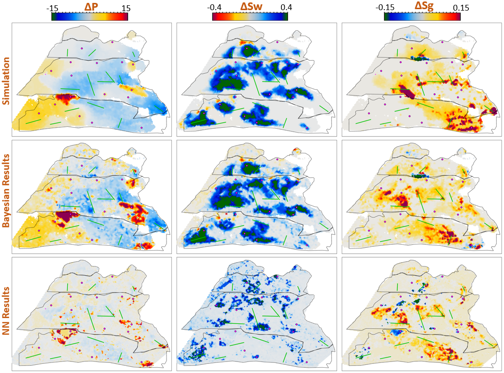

**Figure 3.8:** 4D QI inversion results from
Bayesian inversion and Neural Network inver- sion. Bayesian inversion
closely resembles simulation output. [NN](#_bookmark225) result
showing good coherency, consistent amplitudes, but problems in strong
changes of gas saturation (from Dramsch et al.,
[2019d)](#_bookmark317).

The workshop paper Dramsch et al. ([2019d](#_bookmark317)) contains
these results compared to the simulation results and Bayesian inversion
results, shown in [Figure 3.8](#_bookmark140). These initial results
on limited training data show that the stochastic process can extract
pressure saturation information from field data, after training on
simulation data. While the overall result is promising, regions of
strong gas saturation changes present a problem. This could be
contingent problems in the modelling as well as the fact, that they
generate strong amplitude differences and are far in between,
essentially behaving like outliers.

Learning meaningful information in deep neural networks is often
contingent on inter- preting the neural network. The results presented
in [Figure 3.8](#_bookmark140) contain three indicators that the
network learned a meaningful inversion regression for the Schiehallion
field. The network gets the overall trend in increase and decrease of
pressure and saturation correct. Additionally, the range of output
values for the network is unconstrained, but the network provides
values in the ranges, that are expected from the simulation and
Bayesian inversion results. However, and more interestingly, the
networks does not con- tain spatial information, being a feed-worward
[DNN](#_bookmark199) not a [CNN](#_bookmark193), yet returns
continuous albeit noisy outputs when assembled into maps.

This chapter comprised of two workshop papers, shows a working
implementation of a machine learning system inverting
pressure-saturation data from seismic. Moreover, an implementation of
a network trained on simulation data that is transferred to field data
by noise modelling is presented. Finally, we show that including basic
physics in the network architecture stabilizes training, making the
case for physics-based Machine Learning. Two journal papers are in
preparation but not included in this thesis that analyze the network
structure and the training data in detail (Corte et al.,
[2019](#_bookmark294); Dramsch et al., [2019f)](#_bookmark320).

Machine Learning in 4D Seismic Time-Shift Extraction
----------------------------------------------------

This final chapter consists of the submitted journal paper "Deep
Unsupervised 4D Seis- mic 3D Time-Shift Estimation with Convolutional
Neural Networks" (Dramsch et al., [2019b](#_bookmark316)). This paper
presents a novel 3D warping technique for the estimation of 4D seismic
time-shifts. The algorithm is unsupervised and provides 3D warp-fields
with uncertainty measures, while avoiding many limiting assumptions.

4D seismic time shift extraction is often done in 1D, due to time
constraints and often sub-par performance of 3D algorithms. This
chapter explores and summarizes conventional 3D warping methods and
machine learning approaches. Many of these algorithms rely on
classical cross-correlational or optical flow approaches. Correlation-
based algorithms can be susceptible to noise and inversion-based
algorithms can take weeks to provide results and optical flow
approaches suffer from the implicit assumption in standard
implementations. These approaches suffer from the same limitations in
Machine Learning systems just like conventional algorithms. In this
chapter the medical Voxelmorph algorithm is adapted to match 4D
seismic data volumes in 3D.

The Voxelmorph algorithm is based on the
diffeomorphic assumption, which at its core describes the map of one
data set to another data set, providing this map with particular
properties. The main benefit of applying diffeomorphic mapping to
geoscience data comes in the fact that all diffeomorphisms are
homeomorphic. The homeomorphic assumption transfers well to the
geological reality that the mathematical topology stays constant,
resulting in reflectors neither crossing nor generating loops.

The algorithm is trained in an unsupervised, or rather self-supervised
way to avoid the bias from time shifts that were extracted from any
other method. Supervised training is discussed in the paper as
implicitly introducing the assumption of the extraction method for the
training data into the newly trained network.

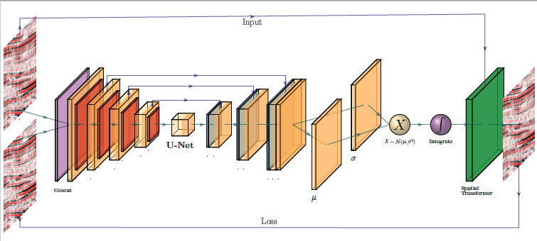

**Figure 3.9:** Voxelmorph Architecture 2D
abstraction. Two 3D volumes are passed to the network, concatenated
(purple) and passed to a U-Net architecture. The U-Net outputs two
cubes that generate the mean static velocity and the standard
deviation, which is sampled during training. The sampled value is
integrated to obtain the diffeomorphic warp velocity used in the
spatial transformer layer (green). The network evaluates losses on the
[KL-](#_bookmark215) divergence at *µ, σ* and [MSE](#_bookmark222)
between the warp result of the monitor volume and the warped base
volume, enabling self-supervised training (from Dram- sch et al.,
[2019b)](#_bookmark316).

The architecture in the network uses the U-Net architecture to input
two 3D seismic volumes and extract a static warp velocity field, shown
in [Figure 3.9](#_bookmark144). The static velocity field is extracted
as a Gaussian distribution to measure the co-variance and provide
uncertainty value of the three-dimensional warp field. The neural
network itself does not warp the seismic data, to increase
transparency of the process. The architecture following the U-net
samples the extracted velocity distribution and integrates this value
to obtain the diffeomorphic flow. These values are passed to a dense
3D warping mechanism to enable the unsupervised training. The losses
involved are a Kullback-Leibler [(KL)](#_bookmark215)-divergence on the stationary velocity field
and [MSE](#_bookmark222) on the difference between that warped monitor
volume and the base volume.

In the paper we present the modified self-supervised Neural Network
system and test the results on the training data itself and two
generalization test sets. The first test set is on the same field but
recorded at different times to the training set, ensuring a similar
underlying geology, whereas, the second test set is taken from an
adjacent field, recorded at different times, testing the full transfer
of the trained network. We go on to test the original Voxelmorph
architecture, which uses upsampled velocity fields and evaluate the
results against our modified architecture, which uses the full flow
field. Overall, this technique introduces a generalizable Deep
Learning approach to extract 3D time-shifts with uncertainty measures
from raw stacked 4D seismic data.

Contributions of this Study
---------------------------

This thesis contributes tangible Machine Learning applications in
geoscience that solve real-world problems as well as work that
contributes to the fundamental understanding of signal processing and
Neural Networks in non-stationary physics.

The explorational work of this thesis validates the impact of image
processing for enhancing the resolution of seismic data and automatic
fault extraction. This work investigated the scale-gap between local
Borehole Imaging and regional seismic data (Aabø et al.,
[2017](#_bookmark241); Aabø et al., [2020)](#_bookmark242). The
exploration of Backscatter Scanning-Electron Microscopy data
introduced a novel unsupervised method to extract chalk grain bound-
aries from image data and shows the improvement of subsequent
morphological filtering (Dramsch et al., [2018a)](#_bookmark314).
These methods reduce labor-intensive manual tasks, introduc- ing
varying degrees of automation in geoscience workflows.

The foundational work investigates low-frequency aliasing in
Convolutional Neural Networks (Dramsch et al., [2018d](#_bookmark322))
and goes on to show that phase information in complex- valued neural
network can stabilize the reconstruction of compressed seismic data.
The smaller complex-valued network outperforms larger real-valued
networks, however, a very large real-valued network can implicitly
learn partial phase information (Dramsch et al.,
[2019g)](#_bookmark323). The paper touches on deficits of current
metrics applied to geoscience and exposes a periodic dimming effect of
frequencies from neural networks that should be further investigated,
particularly in the context of aliasing. This paper led to the
creation of the open source software package keras complex to enable
complex-valued deep learning in Tensorflow (Manual in
[C)](#_bookmark182). The code was available in an older framework
(Trabelsi et al., [2017)](#_bookmark526), which I consolidated for
this study. I went on to package the code, make it easily installable
and generate online documentation to enable researchers to generate
their own studies from this work (Dramsch et al.,
[2019c)](#_bookmark318).

The research in Dramsch et al. [(2018c](#_bookmark321)) showed that
transfer learning can alleviate the necessity for large amounts of
labeled data, by re-using a neural network on natural images. This
study showed the generalizable networks can be transferred to seismic
data and outperform smaller networks trained from scratch, the smaller
network size beingnecessary to avoid overfitting. The source
code for this research was made available and has been of use to
multiple researchers (Dramsch, [2018](#_bookmark311)). This has wide
applications in industry and research settings, considering the
limited availability of labeled data and wide availability of
pre-trained network architectures. Moreover, this insight is
applicable to pre-training geoscientific Neural Networks and
fine-tuning these models to specific applications when needed.

The tutorial paper (Dramsch et al., [2019a](#_bookmark315))
contributes insights into applications of Dynamic Time Warping in 4D
seismic. This work explores the influence of varying metrics in
geoscience, introducing the Huber loss as a possible loss function for
geoscien- tific application. The study goes on to show that a novel
application of the LB\_Keogh lower bound for Dynamic Time Warping can
significantly improve the accuracy for field data, introducing a
constraint on the search space for Dynamic Time Warping. The code for
this tutorial including further interactive explorations into
constraints for Dy- namic Time Warping will be made available after
the double-blind peer review process concludes (Dramsch,
[2020)](#_bookmark313).

The first application of Machine Learning to 4D seismic data
introduces a novel method to perform pressure-saturation inversion on
amplitude difference maps (Dram- sch et al., [2019d)](#_bookmark317).
This work introduces basic physics principles into the neural network
architecture, which was shown to stabilize the training result.
Moreover, this work shows the possibility of training Deep Neural
Networks on simulation data and subsequently transferring the network
to field data, by applying adequate noise injection. The Deep Neural
Network results were successfully compared to results from the
Bayesian inversion showing a promising application of Deep Neural
Networks in 4D Qantitative Interpre- tation (Dramsch et al.,
[2019d](#_bookmark317)). While this work has attracted interest in a
sponsors meeting and the workshop presentations (Dramsch et al.,
[2019d](#_bookmark317); Dramsch et al., [2019e)](#_bookmark319),
further investigation into model explainability and lower complexity
baseline models is necessary (in preparation Corte et al.,
[2019](#_bookmark294); Dramsch et al., [2019f)](#_bookmark320).

The second application of Machine Learning to 4D seismic data presents
a completely novel method for time-shift extraction (Dramsch et al.,
[2019b)](#_bookmark316). This method combines recent advancements in
diffeomorphic mapping, Deep Learning and unsupervised learn- ing to
introduce a 3D time shift extraction method including uncertainty
values, where 1D extraction is the standard. The method is shown to
work on 3D seismic post-stack data with strongly differing acquisition
parameters, without supplying any time shift in- formation. After
applying the method, the 3D seismic volumes are aligned well, with the
diffeomorphic constraint performing well on seismic data. This work
tests the trained network on two other 3D seismic volume pairs to test
the generalization of the Convo- lutional Neural Network after
training. The two test sets show that the trained model on a single 3D
seismic volume pair transfers well to the same field with different
acqui- sition parameters and even a different field with vastly
different geological setting. The code is openly available to foster
further development and investigation of the method (Dramsch,
[2019)](#_bookmark312).

Overall, this thesis shows the impact Deep Learning can have in
geoscience with two novel methods for 4D seismic analysis. It shows
the impact of fundamental research of signal processing and
information theory in Deep Neural Networks and Convolutional
Neural Networks. Moreover, it shows applications of building systems
in label sparse environments to leverage technological advancements
and the value of including prior physical insights into Machine
Learning workflows. This thesis builds heavily on open source software
and aims to return some of the effort.