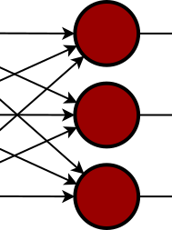
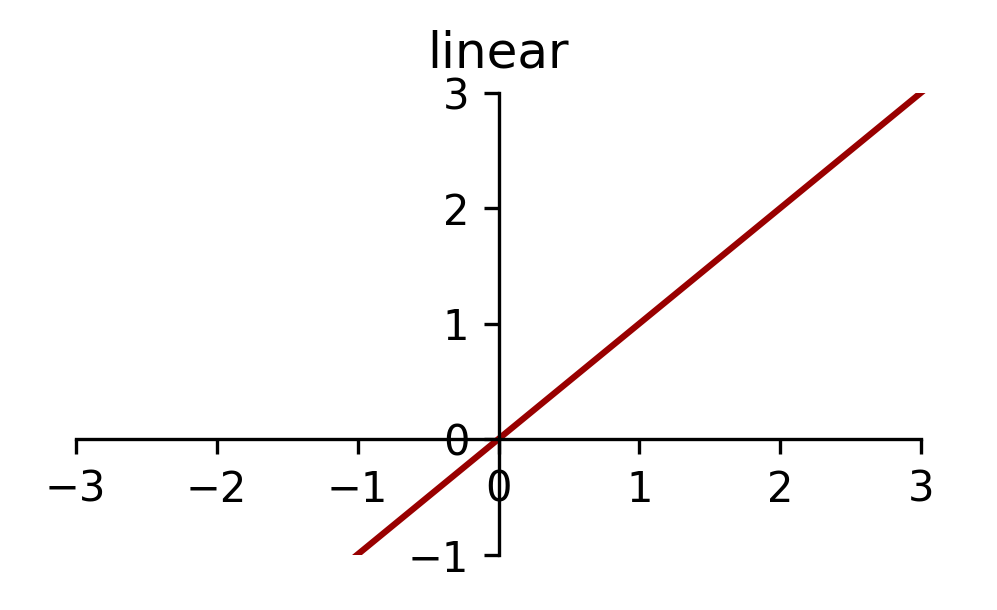
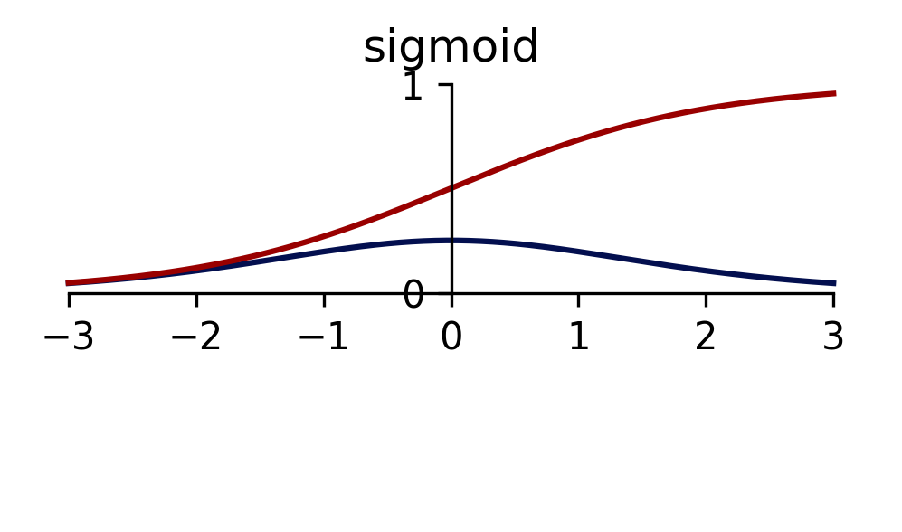
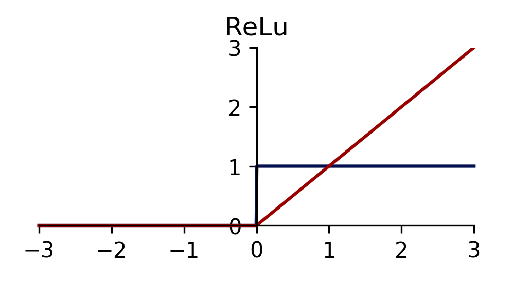
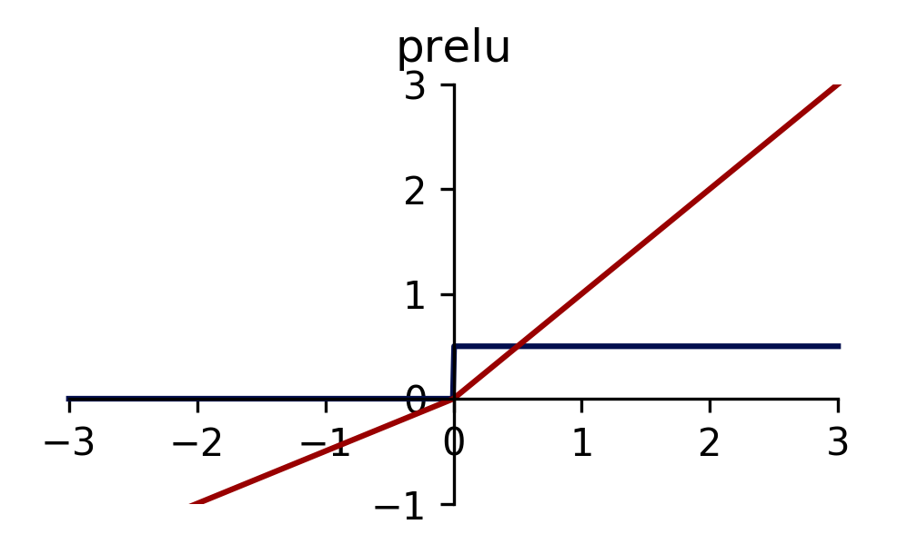
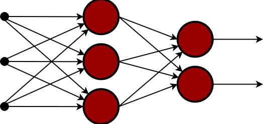
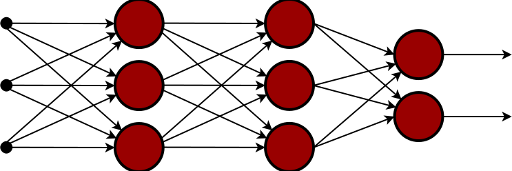
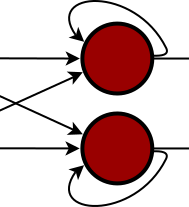
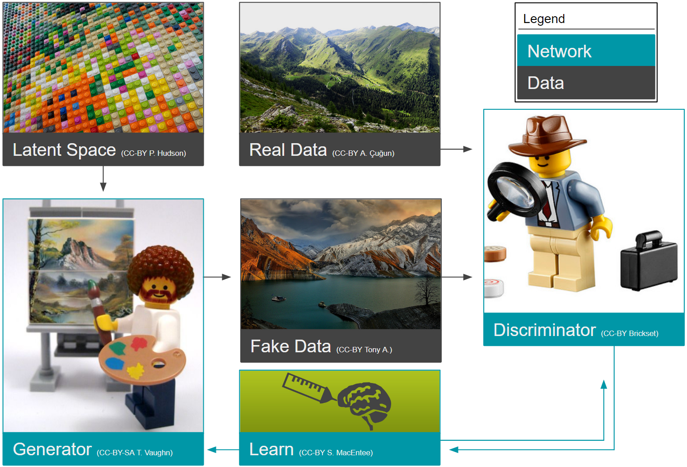
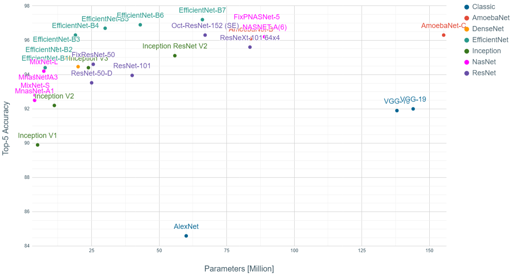

# Chapter 2: Theory

This thesis applies Machine Learning methods to 4D seismic data. In
this chapter I introduce 4D seismic concepts and the motivation to
acquire and analyze 4D seismic data. I go on to introduce machine
learning and review the development of machine learning in itself and
in the field of geoscience. The focus on this thesis is on Neural
Networks, particularly Deep Learnings to geophysical problems.
Considering recent developments in computer vision, a focus on
Convolutional Neural Networks, the
developments and break-throughs of this type of Neural Network
([NN](#_bookmark225)) and the innovations that lead to the recent
adoption of Machine Learning in geoscience are explored.

4D seismic
----------

4D seismic is the analysis of seismic data that was acquired over the
same location after some calendar time has passed. The repeated
imaging of the same subsurface location, highlights changes in the
subsurface that can lead to improved understanding of subsurface
processes and fluid movement. E&P companies in particular have an
interest in imaging hydrocarbon reservoirs (Johnston,
[2013b)](#_bookmark384), however 4D seismic imaging wide ap-
plications for subsurface characterization, such as observing volcanic
activitiy (Londoño et al., [2018](#_bookmark418)) or CO~2~
sequestration monitoring (Arts et al., [2004)](#_bookmark251).

The main applications of 4D seismic analysis according to Yilmaz
[(2003](#_bookmark542)) and Johnston [(2013a](#_bookmark383))
include:

-  Tracking fluid movement (steam, gas, and water)
-  Monitoring pressure depletion and validating depletion plans
-  Fault property estimation i.e. sealing or leaking faults
-  Locating bypassed oil in heterogeneous reservoirs
-  Validating and updating geological and reservoir-simulation models

4D seismic data analysis suffers from the superposition of multiple
effects on the seismic imaging. These effects include changes in the
acquisition equipment due to technological advances, changes in
acquisition geometry (source-receiver mismatch), as well as physical
changes in the subsurface (Yilmaz, [2003](#_bookmark542); Johnston,
[2013b](#_bookmark384)). These physical changes are in part due to
fluid movement in the subsurface (Lumley, [1995](#_bookmark419)), as well as, changes in the geology due to
compaction and expansion (Hatchell et al., [2005a](#_bookmark358)).
These geomechanical effects change the position of the reflectors, the
thickness of stratigraphy and the physical properties such as density
and wave velocity (Herwanger, [2015](#_bookmark363)).

Succesfull 4D applications rely on careful acquisition planning,
closely matching the mismatch of source (∆*S*) and receiver (∆*R*).
This awareness has generally improved the
repeatability of seismic acquisition, however, the Normalized Root
Mean Squared Error [(NRMS](#_bookmark226)) remains to be an important
measure of noise sources that deteriorate the 4D seismic analysis.
Moreover, 4D seismic analysis has brought to light that some 3D
seismic processing workflows are not as repeatable and
amplitude-preserving as they were thought to be (Lumley,
[2001](#_bookmark420)). Modern processing flows include co-processing
of the base and monitor seismic volumes with specialized tools to
reduce differences from processing (Johnston, [2013a)](#_bookmark383).

The standard analysis tool in 4D seismic interpretation are amplitude
differences (Johnston, [2013b](#_bookmark384)). Differences can stem
from fluid movement or replacement and changes in the rock matrix due
to compaction, temperature changes, and movement of injected CO~2~
plumes. Additionally, by-passed oil zones in heterogeneous reservoirs
can be identified by "low difference zones" in generally mobile
reflector packets (Yilmaz, [2003](#_bookmark542)). Usually, a simple
difference of the 3D seismic volumes will not yield satisfactory
results due to small-scale fluctuations in both arrival times and
amplitudes, making time-shift analysis an important process to match
the reflection events. These time-shift values have been shown to be a
valuable source of information themselves (Hall et al.,
[2002a](#_bookmark354); Hatchell et al., [2005b)](#_bookmark359),
considering their sole dependence on wavefield kinematics, time shifts
tend to be a more robust measurement than amplitude differences
(Johnston, [2013b](#_bookmark384)).

Considering normal incidence on a horizontal layer of thickness *z*
and a P-wave velocity *v* with a traveltime *t*, we can express the
changes in traveltime as:

for homogeneous isotropic *v* and small changes in *z* and *v*.
Originally developed in Hatchell et al. [(2005b)](#_bookmark359), with
a rigorous integral derivation presented in MacBeth et al.
([2019](#_bookmark425)).

The vertical strain [ ∆*z*]{.underline} directly relates to the
geomechanical strain *ξ~zz~*, describing the vertical strain on the
vertical surface of a infinitesemal element (Herwanger,
[2015)](#_bookmark363). Independently Hatchell et al.
[(2005b](#_bookmark359)) and Røste et al. ([2006](#_bookmark487))
developed a single-parameter solution to relate velocity changes and
vertical strain

with *R* being the single parameter Hatchell-Bourne-Røste
[(HBR)-facto](#_bookmark211)r (Hatchell et al.,
[2005a](#_bookmark358); MacBeth et al., [2019](#_bookmark425)). The
[HBR](#_bookmark211) being a lithological constant, we can relate
([2.2](#_bookmark29)) and [(2.1](#_bookmark28)) and obtain a direct
relationship between the vertical strain *ξ~zz~* and the time shift
∆*t* for a given lithology with property *R*

%20\cdot%20\xi_{zz}.)

Contingent on the assumption of zero-offset incidence, homogeneous
velocity and isotropy, time shift extraction is mostly performed in
z-direction by comparing traces directly. Prominently, the 1D
windowed cross-correlation is used due to its computational speed and
general lack of limiting underlying assumptions (Rickett et al.,
[2001)](#_bookmark479). The main drawback of this method is, however,
that the result is highly dependent on the window-size and
susceptible to noise. Other methods for
post-stack seismic time shift extraction include Dynamic Time Warping
[(DTW](#_bookmark201)) (Hale, [2013a](#_bookmark350)) and
inversion-based approaches (Rickett et al., [2007)](#_bookmark480).

More recently research into pre-stack time shift extraction and
3D-based methods is conducted. These methods relax the constraints of
some assumptions of 1D applications (Ghaderi et al.,
[2005](#_bookmark335); Hall et al., [2002b](#_bookmark355)). 3D time
shifts have the ability to capture subsurface movement of reflectors
and account for 3D effects of the ∆*R/*∆*S* acquisition mismatch, which effect seismic illumination.

Qantitative Interpretation ([QI](#_bookmark228)) extends the
interpretation of 4D changes to estimate fluid saturation and pressure
changes within the reservoir. The subsurface changes recorded by the
seismic data can be related numerically to subsurface changes. The
process of extracting causal information from imaging data is called
inversion. The underlying phenomena interact with several possible and
physical explanations for the same seismic response, which makes the
inversion process non-unique and often reliant on prior information.
The decoupling of pressure and saturation changes is non-trivial and
relies on pre-stack or angle-stack information (Landrø,
[2001)](#_bookmark404). This process is, however, highly desirable
with the benefit of quantifying the subsurface changes from seismic
data directly.

Active areas of research in 4D seismic are the use of 4D seismic data
to estimate saturation and pressure changes quantitatively
particularly in volumetric applications as opposed to map-based
approaches. However, these approaches often depend on reliable
rock-physics models, an area of research in model-based approaches.
Moreover, there's active research in moving to volumetric approaches
in time-shift estimation and quantitative pre-stack analysis.
Additional research in extractive data-based methods and model-based
approaches investigate how much information is available directly from
the data and what information is available from the modelling
feedback-loop.

Machine Learning
----------------

Machine Learning ([ML](#_bookmark220)) is the
discipline of defining a statistical or mathematical models based on
data. These [ML](#_bookmark220) models are either trained in a
supervised or unsupervised fashion, which usually results in them
learning a decision boundary, or a representation or structure of the
data respectively. Historically, [ML](#_bookmark220) has been an
interest in geoscience but has not gained momentum due to sparse data,
computational capability, and availability of algorithms. Geoscience
data was often not available and still is often not available with a reliable ground truth. However,
particularly [NN](#_bookmark225)s have found broad interest in
geophysical applications, Bayesian methods are often used in inversion
schemes and recent software developments have changed the research
entirely.

Recently, the subfield Deep Learning
([DL](#_bookmark198)) has reignited interest in the wider field of
[ML](#_bookmark220) by outperforming rule-based algorithms on computer
vision tasks, such as image classification and segmentation (Bishop,
[2016)](#_bookmark270). These developments have propelled de-
velopments in other non-related fields such as biology (Ching et al.,
[2018)](#_bookmark291), chemistry (Schütt et al.,
[2017)](#_bookmark501), medicine (Shen et al., [2017](#_bookmark507))
and pharmacology (Kadurin et al., [2017](#_bookmark385)).
[DL](#_bookmark198) utilizes many-layered artificial
[NN](#_bookmark225) to approximate an objective function. In recent
years the open source movement, democratization of access to computing
power and developments in the field of [DL](#_bookmark198) have
rekindled interest in applications of [ML](#_bookmark220) to
geoscience. The availability of free open source libraries such as
skikit-learn (Pedregosa et al., [2011](#_bookmark468)) has made
[ML](#_bookmark220) methods and several tools for the application of
rigorous statistical evaluation of experiments without explicit expert
knowledge widely available. Furthermore, Tensorflow (Martı́n Abadi et
al., [2015](#_bookmark436)), PyTorch (Paszke et al.,
[2017](#_bookmark465)), and Keras (Chollet et al.,
[2015](#_bookmark292)) have made [NN](#_bookmark225)s easily
accessible and provide experimentation capabilities to transfer
recent developments in [ML](#_bookmark220) research to other
scientific fields.

Algorithms and methods in [ML](#_bookmark220) can be organized in
different ways. Two ways to categorize algorithms are based on the
training or based on the learned distribution. In training, these
algorithms can be categorized into supervised and unsupervised
methods, where supervised methods learn the functional mapping from
*x*, being the data, to *y*, being the ground truth or label for the
data. When the ground truth is not known, unsupervised methods can be
applied to determine structures and relationships within the data.
Semi-supervised, and weakly supervised try to propagate partial labels
to similarly distributed data and then learn the supervised mapping
f(x) = y. Alternatively, [ML](#_bookmark220) algorithms can be
categorized into generative methods that learn the joint probability
distribution or discriminative methods that learn a decision boundary
to optimally separate data. Additionally, methods can be distinguished
by application. Assigning labels to data is called classification. The
general, continuous application to map data from the input to the
output domain is called regression. Finding relationships and
agglomerations of data is called clustering. Most algorithms can be
applied to several of these categories, such as support vector
machines that can function as classifier and regressor.

Applications in [ML](#_bookmark220) are quickly evolving and many are
improved by mathematical insights, engineering features and increased
availability of data. This thesis focuses on the application of
[NNs](#_bookmark225), which come in different implementation details
and particularly [NN](#_bookmark225) architectures are often
re-implemented with slight differences that deviate from the original
published architecture. Particularly in [NN](#_bookmark225) we have to
focus on the most practical building blocks, to be able to give a
comprehensive overview.

**Figure 2.1:** Selection of notable milestones in machine learning.

### History of Machine Learning

Creativity, learning, and intelligence with regard to computers have
been discussed as early as of the first programmer Ada Lovelace
(Taylor, [1843)](#_bookmark523).

"The Anlytical Engine has no pretensions whatever to *originate* any
thing. It can do whatever we *know how to order it* to perform. It can
*follow* analysis; but it has no power of *anticipating* any
analytical relations or truths. Its province is to assist us in making
*available* what we are already acquainted with. This it is calculated
too effect primarily and chiefly of course, through its executive
faculties; but it is likely to exert an *indirect* and reciprocal
influence on science itself in another manner." -Note G, Page 689,
Ada A. Lovelace. (Taylor, [1843)](#_bookmark523); Emphasis taken from
source text.

This notion was challenged by Alan Turing (Turing,
[1950](#_bookmark527)) who proposed the "Learning Machine", which
specifically predict genetic algorithms, a metaheuristic that finds
application in optimization and search problems. Evolutionary
computing and genetic algorithms specifically can perform some machine
learning tasks (Goldberg et al.,
[1988)](#_bookmark337). This is generally considered the commencement
of Artificial Intelligence ([AI](#_bookmark186)) and
[ML](#_bookmark220), however, they rely heavily on earlier
developments in statistics such as the Bayesian theorem (Bayes,
[1763](#_bookmark259)) and Markov processes (Markov,
[1906](#_bookmark432); Markov, [1971)](#_bookmark433). The first
method, we include on the timeline in [Figure 2.1](#_bookmark38) is
"kriging" (Krige, [1951](#_bookmark397)), which is based on Gaussian
Processes, these form an important category of non-parametric machine
learning these days. Gaussian processes are often also attributed to
work of Kolmogorov [(1939](#_bookmark396)) on time series. Another
method was developed to mimic the human brain, namely Neural Networks
([NNs)](#_bookmark225). The construction of the first
[NN](#_bookmark225) machine by Minsky (Russell et al.,
[2010](#_bookmark494)) was soon followed by the "Perceptron", a binary
decision boundary learner (Rosenblatt, [1958)](#_bookmark484). The
decision is made according to

which describes a linear system of the input data *x*, the weights *w*
and bias *b* and a binary activation funtion *σ*. The linear system is
still used in modern neurons, however, the activation *σ* is usually a Rectifier function. Shortly after,
Belson ([1959](#_bookmark260)) describe the
first Decision Tree ([DT](#_bookmark200)), which learns hierarchical
decision systems. The next method, k-Nearest Neighbour
([KNN](#_bookmark216)) search, was introduced by Cover et al.
([1967](#_bookmark296)) to solve the traveling salesman problem. Two
decades later Q-learning (Watkins, [1989](#_bookmark536)) introduces a
method to reinforcement learning that is still
used to this day. The final two methods in the timeline were
introduced in 1995. Random Forests ([RF](#_bookmark230)s) (Ho, [1995](#_bookmark367)) introduce
ensemble learning of weak learning Decision Trees
([DT](#_bookmark200)s). Support Vector Machine ([SVM](#_bookmark236))
(Cortes et al., [1995](#_bookmark295)) introduce a strong learner that
aims to maximize the margin between classes.

These methods have been improved upon over the decades. Specific
milestones that accelerated further developments in
[NN](#_bookmark225) are automatic differentiation (Linnainmaa, [1970](#_bookmark415)) and consequently
applying this to backpropagate errors in Deep Neural Networks
([DNNs](#_bookmark199)) (Rumelhart et al., [1988)](#_bookmark491).
Backpropagation itself as a concept existed earlier (Kelley,
[1960](#_bookmark387); Bryson, [1961](#_bookmark275)), followed by a
simplification by using the chain rule (Dreyfus,
[1962)](#_bookmark324). These enable effective implementation of
[NN](#_bookmark225)s today. Moreover, open sourcing the Torch library
(Collobert et al., [2002](#_bookmark293)) made and assembling the Im-
ageNet database (Deng et al., [2009](#_bookmark303)) has accelerated
developments in computer vision and enabled modern developments in
deep learning. In the same year of 2009 the library Scikit-Learn (Pedregosa et al., [2011](#_bookmark468)) was
established, which introduced a common open source Application
Programming Interface [(API](#_bookmark187)) (Buitinck et al.,
[2013](#_bookmark276)) for a diverse and growing set of shallow
machine learning models (e.g. [SVM](#_bookmark236)s,
[RFs](#_bookmark230), [KNNs](#_bookmark216), shallow
[NN](#_bookmark225)s). Scikit-learn has had a profound impact on
machine learning applications across the sciences and the API is
modelled in other open source libraries. Chang et al.
[(2011](#_bookmark284)) introduced a widely used implementation for
Support Vector Machine [(SVM)](#_bookmark236), which is also used in
Scikit-Learn. Recently, the Tensorflow library (Martı́n Abadi et al.,
[2015](#_bookmark436)) was introduced for open source deep learning
models, with some different design choices than Pytorch. In this open
environment fueled by competitions (e.g. ImageNet (Russakovsky et
al., [2013](#_bookmark492)), Netflix Prize (Bennett et al.,
[2007)](#_bookmark261), Kaggle (Goodfellow et al.,
[2013](#_bookmark339))) XGBoost (Chen et al., [2016)](#_bookmark286),
a library for extreme gradient tree boosting was developed.

Recent developments in deep learning are based
in Neural Networks [(NNs)](#_bookmark225), hence, we highlight some
key developments in [Figure 2.1](#_bookmark38). Convolutional Neural
Networks [(CNNs](#_bookmark193)) are essential in the modern
computational vision systems, they were inspired by the concept of Neocognitron (Fukushima, [1980](#_bookmark331);
LeCun et al., [2015)](#_bookmark409). In the same decade Recurrent
Neural Networks ([RNNs](#_bookmark232)) were introduced implemented as
Hopfield Networks (Hopfield, [1982](#_bookmark370)). While Hopfield
networks are not a general [RNN](#_bookmark232), they provide content-
adressable memory with the internal state memory. Hochreiter et al.
[(1997](#_bookmark369)) implement the Long Short-Term
Memory ([LSTM)](#_bookmark218), which contain internal states (i.e.
memory) that can process temporal sequences,
still used and performing to the state-of-the-art in sequence analysis and Natural Language Processing
[(NLP](#_bookmark224)) to this day. Recently, Generative Adversarial
Network [(GAN](#_bookmark207)) (Goodfellow et al.,
[2014c](#_bookmark343)) introduced a system of [NN](#_bookmark225)s
that can create new samples from a distribution. The
[GAN](#_bookmark207) consists of two [NN](#_bookmark225)s, a generator
and a discriminator, which generate samples from a noise distribution
and judge the validity of the sample respectively. We discuss
[NN](#_bookmark225)s in more detail in [Section
2.2.2](#neural-networks-nns)

### Neural Networks [(NNs](#_bookmark225))

Neural Network ([NN](#_bookmark225)) as a class of [ML](#_bookmark220)
algorithms are very diverse and versatile. [NN](#_bookmark225)s have
persisted for decades and their nomenclature
has changed in this time. [NN](#_bookmark225)s were long called
Artificial Neural Network [(ANN)](#_bookmark189), which has changed to
simply [NN](#_bookmark225), usually prepended with the class of Neural
Network, namely Recurrent Neural Network [(RNN)](#_bookmark232),
Convolutional Neural Network [(CNN)](#_bookmark193), Deep Neural
Network [(DNN)](#_bookmark199), which I will discuss in more detail.

**Figure 2.2:** Basic [NN](#_bookmark225) with three inputs that are densely connected to three output neurons by weights.

Neural Networks ([NNs](#_bookmark225)) can be approached from several
theoretical bases. Mathematically, [NN](#_bookmark225)s are directed
acyclical graphs with edges and nodes. In neural computation, these
are generally referred to as weights and nodes
or neurons. In [Figure 2.2](#_bookmark56), we present a simple densely
connected Multi-Layer Perceptron ([MLP](#_bookmark221)) with three
inputs and three outputs. This configuration is equivalent to a linear
regression model. The inputs are distributed across the nodes, and
each weight is multiplied with a weight inherent to that graph edge.
During the training of this machine learning model, these weights get
adjusted to obtain a generalizable result. Each node sums the
contributions of these weights and possibly a bias, which is trainable
but does not take input data. This amounts to each node performing

,)

with *a* signifying the activation at a node, *i, j* being the index
of the source and target node respectively, *w* being the trainable
weight, and *b* being the trainable bias, and *σ* representing an
activation function. Activation functions are an active topic of
research, but the generally perform a non-linear transformation of the
activation at the node.

**(a)** Linear activation **(b)** Sigmoid activation **(c)** Tanh activation

**(d)** [ReLU](#_bookmark229) activation **(e)** [PReLU](#_bookmark227) activation (*α* = *.*5) **(f)** [ELU](#_bookmark202) activation (*α* = 1)

**Figure 2.3:** Common Activation functions
(red) and derivatives (blue). The linear activation does not modify
the data. The sigmoid and tanh functions are mainly used to limit
output activations to a range of values. The [ReLU](#_bookmark229),
[PReLU](#_bookmark227) and [ELU](#_bookmark202) activations are
different iterations of rectifiers that are used in Deep Neural
Networks.

In [Figure 2.3](#_bookmark63) I present common activation functions
used in [NNs](#_bookmark225). The activation functions introduce
non-linearities into the network to transform the linearly scaled
input to arbitrary non-linear outputs. The mathematical function in
[Figure 2.3(b)](#_bookmark59) and [Figure 2.3(c)](#_bookmark60) are
used less, because of the vanishing gradient problem (Hochreiter,
[1991)](#_bookmark368). These occur in the extrema of both functions,
where the function saturates and the gradient is close to zero for
large values of x. Rectifiers presented in [Figures 2.3(d)](#_bookmark61) to [2.3(f)](#_bookmark62) circumvent this problem by one-sided saturation.

**Training the Model** Before training, each weight and bias is
assigned an initial number that is drawn from a distribution
appropriate to the network architecture and data (LeCun et al.,
[2012](#_bookmark408); Glorot et al., [2010](#_bookmark336); He et
al., [2015)](#_bookmark360). These strategies collectively initialize
weights in a pseudo-random way within limits. The data is then passed
through the network, which calculates a result. This result is then compared to the ground truth, using a loss function (e.g. Mean
Absolute Error ([MAE)](#_bookmark219), Mean Squared Error
([MSE))](#_bookmark222). The resulting error ∆*t* is then used to
correct the weights and biases in the network, calculating the
correction per weight ∆*w~ij~* recursively (for many-layered
networks).

with *η* being the learning rate and *δ* being

Therefore, hidden nodes are reliant on the result *δ~j~* ~1~ of the
node at index *j* 1 (Goodfellow et al.,
[2016)](#_bookmark341). The training of the model can be done on a
per-sample basis, which is Stochastic Gradient Descent
[(SGD](#_bookmark234)) or in the case of noisy inputs, the mean error
of several samples can be calculated to perform mini-batch gradient
descent. Iteration over forward and backward passes adjusts
the weights to predict the correct result.

Modern deep [NN](#_bookmark225)s are trained on Graphical Processing Units ([GPUs](#_bookmark210)) that are
optimized for matrix multiplications instead of Central Processing
Units [(CPUs](#_bookmark195)) that are
magnitudes slower. However, more recently
task-specific hardware such as Field Programmable Gate
Arrays ([FGPA](#_bookmark205)s) and Tensor
Processing Units ([TPU](#_bookmark238)s), which work closely with the
Tensorflow ([TF](#_bookmark237)) library are being developed and made
available in cloud infrastructures.

The optimization of the backpropagation is performed using
[SGD](#_bookmark234) or other gradientbased optimizers such as the
Adam optimizer (Kingma et al., [2014)](#_bookmark392). However, during
training of the [NN](#_bookmark225), it is important to ensure that
the network learns a general relationship instead of memorizing the
input data. This memorization is called overtraining, or overfitting.
Overfitting can be avoided by regularizations like weight decay (Krogh
et al., [1992](#_bookmark399)) and Nesterov momentum (Sutskever et
al., [2013)](#_bookmark515), which modify the
optimization loop. Alternatively, methods like Dropout (Hinton et al.,
[2012](#_bookmark366)) and Batch Normalization ([BN](#_bookmark191))
(Ioffe et al., [2015](#_bookmark377)) modify the network at training
time. Moreover, a diverse training set and train-val-test split help
avoid overfitting and ensure generalization of the trained model.

The train-val-test split separates the data into three parts. The
training and validation set are available during training and
hyperparameter tuning, the test set, however, should only be used once
to ensure generalization of the model. The train test is used during
the optimization loop, the actual training of the model, with the
validation set ensuring generalization of the model to unseen data
within the loop. In and of itself, the train and validation data would
be sufficient, if no other changes to the model were made based on the
results of the validation data. Since hyperparameter tuning and model
selection are a common procedure today, these present an implicit
source of information leakage from the validation set into the data.
The hyperparameter tuning will often pose an optimization loop in
itself that optimizes based on the results on the "unseen" validation
set, essentially implicitly fitting the model to the validation data,
therefore, a separate test set is necessary to ensure true
generalization.

#### Feed Forward Networks

Feed forward Neural Networks [(NNs](#_bookmark225)) or
[MLP](#_bookmark221)s are the simplest for of [NN](#_bookmark225). In
its simplest form it uses a set of linear equations to approximate a
function. The network can be described as a graph with edges and
nodes. In the neural information community the nodes are often named
neurons. These neurons are arranged into layers in [Figure 2.4](#_bookmark74). The first layer in a [NN](#_bookmark225) is the
input layer with a number of nodes corresponding to the number of
input data points. The input nodes are connected to the next layer by
the graph's edge. The next node can be the output layer. The weights
between subsequent are floating point numbers that scale each input
point and determine the value at the output nodes.

**Figure 2.4:** Feed forward
[NN](#_bookmark225) with three input neurons that are connected to a
single hidden layer with three neurons. The hidden layer is densely
connected to two output neurons.

[NN](#_bookmark225)s gain their powerful learning capabilities from
adding layers (see [Figure 2.4](#_bookmark74)) in between the input
and output node and applying a non-linear activation function. Non-
linear activations scale the input from the edge at each neuron.
Historically, these have been straight-forward mathematical functions
such as *tanh*() and *sig*() (cf. [Figure 2.3](#_bookmark63)). These
suffer from some short-comings that were overcome to leverage
multi-layered Deep Neural Networks ([DNNs)](#_bookmark199).

#### Deep Neural Networks [(DNNs](#_bookmark199))

Improvements in computational power made it possible to train
many-layered [NN](#_bookmark225)s (see [Figure 2.5)](#_bookmark76).
These Deep Neural Networks [(DNNs](#_bookmark199)) are at the core of
recent developments in Deep Learning [(DL)](#_bookmark198), leading
to the re-implementation of many algorithms into openly available
libraries, which has led to further innovative uses of these building
blocks. These networks leverage the combinatorial power of
[NN](#_bookmark225) layers. In deep [NN](#_bookmark225)s gradient
propagation led to exploding or vanishing gradients before. New
non-saturating activation functions lead to stabilization of training
[DNN](#_bookmark199) (cf. [Figure 2.3)](#_bookmark63).

**Figure 2.5:** Deep
Feed forward [NN](#_bookmark225) with two hidden layers with three
neurons each, densely connected to three inputs and two output
neurons. Deep networks are [NN](#_bookmark225)s that contain more than
one hidden layer.

#### Self-Organizing Maps [(SOMs](#_bookmark235))

Self-Organizing Map [(SOM)](#_bookmark235), also named
Kohonen-networks (Kohonen, [1982](#_bookmark395)) are a special case
of networks that do not modify the flow of data from the input to the
output nodes. They treat each data point as a node and adjust the
weights between each node in on a similarity metric. These tend to
perform well on spatially correlated data and find good adoption in
geoscience.

#### Recurrent Networks

A special configuration of [NN](#_bookmark225) is the Recurrent Neural
Network [(RNN)](#_bookmark232). These networks use edges that feed
back into the network. [RNN](#_bookmark232)s are used in two
applications in [ML](#_bookmark220). They can preserve hidden states,
which gives them temporal context sensitivity. Application two is
time series analysis similar to feed-forward [NNs](#_bookmark225),
where the input is a time step that can be analyzed within the context
of surrounding time steps. These [RNN](#_bookmark232) represent cyclic
directed graphs of computation, as opposed to the other types of
[NN](#_bookmark225) we discuss, which are acyclic directed graphs. In
[Figure 2.6](#_bookmark79) we show the changes of a simple
[RNN](#_bookmark232) graph compared to a feed forward
[NN](#_bookmark225) in [Figure 2.4](#_bookmark74). The
[RNN](#_bookmark232) loops back into itself, which is often regarded
as the internal state or feedback. This internal state enables content
addressable memory and good performance on sequential data such as
time series and language.

**Hopfield Networks** are one type of recurrent networks that model
the human memory. Hopfield networks and their subclasses can be used
for pattern recognition. They are guaranteed to find a pattern,
however, they are known to converge to local minima. Boltzman machines
are configured like Hopfield networks, in contrast to deterministic
Hopfield networks, their response to an input is stochastic. Boltzman
machines draw from a joint distribution, making them a generative
model.

**Figure 2.6:** Recurrent [NN](#_bookmark225)
that connects two input neurons to two recurrent neurons. These
recurrent neurons feed back into themselves, which signifies the state
of the neuron. [RNN](#_bookmark232) neurons are more complicated
internally than the neurons in [CNN](#_bookmark193)s accomodating the
state memory.

**Long Short-Term Memory [(LSTM](#_bookmark218))** is a type of
[RNN](#_bookmark232) that models memory. Details differ in
implementations of Long Short-Term Memory [(LSTM)](#_bookmark218),
however the main criteria are three gates and an inner cell.

-  Input Gate
-  Forget Gate
-  Output Gate

The input gate regulates the contribution of input values to the
internal cell. The forget gate regulates the persistence of values in
the cell. Finally, the output gate regulates the contribution of the
input value to the output value convolved with the cell state.

#### Convolutional Networks

Convolutional Neural Network ([CNN](#_bookmark193)) were developed in
computer vision to automatically learn a filter that spatially
correlates data. The convolutional kernels are computationally
efficient due to weight sharing, making them feasible for very deep
networks (cf. [Section 2.2.2.2](#deep-neural-networks-dnns)).
[CNN](#_bookmark193)s have had the biggest influence on the
renaissance of modern [ML](#_bookmark220). These building blocks for
[NN](#_bookmark225)s are very good for image data and data where spa-
tially correlated information provides valuable context. It has
therefore quickly gained attention in seismic interpretation and
seismic data analysis. CNNs like other [NN](#_bookmark225)s are
optimized by [SGD](#_bookmark234), optimizing a defined loss over the
chosen task.

For a two-dimensional [CNN](#_bookmark193), the convolution of the *m
n*-dimensional image *G* with a filter matrix *f* can be expressed as:

**Figure 2.7:** Schematic of a [CNN](#_bookmark193) filter (purple) in the image data (orange) in 2D.
The filter passes over the image, extracting a filtered representation
of the input image. The image is downsampled spatially by striding
or pooling. Convolutional filters are efficient due to weight sharing.

resulting in the central result *G^∗^* around the coordinate *c*.
Realistically, the calculation is done in the Fourier domain, due to
the Convolution theorem reducing the computational complexity from
*O*(*n*^2^) to *O*(*n* log *n*) with

with *f* denoting the Fourier transform of *f* and *k* being a
normalization constant. This reduces the
convolution to a simple multiplication in the Fourier domain, sped up
by Fast Fourier transform ([FFT)](#_bookmark206).

[Figure 2.7](#_bookmark81) shows the schematic of connected
convolutional layers in a [CNN](#_bookmark193). The network learns a
specified number of 3 3 filters from the initial image. Strided con-
volutions with a step-size larger than 1 or Pooling layers are used to
reduce the spatial extent of the image. The repeated downsampling of
the image and extraction of convolutional filters has been shown to
work for computer vision tasks. Historically, the CNN architecture
AlexNet (Krizhevsky et al., [2012](#_bookmark398)) was the first
[CNN](#_bookmark193) to enter the ImageNet challenge and improved the
classification error rate from 25.8 % to 16.4 % (top-5 accuracy).
This has propelled research in [CNNs](#_bookmark193), resulting in
error rates on ImageNet of

2.25 % on top-5 accuracy in 2017 (Russakovsky et al.,
[2015)](#_bookmark493).

#### Generative Adversarial Networks

Goodfellow et al. ([2014b](#_bookmark342)) introduced Generative Adversarial Network ([GAN](#_bookmark207)) as
a combination of two [CNN](#_bookmark193)s. These Deep Convolutional
Generative Adversarial Networks ([DCGAN](#_bookmark196)s) exist in
different modifications that draw from the original
[GAN](#_bookmark207), these modifications add more regularization
and other feedback loops, as [GAN](#_bookmark207)s are notoriously
difficult to train without careful fine-tuning. These modifications
include Wasserstein losses (Arjovsky et al., [2017](#_bookmark250)),
and gradient penalization (Gulrajani et al., [2017](#_bookmark347))
for regularization, or cycle-consistent loss for unsupervised training
(Zhu et al., [2017)](#_bookmark552).

**Figure 2.8:** Schematic of a Generative Adversarial Network. The generator samples a
latent space to generate fake data. The discriminator randomly obtains
real or fake data and decides whether it was created by the generator
or a real sample. The networks learn by gradient descent gaining
information regardless of the discriminator being right.

[Figure 2.8](#_bookmark84) shows the basic working of
[GANs](#_bookmark207). The arrows are colored in blue and grey, where
the blue paths show network feedback and grey shows the progression of
data. These networks learn from each other, where the generator draws
from latent space (a noise vector) to create a fake version of a
target. The discriminator tries to discern whether the presented data
is real or generated from the adversarial generator. These networks
leverage game theory to outperform each other and comparative
networks. They reach a Nash equilibrium during training, which
describes the concept on a noncooperative game reaching steady state
(Nash, [1951)](#_bookmark457).

### Neural Architectures

Neural Networks can generally be assembled in different architectures.
In [Figure 2.10](#_bookmark89) we present reported performances of
neural architectures on the classification task of the ImageNet
challenge. The colors in this figure express different classes of
architectures. Early networks that broke ground as the new
state-of-the-arts in image classification are the AlexNet, VGG-16, and VGG-19. These
networks clearly do not leverage some tricks that modern CNNs
implement, the VGG-16 with a relatively high amount of parameters is
known to generalize well on transfer learning tasks however (Dramsch
et al., [2018c)](#_bookmark321).

**Figure 2.9:** Resnet Block with two 1 1
convolutional layers that frame a 3 3 convolutional layer with
[ReLU](#_bookmark229) activation each. The result being added with the
original data, also known as identity..

Research into deep convolutional networks showed that the data in the
network would lose signal with increasing depth. Hence, the limitation
of VGG at 19 layers. Residual blocks introduced a solution to this
problem by implementing a shortcut between the original data and the
output from the block. [Figure 2.9](#_bookmark87) presents the
original ResNet block architecture, which was used in ResNet-50 and
ResNet-101 in [Figure 2.10](#_bookmark89) (He et al.,
[2016](#_bookmark361)). Details on ResNet blocks differ, the main
take-away being the sum or concatenation of the original data with the
block output. DenseNets (Huang et al., [2017a](#_bookmark372)) and
Inception-style networks (Szegedy et al., [2015](#_bookmark517)) are
other approaches to build deeper [NN](#_bookmark225)s.

The categories of AmoebaNet, NASNet, and EfficientNet are a more recent development in neural
architecture research, based on Neural Architecture Search
([NAS](#_bookmark223)). The AmoebaNet is based on Evolutionary
Computing and hand-tuning the solution to search for an ideal neural
architecture to solve the task (Real et al., [2019)](#_bookmark475).
The NASNet fixes the overall architecture, but uses a controler
[RNN](#_bookmark232) to modify the blocks within the architecture
(Zoph et al., [2018)](#_bookmark554). The EfficientNet architecture
was also acquired by [NAS](#_bookmark223), by optimizing for both
accuracy and FLOPS to reduce the computational cost (Tan et al.,
[2019b)](#_bookmark520). Moreover, Tan et al. [(2019b](#_bookmark520))
derives a method of compound scaling for deep neural networks. While
ResNet-50 and ResNet-101 differ only in depth, the authors derive a
relationship between depth, width and resolution-scaling of deep
neural networks.

Apart from building deeper networks for image classification, the
neural architectures can serve as a forcing function to the task the
network is built for. Encoder-Decoder networks will compress the data
with a combination of downsampling layers, which in the case of a
computer vision could either be strided convolutions or pooling layers
after convolutional layers. During these operations, the number of
filters increases, while the

**Figure 2.10:** Top-5 Accuracies of Neural Architectures on ImageNet plotted against Million
Parameters, color-coded to similar network type. Data and references
shown in [Table A.1](#_bookmark177).

spatial extent is diminished significantly. This encoding operation is
equivalent to a lossy compression, with the low-dimensional layer
called "code" or "bottleneck". The bottleneck is then upsampled by
either strided transpose Convolutions or upsampling layers that
perform a specified interpolation. This is the Decoder of the Encoder-Decoder pair. These networks can be
used for data compresssion in AutoEncoders ([AEs)](#_bookmark185),
where the decoder restores the original data as good as possible
(Hinton et al., [2006](#_bookmark365)). Alternatively, the Decoder
can learn a dense classification task like semantic segmentation or
seismic interpretation.

U-Nets present a special type of encoder-decoder networks, that learn
semantic segmentation on from small datasets
(Ronneberger et al., [2015](#_bookmark483)). They form a special kind
of Fully Convolutional Network (F[CN](#_bookmark203)) shown in [Figure
2.11](#_bookmark94). Originally developed on biomedical images, the
network found wide acceptance in label sparse disciplines. The Unet
implements shortcut connections between convolutional layers of equal
extent in the Encoder and Decoder networks. This alleviates the
pressure of the network learning and reconstructing the output data
from the bottleneck in isolation.

**Figure 2.11:** Unet after Ronneberger et al.
[(2015](#_bookmark483)) using 2D convolutional layers (yellow) with
[ReLU](#_bookmark229) activation (orange) and skip connection between
equaldimensional layers. The Encoder uses pooling (red), while the
Decoder uses Upsampling layers (blue), witha final SoftMax layer
(purple) for classification / semantic segmentation.

2.3 Machine Learning in Geoscience
----------------------------------

The development of the subfield of deep learning has lead to advances
in many scientific fields that are not directly related to the
larger field of artificial intelligence. This section focuses on
historic use-cases of machine learning models in geoscience and eval-
uate these in the context of recent advances in deep learning. I
provide an overview of supervised and unsupervised methods that have
persevered. Furthermore, I distinguish implementations of deep
neural network topologies and advanced machine learning methods in
geoscientific applications. I go on to investigate where these methods
differ from previously unsuccessful attempts at application.

Early on Machine Learning ([ML](#_bookmark220)) has been reviewed in a
geophysical context. Early publications of [ML](#_bookmark220) in
geoscience apply [NN](#_bookmark225)s to geophysical problems.
Particularly seismic processing lends itself to explore
[NN](#_bookmark225)s as general functional approximator (Hornik et
al., [1989)](#_bookmark371). McCormack [(1991](#_bookmark439)) review
of the emerging tool of neural networks in 1991. He highlights the
application of pattern recognition and is very succinct in describing
basic math associated with neural computing. The wording of most parts
has changed, as compared to today. Generally this gives a good
baseline and McCormack gives a good illustration and overview with
examples in well log classification and trace editing. The author
summarizes [NN](#_bookmark225) applications over the 30 year prior to
the review and hightlights automated well-log analysis and seismic
trace editing. The review comes to a conclusion that these methods
show promise as general approximators.

Baan et al. ([2000](#_bookmark254)) review the most recent
advancements in Neural Networks ([NNs](#_bookmark225)) in geophysical
applications. It goes into much detail on the neural networks employed
in 2000 and the difficulties in building these models and training
them. They identify the following subsurface geoscience applications
through history: First-break picking, electromagnetics,
magnetotellurics, seismic inversion, shear-wave splitting, well log
analysis, trace editing, seismic deconvolution,
and event classification. The authors evaluate the application of
[NN](#_bookmark225)s as subpar to physics-based approaches. The paper
concludes that neural networks are too expensive and complex to be of
real value in geoscience. Generally, this review focuses very much on
exploration geoscienc.

Mjolsness et al. [(2001](#_bookmark448)) review [ML](#_bookmark220) in
a broader context outside of exploration geoscience. They illustrate
recent successes of [ML](#_bookmark220) in analyzing sattelite data and computer robotic
geology. The authors include graphical models, Random Markov Models
([RMMs)](#_bookmark233), Hidden Markov Models [(HMMs)](#_bookmark212),
and [SVMs](#_bookmark236). They further highlight limitations to
vector data, therefore failing richer data such as graphs and text
data. Moreover, the authors from NASA JPL go into detail on pattern
recognition in automated rovers to identify geological prospects on
Mars. They state:

"The scientific need for geological feature catalogs has led to
multiyear human surveys of Mars orbital imagery yielding tens of
thousands of cataloged, characterized features including impact
craters, faults, and ridges." (Mjolsness et al.,
[2001](#_bookmark448))

The authors evaluate how especially the introduction of
[SVM](#_bookmark236) have allowed the identification of
geomorphological features without modeling the processes behind.
Further they mention recurrent neural networks in gene expression
data, a method that has experienced a renaissance in deep learning.

### History of Machine Learning in Geoscience

Machine learning, statistical, and mathematical models have a long
history in geoscience. Markov models have been used to describe
sedimentology as early as the 1970s (Schwarzacher,
[1972](#_bookmark502)) and the use of k-means in geoscience as early
as 1964 (Preston et al., [1964)](#_bookmark471). In geophysics
applications of [NN](#_bookmark225)s to perform seismic devonvolution
were published in the 1980s Zhao et al. [(1988)](#_bookmark549). Early
tree-based methods were chiefly used in economic geology and
exploration geophysics for prospectivity mapping with Decision Trees
([DT](#_bookmark200)s) (Newendorp, [1976](#_bookmark458); Reddy et
al., [1991)](#_bookmark476). [SVM](#_bookmark236) has early on been
applied to AVO classification Li et al., [2004](#_bookmark413) and
geological facies delineation for hydrological analysis
(Tartakovsky, [2004](#_bookmark522)). This thesis mostly focuses on
the application of [NNs](#_bookmark225), however, we give an
additional overview of geoscientific applications of shallow
[ML](#_bookmark220).

#### Machine Learning Applications in Geoscience

Early applications of neural networks were prominent in seismic data
processing and analysis. Zhao et al. ([1988](#_bookmark549)) use a
[NN](#_bookmark225) to perform seismic deconvolution early on. An
application of seismic inversion with [NN](#_bookmark225)s was
published by Röth et al. ([1994)](#_bookmark488). Early
[ML](#_bookmark220)-based electromagnetic geophysics performs
subsurface localization (Poulton et al., [1992](#_bookmark470)) and
magnetotelluric inversion via Hopfield [NN](#_bookmark225)s (Zhang et
al., [1997)](#_bookmark546). Feng et al. ([1998](#_bookmark328))
applied [NN](#_bookmark225) to model geomechanical microfractures in
triaxial compression tests. Interestingly, Legget et al.
[(1996](#_bookmark410)) used a combination of Self-Organizing Map
[(SOM](#_bookmark235)) and back-propagation [NN](#_bookmark225)s
that function similar to modern day Convolutional Neural Networks
([CNN](#_bookmark193)s) to perform 3D horizon
tracking (Leggett et al., [2003](#_bookmark411)). With the recent
[DL](#_bookmark198) explosion, papers on Automatic Seismic
Interpretation ([ASI](#_bookmark188)) have gotten very popular, given
the similarity to 2D segmentation tasks (cf. [Table
B.1](#_bookmark180)).

Modern [CNN](#_bookmark193)s have been applied to a wide variety of
geoscience problems including seismic inversion (Araya-Polo et al.,
[2018)](#_bookmark249), and applications in seismology such as first
break picking (Ross et al., [2018a](#_bookmark485)) or event
classification (Zhu et al., [2018](#_bookmark553); Ross et al.,
[2018b)](#_bookmark486). In 2017 the application of Generative
Adversarial Networks in geoscience in digital rock modelling (Mosser
et al., [2017](#_bookmark449)), geostatistical modelling (Laloy et
al., [2017](#_bookmark402)) and seismic inversion (Mosser et al.,
[2018d](#_bookmark453); Mosser et al., [2018c)](#_bookmark452).
Further applications extend to geochemical
anomaly detection (Zuo et al., [2018](#_bookmark555)) using
Variational AutoEncoders ([VAE](#_bookmark240)s) and hydrogeological
modelling (Sahoo et al., [2017](#_bookmark496)). Common applications
include Ground Penetrating Radar [(GPR)](#_bookmark209), various
applications in seismic processing, analysis and interpretation, as
well as seismology, listed in detail in [Table B.1](#_bookmark180).
Recently, some applications of Deep Neural Networks to predict
earthquake aftershocks (DeVries et al., [2018](#_bookmark304)) has
been called into question by the publication "One neuron versus deep
learning in aftershock prediction" (Mignan et al.,
[2019b)](#_bookmark447). Criticizing the original publication for
over-engineering a problem that is well-defined on less input data. A
common critique of [ML](#_bookmark220) and big data analytics by
classical statistics and rigorous data science (Mignan et al., [2019a)](#_bookmark446).

Support Vector Machines have early-on been used for seismic data
analysis (Li et al., [2004](#_bookmark413)) and the popular approach
of Automatic Seismic Interpretation (Liu et al.,
[2015](#_bookmark417); Di et al., [2017b](#_bookmark306); Mardan et
al., [2017)](#_bookmark430). Additionally, early applications include
seismological volcanic tremor classification (Masotti et al.,
[2006](#_bookmark438); Masotti et al., [2008](#_bookmark437)) and
Ground Penetrating Radar analysis (Pasolli et al.,
[2009](#_bookmark464); Xie et al., [2013)](#_bookmark540). The 2016
SEG [ML](#_bookmark220) challenge was introduced using a
[SVM](#_bookmark236) baseline (Hall, [2016)](#_bookmark351), with
several other investigations into [SVM](#_bookmark236)s for well log
analysis (Anifowose et al., [2017a](#_bookmark245); Caté et al.,
[2018](#_bookmark282); Gupta et al., [2018](#_bookmark349); Saporetti
et al., [2018)](#_bookmark498). Moreover, this method has been applied
to seismology for event classification (Malfante et al.,
[2018](#_bookmark429)) and magnitude determination (Ochoa et al.,
[2018)](#_bookmark461). Considering the strong mathematical foundation
of [SVMs](#_bookmark236), they have been applied to applied to a
variety of geoscience problems such as microseismic event
classification (Zhao et al., [2017b)](#_bookmark550), seismic well
ties (Chaki et al., [2018)](#_bookmark283), landslide susceptibility
(Marjanović et al., [2011](#_bookmark431); Ballabio et al.,
[2012)](#_bookmark256), and digital rocks (Ma et al.,
[2012](#_bookmark423)).

Random Forests and other tree-based methods, including gradient
boosting, have gained increased attention with the implementation into
scikit-learn (Buitinck et al., [2013](#_bookmark276)). Similar to
[NN](#_bookmark225) applications, [RF](#_bookmark230)s are applied to
Automatic Seismic Interpretation (Guillen et al.,
[2015](#_bookmark345)) with limited success. Seismological
applications including localization (Dodge et al.,
[2016)](#_bookmark307), event classification in volcanic tremors
(Maggi et al., [2017](#_bookmark426)) and slow slip analysis (Hulbert
et al., [2018)](#_bookmark376). Further geomechanical applications
include fracture modelling (Valera et al., [2017](#_bookmark528)) and
fault failure prediction (Rouet‐Leduc et al., [2017](#_bookmark489);
Rouet‐Leduc et al., [2018)](#_bookmark490). Gradint Boosted Trees were
the most performant models in the 2016 SEG [ML](#_bookmark220)
challenge (Hall et al., [2017](#_bookmark353)) for well-log analysis,
propelling a variety of publications in facies prediction (Bestagini
et al., [2017](#_bookmark263); Blouin et al., [2017](#_bookmark271); Caté et al., [2018](#_bookmark282); Saporetti
et al., [2018](#_bookmark498)). Moreover, random forests were applied
to detect reservoir property changes from 4D seismic data (Cao et al.,
[2017)](#_bookmark278).

Furthermore, various methods have been applied to various doomains.
Hidden Markov Models were used on seismological event classification
(Ohrnberger, [2001](#_bookmark463); Beyreuther et al.,
[2008](#_bookmark264); Bicego et al., [2013)](#_bookmark267), well-log
classification (Jeong et al., [2014](#_bookmark382); Wang et al.,
[2017a](#_bookmark533)), and landslide detection from seismic
monitoring (Dammeier et al., [2016)](#_bookmark302).
[KNN](#_bookmark216)

has been used for well-log analysis (Caté et al.,
[2017](#_bookmark281); Saporetti et al., [2018)](#_bookmark498),
seismic well ties (Wang et al., [2017b](#_bookmark535)) combined with
[DTW](#_bookmark201) and fault extraction in seismic interpretation
(Hale, [2013b)](#_bookmark352). The unsupervised k-means equivalent
has been applied to seismic interpretation (Di et al.,
[2017a](#_bookmark305)), ground motion model validation (Khoshnevis et
al., [2018](#_bookmark390)), and seismic velocity picking (Wei et al.,
[2018](#_bookmark537)). The biologically inspired anttracking
algorithm is commonly used for seismic interpretation (Pedersen et
al., [2002](#_bookmark467)) and in conjunction with
[NN](#_bookmark225)s (Zheng et al., [2014)](#_bookmark551). Graph
modelling has been applied to seismology in modelling the earthquake
parameters (Kuehn et al., [2011)](#_bookmark400), basin
modelling (Martinelli et al.,
[2013)](#_bookmark435), seismic interpretation (Ferreira et al.,
[2018](#_bookmark329)) and flow modelling in Discrete Fracture
Networks ([DFNs](#_bookmark197)) (Karra et al.,
[2018)](#_bookmark386).

Machine Learning methods have been applied to various disciplines in
geoscience, with the main objective increasing predictive capability
or automating expensive and labour-intensive tasks. These approaches
rely on diverse labelled data sets and are prone to common problems of
[ML](#_bookmark220) in geoscience inherent to geoscientific data and
the implication of cost of data acquisition.

### Challenges of machine learning in geoscience

Statistical methods and machine learning are based on several
assumptions and demand some pre-requisites
that can cause problems in geoscience. These include the assumption
that data is independent and identically distributed
([iid](#_bookmark214)) and the pre-requisite of a ground truth for
supervised learning. In this section I discuss these challenges and
present some approaches to solve these problems.

Geoscientific data is known to be very heterogeneous across vastly
different scales (mm to km), which makes the system hard to model in
general. Additionaly, a core assumption of statistics
[iid](#_bookmark214) is usually in conflict with the geological
processes. Regionality of depositional patterns violates the
assumption data is identically distributed and time-dependent
processes, such as systems tracts in sedimentology, violate the
independence assumption of individual samples. This fact has to be
taken into account, when choosing models and sampling methods.
Expanding on the sedimentology example, the time-varying deposition
can be modelled as markovian (Schwarzacher, [1972](#_bookmark502)),
instead of treating samples as strictly independent. Moreover,
sampling of any data needs to honour the clustering in distribution of
samples. Stratified sampling (Kish, [1965](#_bookmark393)) can
alleviate sampling bias. Additionally, stratified sampling can address
the problem that geoscientific data often contains imbalanced data.
Imbalanced data implies that the number of samples per class in the
label data set is not uniformly distributed. These imbalances can stem
from the fact that different depositional regimes cause different thicknesses in the stratigraphic columns, for
example commonly leaving thicker sand columns and fine shale layers.
Alternatively, imbalances can stem from the data collection process
itself, be it that seismic data does not adequately image variations
below 10 m or the location where data is collected, considering that
e.g. E&P companies do not choose the location for 3D seismic data
acquisition randomly. This imbalance due to non-uniform sampling can
not be solved by sampling itself, as the bias is implicit in the
available data itself.

In the computer vision community hand-labelled data sets like
ImageNet, CIFAR, and PASCAL-VOC are openly available, which catalyzed
the developed new architectures and approaches in deep learning.
Geoscientific data is often expensive to acquire and companies are
reluctant to make data available, less even for processed or inter-
preted data. Early machine learning workshops often showed results on
the open Dutch F3 dataset, however, national data repositories have
started to change this approach to foster innovation. With data
becoming more available, the next problem is the lack of ground truth.
Obtaining accurate labels for seismic data is impossible, as any
inversion process is non-unique and digging is not practical. In other
imaging-based fields (e.g. radiology) that rely on interpretation of
imaging results, studies investigate both interinterpreter
variations, by making several interpretations available and
intra-interpreter variability by re-interpreting the dataset after a
set time interval (McErlean et al., [2013](#_bookmark441); Alikhassi
et al., [2018](#_bookmark243); Al-Khawari et al.,
[2010](#_bookmark389)). Additionally, simulations provide a ground
truth, but can implicitly include modelling assumptions in the data or
commit the inverse crime (Wirgin, [2004)](#_bookmark538). The inverse
crime presents the problem of modelling and inverting data with the
same theoretical ingredients.

In geophysics itself, seismic data presents a unique challenge to
computer vision problems, in that the 3̃rd percentile of amplitudes
occupy large parts of the dynamic range (Forel et al.,
[2005)](#_bookmark330). Displays of seismic data usually clip
amplitudes to make most of the seismic amplitude content visible, this
has also proven to be a viable preprocessing step before feeding
seismic data to computer vision systems, such as convolutional neural
networks. Machine learning systems have been known to be vulnerable to
noise. This noise can be physical noise (i.e. low SNR) for simpler
models or adversarial attacks that reverse engineer more complex
models to fool said model. Adversarial attacks include a one-pixel
attack on ImageNet classifiers (Su et al., [2019)](#_bookmark513),
humanly imperceptible noise (Goodfellow et al.,
[2014a)](#_bookmark340), or physical stickers (Brown et al.,
[2017)](#_bookmark274). In addition, geological data contains
regions of geological interest and regions that are inconsequential,
this has not been represented in metrics adequately (Purves et al.,
[2019)](#_bookmark473).

Realistically, the sparsity of labelled ground truth data can be
addressed in different ways. In the case when labels are available
but not abundant, transfer learning of highly generalizable models
like VGG-16 can be fine-tuned to seismic data. The VGG16
architecture can also be included in U-Nets as a decoder to leverage
the benefits of transfer learning in semantic segmentation tasks
(Dramsch et al., [2018c)](#_bookmark321). Moreover, weakly-supervised
training can preform label propagation of labeled sections of the full
data set to unlabeled sets. Unsupervised or self-supvervised training
can be applicable, where no reliable ground truth is available, but a
desired operation on the data is known or an internal structure of the
data can be exploited (Dramsch et al., [2019b)](#_bookmark316).
Additionally, multi-task learning has been shown to
be able to stabilize network performance in Natural Language
Processing (Liu et al., [2019](#_bookmark416)) and Reinforcement
Learning (Yu et al., [2019](#_bookmark544)).

One caveat of increasingly performant but complex machine learning
models is stakeholder buy-in or trust. These issues can be adressed,
by benchmarking complex models against simpler models and
physics-based solutions. Additionally, model explainability has become
an important topic of research (Lundberg et
al., [2017)](#_bookmark421). Ribeiro et al. ([2016](#_bookmark477))
introduce the local interpretable model-agnostic explanation
[(LiME](#_bookmark217)) method to gain insight into black-box models
for individual samples. Shrikumar et al. [(2017](#_bookmark510))
propose a method to propagate activations in Deep Neural Networks. The
Grad-CAM algorithm (Selvaraju et al., [2017](#_bookmark503)) provides
attention-like explanations for [CNN](#_bookmark193)s in computer
vision tasks, to explain the main contributors to a classification
output. Additionally, strict adherence to train-val-test splits and
exploration of biases within the data can be essential. Considering
these caveats and best practices in Machine Learning for geosciences,
the following chapter introduces the main chapters of this thesis.