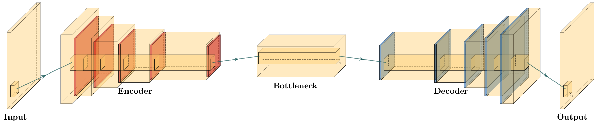

.. title: Complex-valued Neural Networks
.. slug: complex-valued-neural-networks
.. date: 2021-01-15 13:34:27 UTC
.. tags:
.. category:
.. link:
.. description:
.. type: text
.. has_math: yes
.. _sec:complex:

+----------+-----------+------------------------------------------------+
| |image9| | |image10| | |image11|                                      |
+----------+-----------+------------------------------------------------+
|   `Dramsch, J. S. <https://orcid.org/0000-0001-8273-905X>`__,         |
|   `Lüthje, M. <https://orcid.org/0000-0003-2715-1653>`__, &           |
|   `Christensen, A. N. <https://orcid.org/0000-0002-3668-3128>`__      |
|   (2019). Complex-valued neural networks for machine learning on      |
|   non-stationary physical data. arXiv preprint                        |
|   arXiv:`1905.12321 <https://arxiv.org/abs/1905.12321>`__.            |
+-----------------------------------------------------------------------+
| Github: https://github.com/JesperDramsch/Complex-CNN-Seismic          |
+-----------------------------------------------------------------------+

-----------

In the paper (Jesper Sören Dramsch, Lüthje, and Christensen 2019) I
explore complex-valued deep convolutional networks to show that phase
content in non-stationary data improves generalization of convolutional neural networks. This
work implements self-supervised aes that compress the data and measure
the reconstruction of the seismic data.

Four different deep convolutional aes are constructed. Two aes are
real-valued and two aes are complex-valued. The complex-valued convolutional neural network is
implemented as two real-valued feature maps, one for the real component
:math:`a` and one for the complex component :math:`b` each, which are
combined into a complex-valued number with :math:`a + b\text{i}`. The
complex convolution is then implemented explicitly in the calculation to
avoid some drawbacks of using complex numbers by a computer. However,
matching the networks proved to be a complicated task with regard to the
number of parameters. This led to building four different architectures
that get progressively bigger and compare the results.

This study implements aes to increase the validity of this experiment.
While vaes have shown better performance on reconstruction tasks, it
would also introduce more variability in the network to control for.
Considering that asi is a fairly new discipline, it is difficult to
disambiguate effects on misclassification. These effects include
erroneous labels, the difficulty of the task of asi, as well as the
choice of architecture.

Therefore, this leads us to the decision to inspect the reconstructed
seismic data numerically. Signal analysis is well-explored in the
seismic data processing. Moreover, this enables analysing the result in
the fk-domain providing additional insight to the denoising effect of
the aes. Overall, the complex-valued networks result in smaller networks
compared to a larger real-valued network achieving comparable
reconstruction error.

.. _sec:complexpaper:

Journal Paper: Complex-valued neural networks for machine learning on non-stationary physical data
--------------------------------------------------------------------------------------------------

.. _introduction-2:

Introduction
~~~~~~~~~~~~

Seismic data has its caveats due to the complicated nature of
bandwidth-limited wave-based imaging. Common problems are cycle-skipping
of wavelets and nullspaces in inversion problems (Özdoğan Yilmaz 2001).
Automatic seismic interpretation is complicated, as the modelling of
seismic data is computationally expensive and often proprietary. Seismic
field data is often not available and their interpretation is highly
subjective and ground truth is not available. The lack of training data
has been delaying the adoption of existing methods and hindering the
development of specific geophysical deep learning methods. Incorporating
domain knowledge into general deep learning models has been successful
in other fields (Paganini, Oliveira, and Nachman 2017).

The state-of-the-art method has been an iterative windowed Fourier
transform for phase reconstruction (Griffin and Lim 1984). Modern neural
audio synthesis focuses on methods that do not require explicit
reconstruction of the phase (Mehri et al. 2016; Oord et al. 2016, 2017;
Prenger, Valle, and Catanzaro 2018). Mehri et al. (2016) introduced a
recurrent neural network formulation, where Oord et al. (2016)
reformulated the network for audio synthesis in a strided convolutional
network. The original WaveNet formulation in Oord et al. (2016) is slow
due to the autoregressive filter, warranting the parallel formulation in
Oord et al. (2017).

We explicitly incorporate phase information in a deep convolutional
neural network. These have been heavily explored in the digital signal
processing community, before the recent renaissance of neural networks
and deep learning. Relevant examples to seismic data processing include
source separation (Scarpiniti et al. 2008), adaptive noise reduction
(Suksmono and Hirose 2002), and optical flow (Miyauchi et al. 1993) with
complex-valued neural networks. Sarroff (2018) gives a comprehensive
overview of applications of complex-valued neural networks in signal and
image processing.

In this work, we evaluate the reconstruction error after compression in
an autoencoder to test how reliable information can be contained within
a network with and without explicit phase information. This insight can
be transferred to the aforementioned applications that benefit from an
increase in information recovery. We calculate the complex-valued
seismic trace by applying the Hilbert transform to each trace. Phase
information has been shown to be valuable in the processing (Liner 2002)
and interpretation of seismic data (Rocky Roden and Sepúlveda 1999;
Mavko, Mukerji, and Dvorkin 2003). Steve Purves (2014) provides a
tutorial that shows the implementation details of Hilbert transforms.

In this paper we give a brief overview of convolutional neural networks
and then introduce the extension to complex neural networks and seismic
data. We show that including explicit phase information provides
superior results to real-valued convolutional neural networks for
seismic data. Difficult areas that contain seismic discontinuities due
to geologic faulting are resolved better without leakage of seismic
horizons. We train and evaluate several complex-valued and real-valued
autoencoders to show and compare these properties. These results can be
directly extended to automatic seismic interpretation problems.

Complex Convolutional Neural Networks
~~~~~~~~~~~~~~~~~~~~~~~~~~~~~~~~~~~~~

Basic principles
^^^^^^^^^^^^^^^^

Convolutional neural networks (Y. LeCun et al. 1999) use multiple layers
of convolution and subsampling to extract relevant information from the
data (see `Figure 5.1 <#complex-fig-3>`__)

The input image is repeatedly convolved with filters and subsampled.
This creates many, but smaller and smaller images. For a classification
task, the final step is then a weighting of these very small images
leading to a decision about what was in the original image. The filters
are learned as part of the training process by exposing the network to
training images. The salient point is, that the convolution kernels are
learned based on the training. If the goal is - for example - to
classify geological facies, the convolutional kernels will learn to
extract information from the input, that helps with that task. It is
thus a very strong methodology, that can be adapted to many tasks.

.. _complex-fix-3:

.. list-table::
   :width: 100%
   :class: borderless

   * - .. image:: ../images/real.png
          :width: 100%
          :name: complex-fig-real

       (a) Real Neural Network

     - .. image:: ../images/cmplx.png
          :width: 100%
          :name: complex-fix-cmplx

       (b) Complex Neural Network

Figure 5.1: Schematic of equivalent real- and complex-valued convolutional neural networks.
Yellow is the input image data and purple shows the 3 × 3 convolutional filters.
In (a) the input image is convolved with filters. This results in several smaller outputs.
The process is repeated, resulting in more outputs even further reduced in size. In (b) we
present the complex-valued network. We start with a complex valued input represented
by two layers, namely the real-valued a and complex-valued b complement in a+ib. The
complex information is propagated through the network by keeping - in each step - the
real and complex information in different layers after convolution with complex-valued
filters.

.. _sec:conv:

Real- and Complex-valued Convolution
^^^^^^^^^^^^^^^^^^^^^^^^^^^^^^^^^^^^

Convolution is an operation on two signals f and g or a signal and a
filter that produce a third signal, containing information from both of
the inputs. An example is the moving average filter, which smoothes the
input, acting as a low-pass filter. Convolution is defined as

.. math:: f(t)*g(t)=\int_{-\infty}^\infty f(\tau)g(t-\tau)d\tau,

at the location :math:`\tau`. While often applied to real value signals,
convolution can be used on complex signals. For the integral to exist
both :math:`f` and :math:`g` must decay when approaching infinity.
Convolution is directly generalizable to N-dimensions by multiple
integrations and maintains commutativity, distributivity, and
associativity. In digital signals this extends to discrete values by
replacing the integration with summation.

.. _complex-convolutional-neural-networks-1:

Complex Convolutional Neural Networks
^^^^^^^^^^^^^^^^^^^^^^^^^^^^^^^^^^^^^

  Implementation details of Complex Convolution (Courtesy Trabelsi et al. (2017))

Complex convolutional networks provide the benefit of explicitly
modelling the phase space of physical systems (Trabelsi et al. 2017).
Unfortunately it is not possible to feed complex numbers directly to a
CNN, as they are not supported by any of the standard implementations
(PyTorch or Tensorflow). Instead, we can represent them in another form.
The complex convolution introduced in Section `3.1.2.2 <#sec:conv>`__,
can be explicitly implemented as convolutions of the real and complex
components of both kernels and the data. A complex-valued data matrix in
cartesian notation is defined as :math:`\textbf{M} = M_\Re + i M_\Im`
and equally, the complex-valued convolutional kernel is defined as
:math:`\textbf{K} = K_\Re + i K_\Im`. The individual coefficients
:math:`(M_\Re, M_\Im, K_\Re, K_\Im)` are real-valued matrices,
considering vectors are special cases of matrices with one of two
dimensions being one.

Solving the convolution of

.. math:: M' = K * M = (M_\Re + i M_\Im) * (K_\Re + i K_\Im),

we can apply the distributivity of convolutions
(cf. section `5.1.2.2 <#sec:conv>`__) to obtain

.. math:: M' =  \{M_\Re * K_\Re - M_\Im * K_\Im\} + i \{ M_\Re * K_\Im + M_\Im * K_\Re\},

where :math:`K` is the Kernel and :math:`M` is a data vector (see
`Figure 5.1 <#complex-fig-4>`__).

We can reformulate this in algebraic notation

.. math:: \begin{bmatrix} \Re\{M * K\} \\ \Im\{M * K\} \end{bmatrix} = \begin{bmatrix} K_{\Re} & -K_{\Im} \\ K_{\Im} & K_{\Re} \end{bmatrix} * \begin{bmatrix}  M_{\Re} \\ M_{\Im} \end{bmatrix}

Complex convolutional neural networks learn by back-propagation.
Sarroff, Shepardson, and Casey (2015) state that the activation
functions, as well as the loss function must be complex differentiable
(holomorphic). Trabelsi et al. (2017) suggest that employing complex
losses and activation functions is valid for speed, however, refers that
Hirose and Yoshida (2012) show that complex-valued networks can be
optimized individually with real-valued loss functions and contain
piecewise real-valued activations. We reimplement the code Trabelsi et
al. (2017) provides in keras (Chollet and others 2015a) with tensorflow
(Abadi et al. 2015a), which provides convenience functions implementing
a multitude of real-valued loss functions and activations.

While common up- and downsampling functions like MaxPooling, UpSampling,
or striding do not suffer from complex-valued neural networks, batch
normalization (BN) (Ioffe and Szegedy 2015) does. Real-valued batch
normalization normalizes the data to zero mean and a standard deviation
of 1. This does not guarantee normalization in complex values. Trabelsi
et al. (2017) suggest implementing a 2D whitening operation as
normalization in the following way.

.. math:: \widetilde{x} = V^{-\frac{1}{2}} ( x - \mathbb{E}[x] ),

where :math:`x` is the data and :math:`V` is the 2x2 covariance matrix,
with the covariance matrix being

.. math:: V = \begin{bmatrix} V_{\Re\Re} & V_{\Re\Im} \\ V_{\Im\Re} & V_{\Im\Im} \end{bmatrix}

Effectively, this multiplies the inverse of the square root of the
covariance matrix with the zero-centred data. This scales the covariance
of the components instead of the variance of the data (Trabelsi et al.
2017).

Autoencoders
^^^^^^^^^^^^

   low dimensional bottleneck, and then reconstructed. In the encoder
   convolutional layers (yellow) are followed by a down-sampling
   operation (red) to reduce the spatial extend of the input image. The
   bottleneck contains a lower-dimensional compressed representation of
   the input. The decoder contains upsampling operations (blue) followed
   by convolutional layers symmetrical to the encoder. Alternatively,
   the encoder is sometimes made up of transpose convolutions.
  :name: complex-fig-autoencoder

  Typical autoencoder architecture. The data is compressed to a low
  dimensional bottleneck, and then reconstructed. In the encoder
  convolutional layers (yellow) are followed by a down-sampling
  operation (red) to reduce the spatial extend of the input image. The
  bottleneck contains a lower-dimensional compressed representation of
  the input. The decoder contains upsampling operations (blue) followed
  by convolutional layers symmetrical to the encoder. Alternatively,
  the encoder is sometimes made up of transpose convolutions.

Autoencoders (Hinton and Salakhutdinov 2006) are a special configuration
of the encoder-decoder network that map data to a low-level
representation and back to the original data. This low-level
representation - the latent space - is often called bottleneck or code
layer. Autoencoder networks map :math:`f(x) = x`, where :math:`x` is the
data and :math:`f` is an arbitrary network. The architecture of
autoencoders is an example of lossy compression and recovery from the
lossy representation. Commonly, recovered data is blurred by this
process.

The principle is illustrated in
`Figure 5.2 <#complex-fig-autoencoder>`__. The input is transformed to
a low-dimensional representation - called a code or latent space - and
then reconstructed again from this low dimensional representation. The
intuition is, that the network has to extract the most salient parts
from the data, to be able to perform a reconstruction. As opposed to
other methods for dimensionality reduction - e.g. principal component
analysis - an autoencoder can find a non-linear representation of the
data. The low-dimensional representation can then be used for anomaly
detection, or classification.

Aliasing in Patch-based training
~~~~~~~~~~~~~~~~~~~~~~~~~~~~~~~~

Mean-Shift in Neural Networks
^^^^^^^^^^^^^^^^^^^^^^^^^^^^^

A single neuron in a neural network can be described by
:math:`\sigma ( w \cdot x + b )`, where :math:`w` is the network
weights, :math:`x` is the input data, :math:`b` is the network bias, and
:math:`\sigma` is a non-linear activation function. During training, the
network weights :math:`w` and biases :math:`b` are are adjusted to a
value that represents the training minimum. Learning on a mean-shift of
:math:`q` of an arbitrary distribution over :math:`x` leads to
:math:`\sigma( w \cdot (x + q) + b )`, which increases the neuron
response by :math:`q`, weighted by :math:`w`. During inference, both
:math:`w` and :math:`b` are fixed, by extension the mean-shift :math:`q`
is fixed as well. The mean-shift over larger inference data disappears,
introducing an additional bias of :math:`w \cdot q` before non-linear
activation. This training bias may lead to prediction errors of the
neuron and consequently the full neural network.

Windowed Aliasing
^^^^^^^^^^^^^^^^^

Non-stationary data such as seismic data can contain sections within the
data that contain spurious offsets from the mean.
`Figure 5.3 <#complex-fig-aliasing>`__ shows varying sizes of cutouts,
with 101 and 256 samples respectively. In the middle, the full
normalised amplitude spectra are presented. On the right, the
corresponding phase spectra are presented. On the left, we focus on the
frequency content of the amplitude spectra around 0 Hz. The cutouts were
Hanning tapered, however, a mean shift appears for any patch size.

These concepts of mean-shift corresponds to a DC offset in spectral
data, which can be audio, seismic or electrical data. In images this
corresponds to a non-zero alpha channel. While batch normalization can
correct the mean shift in individual mini-batches (Ioffe and Szegedy
2015), this may shift the entire spectrum by the aliased offset.
Additionally, batch normalization may not be feasible in some physical
applications pertaining to regression tasks.

   Jesper Sören Dramsch and Lüthje (2018d)). The true amplitude spectrum
   (green) is 0 at a frequency of 0 Hz, whereas windows of the data
   experience low-frequency aliasing that introduce a non-zero offset at
   0 Hz analogous to the Nyquist-Shannon theorem for high frequencies.
  :name: complex-fig-aliasing

  Spectral aliasing dependent on window-size (modified from Jesper
  Sören Dramsch and Lüthje (2018d)). The true amplitude spectrum
  (green) is 0 at a frequency of 0 Hz, whereas windows of the data
  experience low-frequency aliasing that introduce a non-zero offset at
  0 Hz analogous to the Nyquist-Shannon theorem for high frequencies.

Complex Seismic Data
~~~~~~~~~~~~~~~~~~~~

Complex seismic traces are calculated by applying the Hilbert transform
to the real-valued signal. The Hilbert transform applies a convolution
with to the signal, which is equivalent to a -90-degree phase rotation.
It is essential that the signal does not contain a DC component, as this
would not have a phase rotation.

The Hilbert transform is defined as

.. math:: H(u)(t) = \frac{1}{\pi}\int_{-\infty}^\infty \frac{u(\tau)}{t-\tau}\,d\tau,

of a real-valued time series :math:`u(t)`, where the improper integral
has to be interpreted as the Cauchy principal value. In the Fourier
domain, the Hilbert transform has a convenient formulation, where
frequencies are set zero and the remaining frequencies are multiplied by
2. This can be written as

.. math:: x_a = F^{-1}(F(x) 2U ) = x + iy

where :math:`x_a` is the analytical signal, :math:`x` is the real
signal, :math:`F` is the Fourier transform, and :math:`U` is the step
function. The imaginary component :math:`y` is simultaneously the
quadrature of the real-valued trace. This provides locality to explicit
phase information, where the Fourier transform itself does not lend
itself to the resolution of the phase in the time domain. In
conventional seismic trace analysis, the complex data is used to
calculate the instantaneous amplitude and instantaneous frequency. These
are beneficial seismic attributes for interpretation (Barnes 2007).

Experiments
~~~~~~~~~~~

Data
^^^^

The data is the F3 seismic data, acquired in the Dutch North Sea in 1987
over an area of 375.31 km\ :sup:`2`. The sampling-rates are 4 ms in time
and inline/crossline bins of 25 m. The extent being 650 inline traces
and 950 crossline traces with a total length of 1.848 s. The data
contains faulted reflector packets, of which the lowest one overlays a
salt diapir. The data contains some noise that masks lower-amplitude
events.

We generate 2D patches of size 64x64 in the inline and crossline
direction from the 3D volume to train our network. We obtain inline and
crossline 64x64 patches that are taken overlapping with a stride of 8
samples. The total amount of data is 188736 patches with 141552 for
training and 47184 for validation in a 75/25 train-validation split. The
test data is the holdout Alaudah et al. (2019) stored in test_once. The
seismic data is normalized to values in the range of [-1, 1]. To obtain
complex-valued seismic data we apply a Hilbert transform to every trace
of the data and subtract the real-valued seismic from the real component
as laid out in Taner, Koehler, and Sheriff (1979).

Architecture
^^^^^^^^^^^^

.. container::
   :name: tab-1

   .. table:: Layers used in the four autoencoders and according
    parameter count on the computational graph for complex-valued
    convolutions and real-valued convolutions respectively. The spatial
    extents in X and Y per layer are kept constant across all networks,
    varying the amount of filters. The compression is calculated by
    number comparing the total input parameters to the bottleneck
    parameters.

    +---------+---------+----+---------+---------+---------+---------+
    | Layer   | Spatial |    | Complex | Real    | Complex | Real    |
    +---------+---------+----+---------+---------+---------+---------+
    | (Size)  | X       | Y  | Small   | Small   | Large   | Large   |
    +---------+---------+----+---------+---------+---------+---------+
    | Input   | 64      | 64 | 2       | 1       | 2       | 1       |
    +---------+---------+----+---------+---------+---------+---------+
    | CConv2D | 64      | 64 | 8       | 8       | 16      | 16      |
    +---------+---------+----+---------+---------+---------+---------+
    | CConv2D | 64      | 64 | 8       | 8       | 16      | 16      |
    | + BN    |         |    |         |         |         |         |
    +---------+---------+----+---------+---------+---------+---------+
    | Pool +  | 32      | 32 | 16      | 16      | 32      | 32      |
    | CConv2D |         |    |         |         |         |         |
    | + BN    |         |    |         |         |         |         |
    +---------+---------+----+---------+---------+---------+---------+
    | Pool +  | 16      | 16 | 32      | 32      | 64      | 64      |
    | CConv2D |         |    |         |         |         |         |
    | + BN    |         |    |         |         |         |         |
    +---------+---------+----+---------+---------+---------+---------+
    | Pool +  | 8       | 8  | 64      | 64      | 128     | 128     |
    | CConv2D |         |    |         |         |         |         |
    | + BN    |         |    |         |         |         |         |
    +---------+---------+----+---------+---------+---------+---------+
    | Pool +  | 4       | 4  | 128     | 128     | 256     | 256     |
    | CConv2D |         |    |         |         |         |         |
    +---------+---------+----+---------+---------+---------+---------+
    | Up +    | 8       | 8  | 64      | 64      | 128     | 128     |
    | CConv2D |         |    |         |         |         |         |
    | + BN    |         |    |         |         |         |         |
    +---------+---------+----+---------+---------+---------+---------+
    | Up +    | 16      | 16 | 32      | 32      | 64      | 64      |
    | CConv2D |         |    |         |         |         |         |
    | + BN    |         |    |         |         |         |         |
    +---------+---------+----+---------+---------+---------+---------+
    | Up +    | 32      | 32 | 16      | 16      | 32      | 32      |
    | CConv2D |         |    |         |         |         |         |
    | + BN    |         |    |         |         |         |         |
    +---------+---------+----+---------+---------+---------+---------+
    | Up +    | 64      | 64 | 8       | 8       | 16      | 16      |
    | CConv2D |         |    |         |         |         |         |
    +---------+---------+----+---------+---------+---------+---------+
    | CConv2D | 64      | 64 | 8       | 8       | 16      | 16      |
    +---------+---------+----+---------+---------+---------+---------+
    | CConv2D | 64      | 64 | 2       | 1       | 2       | 1       |
    +---------+---------+----+---------+---------+---------+---------+
    | Par     |         |    | 100,226 | 198,001 | 397,442 | 790,945 |
    | ameters |         |    |         |         |         |         |
    | on      |         |    |         |         |         |         |
    | Graph   |         |    |         |         |         |         |
    +---------+---------+----+---------+---------+---------+---------+
    | Comp    |         |    | 4:1     | 2:1     | 2:1     | 1:1     |
    | ression |         |    |         |         |         |         |
    | Ratio   |         |    |         |         |         |         |
    +---------+---------+----+---------+---------+---------+---------+
    | Size on |         |    | 1.4     | 2.5     | 4.8     | 9.2     |
    | Disk    |         |    |         |         |         |         |
    | [MB]    |         |    |         |         |         |         |
    +---------+---------+----+---------+---------+---------+---------+

The autoencoder architecture compresses the input data to a lower
dimensional representation, i.e. bottleneck
(cf. `Figure 5.2 <#complex-fig-autoencoder>`__), with an encoder
network and reconstruct the input data from the bottleneck with a
decoder network. It is common that the encoder and decoder networks are
formulated symmetrically, as we have done in this paper. We reduce a
64x64 input 4 times by a factor of two spatially to encode a 4x4
encoding layer. We define varying amounts of filters during the
downsampling steps and in the code layer to achieve varying amounts of
compression shown in `Table 5.1 <#tab-1>`__. The architecture for the
complex convolutional network is identical to the real network, except
for replacing the real-valued 2D convolutions with complex-valued
convolutions represented by two feature maps instead of one. The layers
for each network are shown in `Table 5.1 <#tab-1>`__ with additional
values, including learnable parameters counted on the computational
graph, compression ratio, and size on disk. In total four network
architectures are presented, two real-valued and complex-valued networks
each matched in the number of feature maps, resulting in different
amounts of parameters and compression ratio. The parameters are counted
on the computational graph compiled by Tensorflow.

The neural networks specifically use 2D convolutions with 3x3 kernels.
We employ batch normalization to regularize and speed up training (Ioffe
and Szegedy 2015). The down and up sampling is achieved by MaxPooling
and the UpSampling operation respectively.

Complex-valued neural networks contain two feature maps for every
feature map contained in a real-valued network. Conceptually, this is
equivalent to :math:`a + \text{i}b`, with :math:`b=0` for the
real-valued network. The information in the complex complement for these
two feature maps is derived from the input data using the Hilbert
transform. Following the argument of deep learning, this input could be
derived from a neural network directly and should not provide an
improvement to the networks reconstruction error. We define a
complex-valued network that has the same number of filters as the
real-valued network in both the "small" and "large" formulation in
`Table 5.1 <#tab-1>`__. This network effectively has half the available
feature maps for the real-valued seismic input, as the other half is
used for the complex-valued information. That means the smaller
real-valued network contains as many feature maps for the real-valued
seismic as the large complex network, the large real-valued network
contains an additional feature map for every real-valued input for the
complex component.

Training
^^^^^^^^

We train the networks with an Adam optimizer (Diederik P. Kingma and Ba
2014) and a learning rate of :math:`10^{-3}` without decay, for 100
epochs. The loss function is mean squared error, as the seismic data
contains values in the range of [-1,1]. All networks reach stable
convergence without overfitting, shown in
`Figure 5.4 <#complex-fig-loss>`__.

   (Real-valued loss on real-valued seismic and combined complex-valued
   loss on complex-valued seismic, as the network "sees" it.)
  :name: complex-fig-loss

  Validation Loss (MSE) on 7 random seeds per network. (Real-valued
  loss on real-valued seismic and combined complex-valued loss on
  complex-valued seismic, as the network "sees" it.)

Evaluation
^^^^^^^^^^

We compare the complex autoencoders with the real-valued autoencoders,
through the reconstruction error on unseen test data on 7 individual
realizations of the respective four networks and qualitative analysis of
reconstructed images. We focus on evaluating the real-valued
reconstruction of the seismic data for both networks.

.. _results-1:

Results
~~~~~~~

We trained four neural network autoencoders with seven random
initializations for each network, to allow for error bars on the
estimates in `Figure 5.4 <#complex-fig-loss>`__. The mean squared error
and the mean absolute error for each parameter configuration during
training is given in `Table 5.2 <#tab-2>`__. There is a clear
correspondence of the reconstruction error of the autoencoder to the
size of network. The real-valued networks outperform the complex-valued
networks in both the mean squared error and mean absolute error,
however, we see that a real-valued network needs around twice as many
parameters as a complex-valued network to attain the same reconstruction
errors.

   chose the "top" section for it’s faulted chaotic texture, "bottom"
   for the faulted blocks, and "silent" for a noisy but geologically
   uninteresting section.
  :name: complex-fig-eval-seis
  :width: 120.0%

  Seismic Test Data with marked section for closer inspection. We chose
  the "top" section for it’s faulted chaotic texture, "bottom" for the
  faulted blocks, and "silent" for a noisy but geologically
  uninteresting section.

|

.. container::
   :name: tab-2

   .. table:: Compression, parameters and errors for networks (lower is better). Losses on network validation. The complex-valued networks achieve similar reconstruction errors at twice the compression values.

      +-------------+-------------+------------+---------------+---------------+
      | Network     | Compression | Parameters | MSE [x10^-2]  | MAE [x10^-2]  |
      +=============+=============+============+===============+===============+
      | 1) C_small  | 4:1         | 100,226    | 0.484 ± 0.013 | 4.695 ± 0.058 |
      +-------------+-------------+------------+---------------+---------------+
      | 2) R_small  | 2:1         | 198,001    | 0.436 ± 0.006 | 4.500 ± 0.028 |
      +-------------+-------------+------------+---------------+---------------+
      | 3) C_big    | 2:1         | 397,442    | 0.227 ± 0.003 | 3.247 ± 0.025 |
      +-------------+-------------+------------+---------------+---------------+
      | 4) R_big    | 1:1         | 790,945    | 0.196 ± 0.002 | 3.050 ± 0.013 |
      +-------------+-------------+------------+---------------+---------------+

The seismic sections in `Figure 5.5 <#complex-fig-eval-seis>`__ show
the unseen test seismic section. We perform a closer inspection of the
regions "top" and "bottom" to focus on geologically relevant sections in
the reconstruction process. The noisy segment without strong reflectors
is a good baseline to evaluate the noise reduction of the autoencoder
and the behaviour of the different networks on low amplitude data.
Overall, all networks denoise the original seismic, with the lowest
reconstruction errors being root-mean-squared (RMS) of 0.1187 and MAE of
0.0947 (cf. `Table 5.3 <#tab-errors>`__).
`Figure 5.7 <#complex-fig-silent-fk>`__ shows the
frequency-wavenumber (FK) of the ground truth
(`Figure 5.7 (a) <#complex-fig-silent-fk>`__ ) and the large
complex network reconstruction
(`Figure 5.7 (b) <#complex-fig-silent-fk>`__ ). These show a
decrease in the 0 - 60 Hz band for larger absolute wavenumbers.

|

.. container::
   :name: tab-errors

   .. table:: RMS and MAE on real component of Data Patches.

      +---------+--------+--------+--------+--------+--------+--------+--------+--------+
      |         | Full            | Silent          |  Top            | Bottom          |
      |         |                 |                 |                 |                 |
      +---------+--------+--------+--------+--------+--------+--------+--------+--------+
      | Network | RMS    | MAE    | RMS    | MAE    | RMS    | MAE    | RMS    | MAE    |
      +---------+--------+--------+--------+--------+--------+--------+--------+--------+
      | C_small | 0.1549 | 0.1145 | 0.1265 | 0.1010 | 0.2315 | 0.1759 | 0.1588 | 0.1200 |
      +---------+--------+--------+--------+--------+--------+--------+--------+--------+
      | R_small | 0.1581 | 0.1153 | 0.1247 | 0.0994 | 0.2395 | 0.1810 | 0.1612 | 0.1205 |
      +---------+--------+--------+--------+--------+--------+--------+--------+--------+
      | C_big   | 0.1508 | 0.1101 | 0.1187 | 0.0947 | 0.2301 | 0.1747 | 0.1514 | 0.1135 |
      +---------+--------+--------+--------+--------+--------+--------+--------+--------+
      | R_big   | 0.1469 | 0.1072 | 0.1214 | 0.0967 | 0.2222 | 0.1679 | 0.1459 | 0.1088 |
      +---------+--------+--------+--------+--------+--------+--------+--------+--------+

.. _complex-fig-silent-fk:

.. list-table::
   :width: 100%
   :class: borderless

   * - .. image:: ../images/silent_fk_truth.png
         :width: 100%
         :alt: FK transform of Ground Truth data
         :align: center

       (a) Ground Truth

     - .. image:: ../images/silent_fk_big_complex.png
         :width: 100%
         :alt: FK transform of Large Complex Network data
         :align: center

       (b) Large Complex Network

Figure 5.7: Evaluation on Silent Noise Patch in FK Domain. Noise reduction of frequencies below 50~Hz apparent, while reconstruction does not introduce visible aliasing.

"Top" seismic section
^^^^^^^^^^^^^^^^^^^^^

The "top" segment contains strong reflections that are very faulted with
strong reflectors. `Figure 5.8 <#complex-fig-top>`__ shows
the top segment and the reconstructions of the four networks. All
networks display various amounts of smoothing. The quantitative results
show that the complex networks perform very similar regardless of size.
The large real-valued network outperforms the complex networks by 2.5 %
on RMS, while the small real-valued network underperforms by 2.5 % on
RMS. The panel in `Figure 5.8 (c) <#complex-fig-top-sr>`__
shows a very smooth result. Despite the close score of the complex
networks, it appears that the complex-valued network restores more
high-frequency content. We can also see less smearing of discontinuities
in the larger complex network, particularly visible in the lower part
(1.2 s) at 6000 m offset, which is smeared to appear like a diffraction
in the smaller network. The large real-valued network shows good
reconstruction with minor smearing with higher amplitude fidelity in
areas like 1.1 s at 2000 m, however, some of the steeply dipping
artifacts are visible below the reflector packet between 0 m and 2000 m
offset.

.. _complex-fig-top:

.. list-table::
    :width: 100%
    :class: borderless

    * - .. image:: ../images/top_truth.png
          :width: 100%
          :alt: Ground Truth
          :align: center
          :name: complex-fig-top-truth

        (a) Ground Truth

      -

    * - .. image:: ../images/top_small_complex.png
          :width: 100%
          :alt: Small Complex Network top Patch
          :align: center
          :name: complex-fig-top-sc

        (b) Small Complex Network

      - .. image:: ../images/top_small_real.png
          :width: 100%
          :alt: Small Real Network top Patch
          :align: center
          :name: complex-fig-top-sr

        (c) Small Real Network

    * - .. image:: ../images/top_big_complex.png
          :width: 100%
          :alt: Large Complex Network top Patch
          :align: center
          :name: complex-fig-top-bc

        (d) Large Complex Network

      - .. image:: ../images/top_big_real.png
          :width: 100%
          :alt: Large Real Network top Patch
          :align: center
          :name: complex-fig-top-br

        (e) Large Real Network

Figure 5.8: Evaluation on Top Noise Patch. Data is normalized between -1 and 1.

"Bottom" seismic section
^^^^^^^^^^^^^^^^^^^^^^^^

The data marked as "bottom" in `Figure 5.5 <#complex-fig-eval-seis>`__
contains a faulted anticline and relatively strong noise levels. The
small complex network in
`Figure 5.9 (d) <#complex-fig-bottom-sc>`__ reconstructs
a denoised image with good reconstruction of the visible
discontinuities. Some leakage of the reflector starting at 1.5 s across
discontinuities is visible. The real small network in
`Figure 5.9(c) <#complex-fig-bottom-sr>`__ reconstructs
a strongly smoothed image, with some ringing below the main reflector,
which is not visible in the other reconstructions. The dipping reflector
at an offset of 16000 m is well reconstructed, however, it seems like
the reconstruction introduced ringing noise over the vertical image. The
large real-valued network in
`Figure 5.9 (e) <#complex-fig-bottom-br>`__ performs
best quantitatively (cf. `Table 5.3 <#tab-errors>`__). The
complex-valued large network in
`Figure 5.9 (d) <#complex-fig-bottom-bc>`__ does a
fairly good job at reconstructing the image, similar to the large
real-valued network. However, the amplitude reconstruction of
high-amplitude events particularly in the main reflector around 1.5 s is
showing.

.. _complex-fig-bottom:

.. list-table::
    :width: 100%
    :class: borderless

    * - .. image:: ../images/bottom_truth.png
          :width: 100%
          :alt: Ground Truth
          :align: center
          :name: complex-fig-bottom-truth

        (a) Ground Truth

      -

    * - .. image:: ../images/bottom_small_complex.png
          :width: 100%
          :alt: Small Complex Network bottom Patch
          :align: center
          :name: complex-fig-bottom-sc

        (b) Small Complex Network

      - .. image:: ../images/bottom_small_real.png
          :width: 100%
          :alt: Small Real Network bottom Patch
          :align: center
          :name: complex-fig-bottom-sr

        (c) Small Real Network

    * - .. image:: ../images/bottom_big_complex.png
          :width: 100%
          :alt: Large Complex Network bottom Patch
          :align: center
          :name: complex-fig-bottom-bc

        (d) Large Complex Network

      - .. image:: ../images/bottom_big_real.png
          :width: 100%
          :alt: Large Real Network bottom Patch
          :align: center
          :name: complex-fig-bottom-br

        (e) Large Real Network

Figure 5.9: Evaluation on Bottom Noise Patch. Data is normalized between -1 and 1.

Full seismic test data
^^^^^^^^^^^^^^^^^^^^^^

It is evident, that the small real-valued network does not match the
performance of the smaller complex-valued network, even less so when
compared to the large complex-valued network. We therefore compare the
large networks on the full seismic data.

.. _complex-fig-full-fk:

.. list-table::
    :width: 100%
    :class: borderless

    * - .. image:: ../images/full_fk_truth.png
          :width: 100%
          :alt: Ground Truth
          :align: center
          :name: complex-fig-full-truth-fk

        (a) Ground Truth

      - .. image:: ../images/full_fk_big_complex.png
          :width: 100%
          :alt: Large Complex Network
          :align: center
          :name: complex-fig-full-bc-fk

        (b) Large Complex Network

      - .. image:: ../images/full_fk_big_real.png
          :width: 100%
          :alt: Large Real Network
          :align: center
          :name: complex-fig-full-br-fk

        (c) Large Real Network

Figure 5.10: FK domain of full seismic data.

Overall, both networks return a smoothed image. The findings for the
strongly faulted sections in the "top" panel hold across the entire
faulted area around 1.1 s in
`Figure 5.11 <#complex-fig-full>`__. The complex-valued
network does a better job at reconstructing faults and discontinuities.
The real-valued network is better at reconstructing high-amplitude
regions that appear dimmer in the complex-valued region. The
reconstruction of both networks seems adequately close to the ground
truth, with differences in the details. Quantitatively, the real-valued
network does the better reconstruction in `Table 5.3 <#tab-errors>`__
with an improvement of 2.5 % over the large complex-valued network. The
FK domain shows a very similar reduction in noise in the sub 50 Hz band
in `Figure 5.10 <#complex-fig-full-fk>`__. All networks
introduce an increase of energy across all frequencies at wave-number
:math:`k=0~km^{-1}`. Additionally, a dimming of the frequencies around
:math:`k=2.5~km^{-1}` appears in all reconstructions, but is more
prominent in the large complex-valued network. The ground truth seismic
contains some scattered energy in the high-frequency mid-wavenumber
region, visible as "diagonal stripes". These were attenuated in the
complex-valued network in
`Figure 5.10 (b) <#complex-fig-full-bc-fk>`__, but are
partially present in the real-valued reconstruction in
`Figure 5.10 (c) <#complex-fig-full-br-fk>`__.

.. _complex-fig-full:

.. list-table::
    :width: 100%
    :class: borderless

    * - .. image:: ../images/full_truth.png
          :width: 100%
          :alt: Ground Truth
          :align: center
          :name: complex-fig-full-truth

        (a) Ground Truth

    * - .. image:: ../images/full_big_complex.png
          :width: 100%
          :alt: Large Complex Network
          :align: center
          :name: complex-fig-full-bc

        (b) Large Complex Network

    * - .. image:: ../images/full_big_real.png
          :width: 100%
          :alt: Large Real Network
          :align: center
          :name: complex-fig-full-br

        (c) Large Real Network

Figure 5.11: Evaluation on full seismic data. Data is normalized between -1 and 1.

Discussion
~~~~~~~~~~

We evaluated the outputs of the real-valued and complex-valued neural
networks. All autoencoder outputs are blurred to different degrees and
denoised. The denoising effect of the seismic was most visible in the
frequency band below 50 Hz. Additionally, some scattered high-frequency
energy was attenuated by the networks.

The largest differences of the outputs in real-valued and complex-valued
networks can be observed in discontinuous areas. Particularly, the
faulted blocks in the top quarter and in the bottom center of the
seismic section show inconsistencies. The real-valued network smooths
over discontinuities and steep reflectors. Fault lines are imaged better
in the complex-valued network output.

In seismic data processing, including phase information stabilizes
discontinuities and disambiguates cycle-skipping in horizons. This could
be observed in the network performance and reconstruction. The increase
in performance of the real-valued networks was significant (7.0 % RMS),
while the complex-valued networks already had an acceptable performance
on the smaller network architecture (2.6 % RMS). We provide the
complex-valued networks with a bias towards learning phase information,
by providing the Hilbert transformed analytical trace, while the
real-valued network needs to learn this information implicitly from the
data itself. Considering, that during the training, the complex network
evaluates both the real-valued seismic, which we primarily care about in
addition to the complex-valued component, we can see how the losses in
`Figure 5.4 <#complex-fig-loss>`__ differ from the real-valued
networks.

The largest network with 790,945 trainable parameters quantitatively
performed the best on the reconstruction of the data. However, analysis
of the reconstructed seismic shows, that while the high-amplitude
regions are reconstructed to higher fidelity, discontinuous sections may
be smeared by the real-valued network. The real-valued network that was
matched to contain as many filters for the real-valued component of the
seismic as the large complex-valued network, did not perform well.
Furthermore, the smaller complex-valued network with 100,226 parameters
that contains as many filter maps as the real-valued network in total,
and half the trainable parameters, outperformed the smaller real-valued
network across all test cases.

.. _conclusion-1:

Conclusion
~~~~~~~~~~

The inclusion of phase-information leads to a better representation of
seismic data in convolutional neural networks. Complex-valued networks
perform consistently, where real-valued networks have to learn
phase-representations through implicit correlation, which requires
larger networks. We show that complex trace information in deep neural
networks improves the imaging of discontinuities as well as steep
reflectors, particularly in chaotic seismic textures that are smoothed
by real-valued neural networks of the same size and level of
compression.

We show that convolutional neural networks can perform lossy compression
on seismic data, where the reconstruction error is dependent on both
network architecture and implementation details, like providing explicit
phase information. During this compression, noise and scattered energy
get attenuated. The real-valued network is prone to introduce steeply
dipping artifacts in the reconstruction and is matched by complex-valued
networks half the size with twice the amount of compression. This is
particularly interesting in the light of the complex complement of the
data being derived from the real-valued data through a Hilbert
transform, which should have been possible to approximate by a neural
network.

The stabilization of the reconstruction can be useful in other seismic
applications. While automatic seismic interpretation may benefit from
the inclusion of information on discontinuities, we see the main
application to be lossy seismic compression. The open source tool
developed to make this research possible, enables further research and
development of complex-valued solutions to non-stationary physics
problems that benefit from explicit phase information.

This research also shows that a change as small as 2.5 % in RMS can
change the reconstruction from being acceptable to very smeared to a
geoscientist. This touches on the fact that better metrics to evaluate
computer vision tasks in geoscience are necessary. Additionally, these
tasks have to be noise-robust and, while amplitude-preserving, be robust
against outliers. Moreover, more research in the frequency dimming of
bands in the network reconstruction is necessary.

Overall, the computational memory footprint of the complex convolution
is higher than real-valued convolutional neural networks comparing
singular convolutional operations. A significant increase in depth and
width of networks to obtain an acceptable result in real-valued neural
network to implicitly learn the phase information is necessary. The
complex-valued networks an 8\ :sup:`th` of the size already performs
well, suggesting that domains where a significant part pf the
information is in the phase of signals, could benefit from applying
complex convolutional networks.

.. _acknowledgments-1:

Acknowledgments
~~~~~~~~~~~~~~~

We thank Andrew Ferlitsch for his valuable insights. The research
leading to these results has received funding from the Danish
Hydrocarbon Research and Technology Centre under the Advanced Water
Flooding program. We thank DTU Compute for access to the GPU Cluster.

.. _contributions-of-this-study-3:

Contributions of this Study
---------------------------

This chapter and Jesper Sören Dramsch, Lüthje, and Christensen (2019)
investigate the application of complex trace analysis to convolutional neural networks. It uses
lossy compression to measure the reconstruction error and therefore, the
informational content in complex-valued neural networks. We were able to show that
networks containing phase information in the complex complement of data
reduce the error as compared to real-valued networks. Moreover, the code
to reproduce the findings in this paper (Jesper Sören Dramsch 2019b), as
well as, a standalone Python library for complex-valued convolutional neural networks in
tensorflow has been made available as foss (Jesper Sören Dramsch and
Contributors 2019).

.. |image9| image:: https://img.shields.io/badge/PDF-Download-important
   :target: ../2019.1.pdf
.. |image10| image:: https://img.shields.io/github/repo-size/JesperDramsch/Complex-CNN-Seismic
   :target: https://github.com/JesperDramsch/Complex-CNN-Seismic
.. |image11| image:: https://img.shields.io/badge/license-Apache--2.0-green
