.. title: Methods & Theory
.. slug: methods-theory
.. date: 2021-01-15 13:08:29 UTC
.. tags: 
.. category: 
.. link: 
.. description: 
.. type: text
.. has_math: yes
.. _sec:theory:

This thesis applies ml methods to 4D seismic data. In this chapter I
introduce 4D seismic concepts and the motivation to acquire and analyze
4D seismic data. I go on to introduce machine learning and review the
development of machine learning in itself and in the field of
geoscience. The focus on this thesis is on nns, particularly dl to
geophysical problems. Considering recent developments in computer
vision, a focus on cnns, the developments and break-throughs of this
type of nn and the innovations that lead to the recent adoption of ml in
geoscience are explored in a published book chapter, reprinted here.

4D seismic
----------

4D seismic is the analysis of seismic data that was acquired over the
same location after some calendar time has passed. The repeated imaging
of the same subsurface location highlights changes in the subsurface
that can lead to improved understanding of subsurface processes and
fluid movement. Exploration & Production companies, in particular, have
an interest in imaging hydrocarbon reservoirs (Johnston 2013b). However,
4D seismic imaging has broad applications for subsurface
characterization, such as observing volcanic activity (Londoño and
Kumagai 2018) or CO\ :sub:`2` sequestration monitoring (R. Arts et al.
2004).

The main applications of 4D seismic analysis, according to Özdoğan
Yilmaz (2003; Johnston 2013a) include:

-  Tracking fluid movement (steam, gas, and water)

-  Monitoring pressure depletion and validating depletion plans

-  Fault property estimation, i.e. sealing or leaking faults

-  Locating bypassed oil in heterogeneous reservoirs

-  Validating and updating geological and reservoir-simulation models

4D seismic data analysis suffers from the superposition of multiple
effects on seismic imaging. These effects include changes in the
acquisition equipment due to technological advances, changes in
acquisition geometry (source-receiver mismatch), as well as physical
changes in the subsurface (Özdoğan Yilmaz 2003; Johnston 2013b). These
physical changes are in part due to fluid movement in the subsurface
(David E. Lumley 1995b), as well as, geological changes due to
compaction and expansion (P. J. Hatchell, Bourne, and Netherlands.
2005). These geomechanical effects change the position of the
reflectors, the thickness of stratigraphy, and the physical properties
such as density and wave velocity (J. Herwanger 2015).

Successful 4D applications rely on careful acquisition planning, closely
matching the mismatch of the source (:math:`\Delta S`) and receiver
(:math:`\Delta R`). This awareness has generally improved the
repeatability of seismic acquisition; however, the nrms remains to be an
essential measure of noise sources that deteriorate the 4D seismic
analysis. Moreover, 4D seismic analysis has brought to light that some
3D seismic processing workflows are not as repeatable and
amplitude-preserving as they were thought to be (David E. Lumley 2001).
Modern processing flows include co-processing of the base and monitor
seismic volumes with specialized tools to reduce differences from
processing (Johnston 2013a).

The standard analysis tool in 4D seismic interpretation is amplitude
differences (Johnston 2013b). Differences can among others stem from
fluid movement or replacement, i.e. oil, gas, or brine, as well as,
changes in the rock matrix due to compaction, temperature changes, and
movement of injected CO\ :sub:`2` plumes. Usually, a simple difference
of the 3D seismic volumes will not yield satisfactory results due to
small-scale fluctuations in both arrival times and amplitudes, making
time-shift analysis a vital process to match the reflection events.
These time-shift values are a valuable source of information themselves
(S. A. Hall et al. 2002b; P. Hatchell, Bourne, and Netherlands 2005),
considering their sole dependence on wavefield kinematics, time shifts
tend to be a more robust measurement than amplitude differences
(Johnston 2013b).

Considering normal incidence on a horizontal layer of thickness
:math:`z` and a P-wave velocity :math:`v` with a traveltime :math:`t`,
we can express the changes in traveltime as:

.. math::

   \frac{\Delta t}{t} = \frac{\Delta z}{z} - \frac{\Delta v}{v},
       \label{eq:timestrain}

for homogeneous isotropic :math:`v` and small changes in :math:`z` and
:math:`v`. Originally developed in P. Hatchell, Bourne, and Netherlands
(2005), with a rigorous integral derivation presented in MacBeth,
Mangriotis, and Amini (2019).

The vertical strain :math:`\frac{\Delta z}{z}` directly relates to the
geomechanical strain :math:`\xi_{zz}`, describing the vertical strain on
the vertical surface of an infinitesimal element (J. Herwanger 2015).
Independently P. Hatchell, Bourne, and Netherlands (2005) and Røste,
Stovas, and Landrø (2006) developed a single-parameter solution to
relate velocity changes and vertical strain

.. math::

   \frac{\Delta v}{v} = - R \xi_{zz}
       \label{eq:R}

with :math:`R` being the single parameter hbr-factor (P. J. Hatchell,
Bourne, and Netherlands. 2005; MacBeth, Mangriotis, and Amini 2019). The
hbr being a lithological constant, we can relate `[eq:R] <#eq:R>`__ and
`[eq:timestrain] <#eq:timestrain>`__ and obtain a direct relationship
between the vertical strain :math:`\xi_{zz}` and the time shift
:math:`\Delta t` for a given lithology with property :math:`R`

.. math:: \Delta t = t \cdot (1 + R) \cdot \xi_{zz}.

Contingent on the assumption of zero-offset incidence, homogeneous
velocity and isotropy, time-shift extraction is mostly performed in the
z-direction by comparing traces directly. Prominently, the 1D windowed
cross-correlation is used due to its computational speed and general
lack of limiting underlying assumptions (J. E. Rickett and Lumley 2001).
The main drawback of this method is, however, that the result is highly
dependent on the window-size and susceptible to noise. Other methods for
post-stack seismic time shift extraction include dtw (Hale2013?) and
inversion-based approaches (J. Rickett, Duranti, Ramon, et al. 2007).

More recently, research into pre-stack time shift extraction and
3D-based methods has been conducted. These methods relax the constraints
of some assumptions of 1D applications (Ghaderi and Landrø 2005; S. A.
Hall et al. 2002b). 3D time shifts can capture the subsurface movement
of reflectors and account for 3D effects of the
:math:`\Delta R / \Delta S` acquisition mismatch, which effect seismic
illumination.

qi extends the interpretation of 4D changes to estimate fluid saturation
and pressure changes within the reservoir. The subsurface changes
recorded by the seismic data can be related numerically to subsurface
changes. Tarantola (2005) defines the scientific procedure for the study
of a physical system loosely as a three-step process involving
parameterization of the system, forward modelling, and inverse
modelling, additionally defining the inversion as the only deductive
method. The inversion process is usually non-unique, where multiple
causal processes could explain an observation. Therefore prior
information can often be beneficial in applications such as Bayesian
inversion. In 4D seismic data particularly, decoupling of pressure and
saturation changes is non-trivial and relies on pre-stack or angle-stack
information (Martin Landrø 2001b). This process is, however, highly
desirable with the benefit of quantifying the subsurface changes from
observed seismic data directly.

Active areas of research in 4D seismic are the use of 4D seismic data to
estimate saturation and pressure changes quantitatively, however, these
approaches often depend on reliable rock-physics models. Moreover,
volumetric time-shift estimation as opposed to trace-wise time-shift
extraction, is particularly beneficial to quantitative pre-stack seismic
analysis. Additional research in extractive data-based methods and
model-based approaches investigate how much information is available
directly from the data and what information is available from the
modelling feedback-loop.

Lately there has been an increased focus on using machine learning in 4D
seismic and the wider field of geoscience. Many 4D seismic approaches
depend on statistical methods, one example being time-shift extraction
by trace-wise windowed cross-correlation, which lends itself to machine
learning applications. The next chapter will give a detailed review of
the use of machine learning in geoscience, while introducing important
theoretical concepts for this thesis.

.. _sec:mlingeo:

Machine Learning in Geoscience
------------------------------

In `11.2 <#sec:mlingeo>`__ a published peer-reviewed book chapter
provides a treatment of the history and recent advancements and
developments of machine learning in geoscience (Jesper Sören Dramsch
2020c). The book chapter covers the historical development of machine
learning with a focus on co-developments with geoscience and provides
the theoretical background for this thesis. `11.2.1.2 <#book:nn>`__
specifically gives a treatment of nns, the main driver of modern ml
applications. `11.2.2.4 <#book:dl>`__ goes on to discuss the development
of dl, with `11.2.2.6 <#ssec:cnnarch>`__ going into detail about cnn
architectures that are particularly relevant to both this thesis and the
wider field of ml in geoscience.

Essential machine learning concepts that are used throughout this thesis
will be introduced. This includes dnns and cnns, as well as, common
natural image benchmarks, i.e. ImageNet. Moreover, the cnns
architectures VGG-16 and ResNet are discussed, which are used in
`13 <#sec:transfer>`__. This chapter goes on to discuss the U-Net
architecture, which is at the core of the Voxelmorph algorithm discussed
in `16 <#sec:timeshift>`__. Moreover, `11.2 <#sec:mlingeo>`__ discusses
composition of nns as applied to geoscience.

In addition svms, kriging and gps, and rfs are discussed as they are
important ml models used in geoscience detailed in their respective
sections. gps in particular have a rich history in geoscience,
originating in geostatistics, having reached the wider ml community.
These methods are particularly suitable for problems on smaller
datasets, where nns would overfit on the dataset and not generalize to
unseen data.

The review shows the use of modern ml software applications and
discusses the necessity of thorough model validation. The machine
learning applications in this thesis split the labelled data into
subsets that are used for training and validation. This serves as a
basic test of generalization of the individual ml model to unseen data.

.. _sec:mlgeotheory:

Book Chapter: 70 years of machine learning in geoscience in review
------------------------------------------------------------------

In recent years machine learning has become an increasingly important
interdisciplinary tool that has advanced several fields of science, such
as biology (Ching et al. 2018), chemistry (Schütt et al. 2017b),
medicine (D. Shen, Wu, and Suk 2017) and pharmacology (Kadurin et al.
2017). Specifically, the method of deep neural networks has found wide
application. While geoscience was slower in the adoption, bibliometrics
show the adoption of deep learning in all aspects of geoscience. Most
subdisciplines of geoscience have been treated to a review of machine
learning. Remote sensing has been an early adopter (Lary et al. 2016),
with geomorphology (A. Valentine and Kalnins 2016), solid Earth
geoscience (Bergen et al. 2019), hydrogeophysics (C. Shen 2018),
seismology (Kong et al. 2019), seismic interpretation (Zhen Wang et al.
2018) and geochemistry (Zuo et al. 2019) following suite. Climate
change, in particular, has received a thorough treatment of the
potential impact of varying machine learning methods for modelling,
engineering and mitigation to address the problem (Rolnick et al. 2019).
This review addresses the development of applied statistics and machine
learning in the wider discipline of geoscience in the past 70 years and
aims to provide context for the recent increase in interest and
successes in machine learning and its challenges [1]_.

Machine learning (ML) is deeply rooted in applied statistics, building
computational models that use inference and pattern recognition instead
of explicit sets of rules. Machine learning is generally regarded as a
sub-field of artificial intelligence (AI), with the notion of AI first
being introduced by Turing (1950). Samuel (1959) coined the term machine
learning itself, with Mitchell and others (1997) providing a commonly
quoted definition:

   A computer program is said to learn from experience E with respect to
   some class of tasks T and performance measure P if its performance at
   tasks in T, as measured by P, improves with experience E.

   Mitchell and others (1997)

This means that a machine learning model is defined by a combination of
requirements. A task such as, classification, regression, or clustering
is improved by conditioning of the model on a training data set. The
performance of the model is measured with regard to a loss, also called
metric, which quantifies the performance of a machine learning model on
the provided data. In regression, this would be measuring the misfit of
the data from the expected values. Commonly, the model improves with
exposure to additional samples of data. Eventually, a good model
generalizes to unseen data, which was not part of the training set, on
the same task the model was trained to perform.

Accordingly, many mathematical and statistical methods and concepts,
including Bayes’ rule (Bayes 1763), least-squares (Legendre 1805), and
Markov models (Andrei Andreevich Markov 1906; Andrey Andreyevich Markov
1971), are applied in machine learning. Gaussian processes stand out as
they originate in time series applications (Kolmogorov 1939) and
geostatistics (Krige 1951), which roots this machine learning
application in geoscience (C. E. Rasmussen 2003). "Kriging" originally
applied two-dimensional Gaussian processes to the prediction of gold
mine valuation and has since found wide application in geostatistics.
Generally, Matheron (1963) is credited with formalizing the mathematics
of kriging and developing it further in the following decades.

Between 1950 and 2020 much has changed. Computational resources are now
widely available both as hardware and software, with high-performance
compute being affordable to anyone from cloud computing vendors.
High-quality software for machine learning is widely available through
the free and open-source software movement, with major companies
(Google, Facebook, Microsoft) competing for the usage of their
open-source machine learning frameworks (Tensorflow, Pytorch, CNTK [2]_)
and independent developments reaching wide applications such as
scikit-learn (F. Pedregosa et al. 2011) and xgboost (T. Chen and
Guestrin 2016).

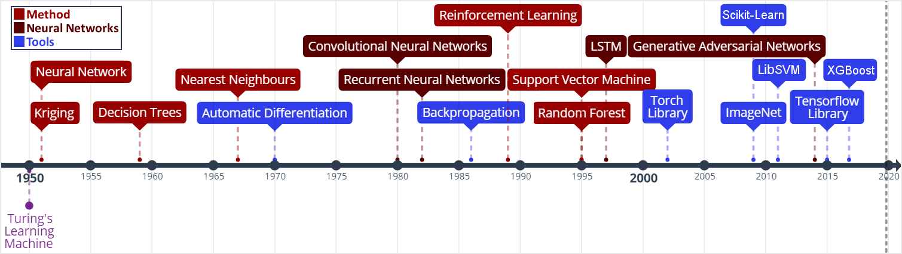
   Neural Networks: (S. J. Russell and Norvig 2010); Kriging: (Krige
   1951); Decision Trees: (Belson 1959); Nearest Neighbours: (Cover and
   Hart 1967); Automatic Differentiation: (Linnainmaa 1970);
   Convolutional Neural Networks: (Fukushima 1980; Y. LeCun, Bengio, and
   Hinton 2015); Recurrent Neural Networks: (Hopfield 1982);
   Backpropagation: (Kelley 1960; Bryson 1961; Dreyfus 1962; David E.
   Rumelhart et al. 1988); Reinforcement Learning: (Watkins 1989);
   Support Vector Machines: (Cortes and Vapnik 1995); Random Forests:
   (Ho 1995); LSTM: (Hochreiter and Schmidhuber 1997); Torch Library:
   (Collobert, Bengio, and Mariéthoz 2002); ImageNet: (Jia Deng et al.
   2009); Scikit-Learn: (F. Pedregosa et al. 2011); LibSVM: (C.-C. Chang
   and Lin 2011); Generative Adversarial Networks: (I. Goodfellow et al.
   2014a); Tensorflow: (Abadi et al. 2015a); XGBoost: (T. Chen and
   Guestrin 2016)
  :name: bookchapter:fig:ml-timeline

  Machine Learning timeline from (Jesper Sören Dramsch 2019a). Neural Networks: (S. J. Russell and Norvig 2010); Kriging: (Krige 1951); Decision Trees: (Belson 1959); Nearest Neighbours: (Cover and Hart 1967); Automatic Differentiation: (Linnainmaa 1970); Convolutional Neural Networks: (Fukushima 1980; Y. LeCun, Bengio, and Hinton 2015); Recurrent Neural Networks: (Hopfield 1982); Backpropagation: (Kelley 1960; Bryson 1961; Dreyfus 1962; David E. Rumelhart et al. 1988); Reinforcement Learning: (Watkins 1989); Support Vector Machines: (Cortes and Vapnik 1995); Random Forests: (Ho 1995); LSTM: (Hochreiter and Schmidhuber 1997); Torch Library: (Collobert, Bengio, and Mariéthoz 2002); ImageNet: (Jia Deng et al. 2009); Scikit-Learn: (F. Pedregosa et al. 2011); LibSVM: (C.-C. Chang and Lin 2011); Generative Adversarial Networks: (I. Goodfellow et al. 2014a); Tensorflow: (Abadi et al. 2015a); XGBoost: (T. Chen and Guestrin 2016)

Nevertheless, investigations of machine learning in geoscience are not a
novel development. The research into machine learning follows interest
in artificial intelligence closely. Since its inception, artificial
intelligence has experienced two periods of a decline in interest and
trust, which has impacted negatively upon its funding. Developments in
geoscience follow this wide-spread cycle of enthusiasm and loss of
interest with a time lag of a few years. This may be the result of a
variety of factors, including research funding availability and a change
in willingness to publish results.

Historic Machine Learning in Geoscience
~~~~~~~~~~~~~~~~~~~~~~~~~~~~~~~~~~~~~~~

The 1950s and 1960s were decades of machine learning optimism, with
machines learning to play simple games and perform tasks like route
mapping. Intuitive methods like k-means, Markov models, and decision
trees have been used as early as the 1960s in geoscience. K-means was
used to describe the cyclicity of sediment deposits (Preston and
Henderson 1964). Krumbein and Dacey (1969) give a thorough treatment of
the mathematical foundations of Markov chains and embedded Markov chains
in a geological context through application to sedimentological
processes, which also provides a comprehensive bibliography of Markov
processes in geology. Some selected examples of early applications of
Markov chains are found in sedimentology (Schwarzacher 1972), well log
analysis (Agterberg 1966), hydrology (Matalas 1967), and volcanology
(Wickman 1968). Decision tree-based methods found early applications in
economic geology and prospectivity mapping (Newendorp 1976; Reddy and
Bonham-Carter 1991).

The 1970s were left with few developments in both the methods of machine
learning, as well as, applications and adoption in geoscience (cf.
Figure `11.1 <#bookchapter:fig:ml-timeline>`__), due to the "first AI
winter" after initial expectations were not met. Nevertheless, as
kriging was not considered an AI technology, it was unaffected by this
cultural shift and found applications in mining (Huijbregts and Matheron
1970), oceanography (Chiles and Chauvet 1975), and hydrology (Delhomme
1978). This was in part due to superior results over other interpolation
techniques, but also the provision of uncertainty measures.

Expert Systems to Knowledge-Driven AI
^^^^^^^^^^^^^^^^^^^^^^^^^^^^^^^^^^^^^

The 1980s marked uptake in interest in machine learning and artificial
intelligence through so-called "expert systems" and corresponding
specialized hardware. While neural networks were introduced in 1950, the
tools of automatic differentiation and backpropagation for
error-correcting machine learning were necessary to spark their adoption
in geophysics in the late 1980s. X. Zhao and Mendel (1988) performed
seismic deconvolution with a recurrent neural network (Hopfield
network). Dowla, Taylor, and Anderson (1990) discriminated between
natural earthquakes and underground nuclear explosions using
feed-forward neural networks. An ensemble of networks was able to
achieve 97 % accuracy for nuclear monitoring. Moreover, the researchers
inspected the network to gain the insight that the ratio of particular
input spectra was beneficial to the discrimination of seismological
events to the network. However, in practice the neural networks
underperformed on uncurated data, which is often the case in comparison
to published results. K. Y. Huang, Chang, and Yen (1990) presented work
on self-organizing maps (also Kohonen networks), a special type of
unsupervised neural network applied to pick seismic horizons. The field
of geostatistics saw a formalization of theory and an uptake in interest
with Matheron and others (1981) formalizing the relationship of
spline-interpolation and kriging and Dubrule (1984) further develop the
theory and apply it to well data. At this point, kriging is
well-established in the mining industry as well as other disciplines
that rely on spatial data, including the successful analysis and
construction of the Channel tunnel (Chilès and Desassis 2018). The late
1980s then marked the second AI winter, where expensive machines tuned
to run "expert systems" were outperformed by desktop hardware from
non-specialist vendors, causing the collapse of a half-billion-dollar
hardware industry. Moreover, government agencies cut funding in AI
specifically.

The 1990s are generally regarded as the shift from a knowledge-driven to
a data-driven approach in machine learning. The term AI and especially
expert systems were almost exclusively used in computer gaming and
regarded with cynicism and as a failure in the scientific world. In the
background, however, with research into applied statistics and machine
learning, this decade marked the inception of Support-Vector Machines
(SVM) (Cortes and Vapnik 1995), the tree-based method Random Forests
(RF) (Ho 1995), and a specific type of recurrent neural network (RNN)
Long Short-Term Memories (LSTM) (Hochreiter and Schmidhuber 1997). SVMs
were utilized for land usage classification in remote sensing early on
(Hermes et al. 1999). Geophysics applied SVMs a few years later to
approximate the Zoeppritz equations for AVO inversion, outperforming
linearized inversion (Kuzma 2003). Random Forests, however, were delayed
in broader adoption, due to the term "random forests" only being coined
in 2001 (Breiman 2001) and the statistical basis initially being less
rigorous and implementation being more complicated. LSTMs necessitate
large amounts of data for training and can be expensive to train, after
further development in 2011 (Ciresan et al. 2011) it gained popularity
in commercial time series applications particularly speech and audio
analysis.

.. _book:nn:

Neural Networks
^^^^^^^^^^^^^^^

M. McCormack (1991) marks the first review of the emerging tool of
neural networks in geophysics. The paper goes into the mathematical
details and explores pattern recognition. The author summarizes neural
network applications over the 30 years prior to the review and presents
worked examples in automated well-log analysis and seismic trace
editing. The review comes to the conclusion that neural networks are, in
fact, good function approximators, taking over tasks that were
previously reserved for human work. He criticizes slow training, the
cost of retraining networks upon new knowledge, imprecision of outputs,
non-optimal training results, and the black box property of neural
networks. The main conclusion sees the implementation of neural networks
in conventional computation and expert systems to leverage the pattern
recognition of networks with the advantages of conventional computer
systems.

Neural networks are the primary subject of the modern day machine
learning interest, however, significant developments leading up to these
successes were made prior to the 1990s. The first neural network machine
was constructed by Minsky [described in S. J. Russell and Norvig (2010)]
and soon followed by the "Perceptron", a binary decision boundary
learner (Rosenblatt 1958). This decision was calculated as follows:

.. math::

   \begin{array}{ll}
       {\color{DesatCyan}o_{j}} & = \sigma \left({\color{DesatMagenta}\sum_j w_{ij} x_{i} + b}\right)\\
       & = \sigma \left({\color{DesatMagenta}a_j}\right)\\
       & = \begin{cases}1&{\color{DesatMagenta}a_j} > 0 \\
       0 &\text{otherwise}   \end{cases}
   \end{array}
   \label{eq:perceptron}

It describes a linear system with the output :math:`o`, the linear
activation :math:`a` of the input data :math:`x`, the index of the
source :math:`i` and target node :math:`j`, the trainable weights
:math:`w`, the trainable bias :math:`b` and a binary activation function
:math:`\sigma`. The activation function :math:`\sigma` in particular has
received ample attention since its inception. During this period, a
binary :math:`\sigma` became uncommon and was replaced by non-linear
mathematical functions. Neural networks are commonly trained by gradient
descent, therefore, differentiable functions like sigmoid or tanh,
allowing for the activation :math:`{\color{DesatCyan}o}` of each neuron
in a neural network to be continuous.

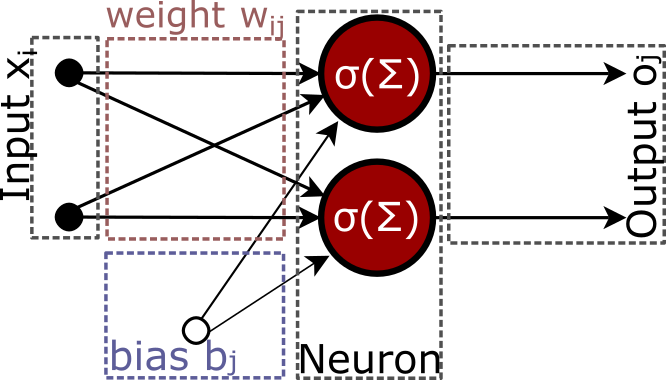
   equation `[eq:perceptron] <#eq:perceptron>`__. Two inputs :math:`x_i`
   are multiplied by the weights :math:`w_{ij}` and summed with the
   biases :math:`b_j`. Subsequently an activation function
   :math:`\sigma` is applied to obtain out outputs :math:`o_j`.
  :name: bookchapter:fig:shallownn

  Single layer neural network as described in
  equation `[eq:perceptron] <#eq:perceptron>`__. Two inputs :math:`x_i`
  are multiplied by the weights :math:`w_{ij}` and summed with the
  biases :math:`b_j`. Subsequently an activation function
  :math:`\sigma` is applied to obtain out outputs :math:`o_j`.

Deep learning (Dechter 1986) expands on this concept. It is the
combination of multiple layers of neurons in a neural network. These
deep networks learn representations with multiple levels of abstraction
and can be expressed using equation `[eq:perceptron] <#eq:perceptron>`__
as input neurons to the next layer

.. math::

   \begin{array}{ll}
       o_k & = \sigma \left(\sum_k w_{jk} \cdot {\color{DesatCyan}o_j} + b\right)\\
       & = \sigma \left(\sum_k w_{jk} \cdot {\color{DesatCyan} \sigma \left(\sum_j w_{ij} x_{i} + b\right)} + b\right)
   \end{array}
   \label{eq:deepnetwork}

.. figure:: ../images/deep-nn.png
  :alt: Deep multi-layer neural network as described inequation `[eq:deepnetwork] <#eq:deepnetwork>`__.
  :name: bookchapter:fig:deepnn

  Deep multi-layer neural network as described in equation `[eq:deepnetwork] <#eq:deepnetwork>`__.

Röth and Tarantola (1994) apply these building blocks of multi-layered
neural networks with sigmoid activation to perform seismic inversion.
They successfully invert low-noise and noise-free data on small training
data. The authors note that the approach is susceptible to errors at low
signal-to-noise ratios and coherent noise sources. Further applications
include electromagnetic subsurface localization (Poulton, Sternberg, and
Glass 1992), magnetotelluric inversion via Hopfield neural networks (Y.
Zhang and Paulson 1997), and geomechanical microfractures modelling in
triaxial compression tests (Feng and Seto 1998).

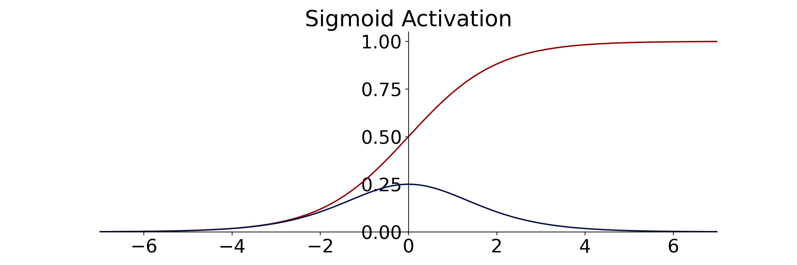

  Sigmoid activation function (red) and derivative (blue) to train multi-layer Neural Network described in equation `[eq:deepnetwork] <#eq:deepnetwork>`__. 

Kriging and Gaussian Processes
^^^^^^^^^^^^^^^^^^^^^^^^^^^^^^

Cressie (1990) review the history of kriging, prompted by the uptake of
interest in geostatistics. The author defines kriging as Best Linear
Unbiased Prediction and reviews the historical co-development of
disciplines. Similar concepts were developed with mining, meteorology,
physics, plant and animal breeding, and geodesy that relied on optimal
spatial prediction. Later, C. K. Williams (1998) provide a thorough
treatment of Gaussian Processes, in the light of recent successes of
neural networks.

   An alternative method of putting a prior over functions is to use a
   Gaussian process (GP) prior over functions. This idea has been used
   for a long time in the spatial statistics community under the name of
   "kriging", although it seems to have been largely ignored as a
   general-purpose regression method.

   C. K. Williams (1998)

Overall, Gaussian Processes benefit from the fact that a Gaussian
distribution will stay Gaussian under conditioning. That means that we
can use Gaussian distributions in this machine learning process and they
will produce a smooth Gaussian result after conditioning on the training
data. To become a universal machine learning model, Gaussian Processes
have to be able to describe infinitely many dimensions. Instead of
storing infinite values to describe this random process, Gaussian
Processes go the path of describing a distribution over functions that
can produce each value when required.

.. math:: p(x)\approx\mathcal{GP}\left(\mu(x),k(x, x')\right),

The multivariate distribution over functions :math:`p(x)` is described
by the Gaussian Process depends on mean a function :math:`\mu(x)` and a
covariance function :math:`k(x, x')`. It follows that choosing an
appropriate mean and covariance function, also known as kernel, is
essential. Very commonly, the mean function is chosen to be zero, as
this simplifies some of the math. Therefore, data with a non-zero mean
is commonly centered to comply with this assumption (Görtler, Kehlbeck,
and Deussen 2019). Choosing an appropriate kernel for the machine
learning task is one of the benefits of the Gaussian Process. The kernel
is where expert knowledge can be incorporated into data, e.g.
seasonality metereological data can be described by a periodic
covariance function.

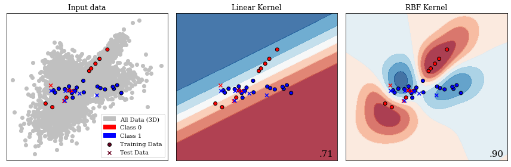
   This image presents a 2D slice out of a 3D decision space. The
   decision boundary learnt from the data is visible, as well as the
   prediction in every location of the 2D slice. The two kernels
   presented are a linear kernel and a radial basis function (RBF)
   kernel, which show a significant discrepancy in performance. The
   bottom right number shows the accuracy on unseen test data. The
   linear kernel achieves :math:`71~\%` accuracy, while the RBF kernel
   achieves :math:`90~\%`.
  :name: bookchapter:fig:gp

  Gaussian Process separating two classes with different kernels. This
  image presents a 2D slice out of a 3D decision space. The decision
  boundary learnt from the data is visible, as well as the prediction
  in every location of the 2D slice. The two kernels presented are a
  linear kernel and a radial basis function (RBF) kernel, which show a
  significant discrepancy in performance. The bottom right number shows
  the accuracy on unseen test data. The linear kernel achieves
  :math:`71~\%` accuracy, while the RBF kernel achieves :math:`90~\%`.

Figure `11.5 <#bookchapter:fig:gp>`__ present a 2D slice of 3D data with
two classes. This binary problem can be approached by applying a
Gaussian Process to it. In the second panel, a linear kernel is shown,
which predicts the data relatively poorly with an accuracy of
:math:`71~\%`. A radial basis function (RBF) kernel, shown in the third
panel generalizes to unseen test data with an accuracy of :math:`90~\%`.
This figure shows how a trained Gaussian Process would predict any new
data point presented to the model. The linear kernel would predict any
data in the top part to be blue (Class 0) and any data in the bottom
part to be red (Class 1). The RBF kernel, which we explore further in
the subsection introducing support-vector machines, separates the
prediction into four uneven quadrants. The choice of kernel is very
important in Gaussian Processes and research into extracting specific
kernels is ongoing (Duvenaud 2014).

In a more practical sense, Gaussian processes are computationally
expensive, as an :math:`n\times n` matrix must be inverted, with
:math:`n` being the number of samples. This results in a space
complexity of :math:`\mathcal{O}(n^2)` and a time complexity
:math:`\mathcal{O}(n^3)` (C. K. Williams and Rasmussen 2006). This makes
Gaussian Processes most feasible for smaller data problems, which is one
explanation for their rapid uptake in geoscience. An approximate
computation of the inverted matrix is possible using the Conjugate
Gradient (CG) optimization method, which can be stopped early with a
maximum time cost of :math:`\mathcal{O}(n^3)` (C. K. Williams and
Rasmussen 2006). For problems with larger data sets, neural networks
become feasible due to being computationally cheaper than Gaussian
Processes, regularization on large data sets being viable, as well as,
their flexibility to model a wide variety of functions and objectives.
Regularization being essential as neural networks tend to not "overfit"
and simply memorize the training data, instead of learning a
generalizable relationship of the data. Interestingly, Hornik,
Stinchcombe, and White (1989) showed that neural networks are a
universal function approximator as the number of weights tend to
infinity, and Neal (1996) were able to show that the infinitely wide
stochastic neural network converges to a Gaussian Process. Oftentimes
Gaussian Processes are trained on a subset of a large data set to avoid
the computational cost. Gaussian Processes have seen successful
application on a wide variety of problems and domains that benefit from
expert knowledge.

The 2000s were opened with a review by Baan and Jutten (2000)
recapitulating the most recent geophysical applications in neural
networks. They went into much detail on the neural networks theory and
the difficulties in building and training these models. The authors
identify the following subsurface geoscience applications through
history: First-break picking, electromagnetics, magnetotellurics,
seismic inversion, shear-wave splitting, well log analysis, trace
editing, seismic deconvolution, and event classification. They reveal a
strong focus on exploration geophysics. The authors evaluated the
application of neural networks as subpar to physics-based approaches and
concluded that neural networks are too expensive and complex to be of
real value in geoscience. This sentiment is consistent with the broader
perception of artificial intelligence during this decade. Artificial
intelligence and expert systems over-promised human-like performance,
causing a shift in focus on research into specialized sub-fields, e.g.
machine learning, fuzzy logic, and cognitive systems.

Contemporary Machine Learning in Geoscience
~~~~~~~~~~~~~~~~~~~~~~~~~~~~~~~~~~~~~~~~~~~

Mjolsness and DeCoste (2001) review machine learning in a broader
context outside of exploration geoscience. The authors discuss recent
successes in applications of remote sensing and robotic geology using
machine learning models. They review graphical models, (hidden) Markov
models, and SVMs and go on to disseminate the limitations of
applications to vector data and poor performance when applied to rich
data, such as graphs and text data. Moreover, the authors from NASA JPL
go into detail on pattern recognition in automated rovers to identify
geological prospects on Mars. They state:

   The scientific need for geological feature catalogs has led to
   multiyear human surveys of Mars orbital imagery yielding tens of
   thousands of cataloged, characterized features including impact
   craters, faults, and ridges.

   Mjolsness and DeCoste (2001)

The review points out the profound impact SVMs have on identifying
geomorphological features without modelling the underlying processes.

Modern Machine Learning Tools
^^^^^^^^^^^^^^^^^^^^^^^^^^^^^

This decade of the 2000s introduces a shift in tooling, which is a
direct contributor to the recent increase in adoption and research of
both shallow and deep machine learning research.

Machine Learning software has been primarily comprised of proprietary
software like Matlabwith the Neural Networks Toolbox and Wolfram
Mathematicaor independent university projects like the Stuttgart Neural
Network Simulator (SNNS). These tools were generally closed source and
hard or impossible to extend and could be difficult to operate due to
limited accompanying documentation. Early open-source projects include
WEKA (Witten, Frank, and Hall 2005), a graphical user interface to build
machine learning and data mining projects. Shortly after that, LibSVM
was released as free open-source software (FOSS) (C.-C. Chang and Lin
2011), which implements support vector machines efficiently. It is still
used in many other libraries to this day, including WEKA (C.-C. Chang
and Lin 2011). Torch was then released in 2002, which is a machine
learning library with a focus on neural networks. While it has been
discontinued in its original implementation in the programming language
Lua (Collobert, Bengio, and Mariéthoz 2002), PyTorch, the
reimplementation in the programming language Python, is one of the
leading deep learning frameworks at the time of writing (Paszke et al.
2017). In 2007, the libraries Theano and scikit-learn were released
openly licensed in Python (Team 2016; F. Pedregosa et al. 2011). Theano
is a neural network library that was a tool developed at the Montreal
Institute for Learning Algorithms (MILA) and ceased development in 2017
after strong industrial developers had released openly licensed deep
learning frameworks. Scikit-learn implements many different machine
learning algorithms, including SVMs, Random Forests and single-layer
neural networks, as well as utility functions including
cross-validation, stratification, metrics and train-test splitting,
necessary for robust machine learning model building and evaluation.

.. _ssec:svm:

Support-Vector Machines
^^^^^^^^^^^^^^^^^^^^^^^

The impact of scikit-learn has shaped the current machine learning
software package by implementing a unified application programming
interface (API) (Buitinck et al. 2013). This API is explored by example
in the following code snippets, the code can be obtained at Jesper
Soeren Dramsch (2020b). First, we generate a classification dataset
using a utility function. The ``make_classification`` function takes
different arguments to adjust the desired arguments, we are generating
5000 samples (``n_samples``) for two classes, with five features
(``n_features``), of which three features are actually relevant to the
classification (``n_informative``). The data is stored in :math:`X`,
whereas the labels are contained in :math:`y`.

.. code:: python

   # Generate random classification dataset for example
   from sklearn.datasets import make_classification
   X, y = make_classification(n_samples=5000, n_features=5,
                              n_informative=3, n_redundant=0,
                              random_state=0, shuffle=False)

It is good practice to divide the available labeled data into a training
data set and a validation or test data set. This split ensures that
models can be evaluated on unseen data to test the generalization to
unseen samples. The utility function ``train_test_split`` takes an
arbitrary amount of input arrays and separates them according to
specified arguments. In this case 25% of the data are kept for the
hold-out validation set and not used in training. The ``random_state``
is fixed to make these examples reproducible.

.. code:: python

   # Split data into train and validation set
   from sklearn.model_selection import train_test_split
   X_train, X_test, y_train, y_test = train_test_split(X, y, 
                                               test_size=.25, 
                                               random_state=0)

Then we need to define a machine learning model, considering the
previous discussion of high impact machine learning models, the first
example is an SVM classifier. This example uses the default values for
hyperparameters of the SVM classifier, for best results on real-world
problems these have to be adjusted. The machine learning training is
always done by calling ``classifier.fit(X, y)`` on the classifier
object, which in this case is the SVM object. In more detail, the
``.fit()`` method implements an optimization loop that will condition
the model to the training data by minimizing the defined loss function.
In the case of the SVM classification the parameters are adjusted to
optimize a hinge loss, outlined in
equation `[eq:hingeloss] <#eq:hingeloss>`__. The trained model
scikit-learn model contains information about all its hyperparameters in
addition to the trained model, shown below. The exact meaning of all
these hyperparameters is laid out in the scikit-learn documentation
(Buitinck et al. 2013).

.. code:: python

   # Define and train a Support Vector Machine Classifier
   from sklearn.svm import SVC
   svm = SVC(random_state=0)
   svm.fit(X_train, y_train)

   >>> SVC(C=1.0, break_ties=False, cache_size=200, 
           class_weight=None, coef0=0.0, degree=3, 
           decision_function_shape='ovr', gamma='scale', 
           kernel='rbf', max_iter=-1, probability=False, 
           random_state=0, shrinking=True, tol=0.001, 
           verbose=False)

The trained SVM can the be used to predict on new data, by calling
``classifier.predict(data)`` on the trained classifier object. The new
data has to contain four features like the training data did. Generally,
machine learning models always need to be trained on the same set of
input features as the data available for prediction. The ``.predict()``
method outputs the most likely estimate on the new data to generate
predictions. In the following code snippet, three predictions on three
input vectors are performed on the previously trained model.

.. code:: python

   # Predict on new data with trained SVM
   print(svm.predict([[0, 0, 0, 0, 0], 
                     [-1, -1, -1, -1, -1], 
                     [1, 1, 1, 1, 1]]))
   >>> [1 0 1]

The blackbox model should be evaluated with the ``classifier.score()``
function. Evaluating the performance on the training data set gives an
indication how well the model is performing, but this is generally not
enough to gauge the performance of machine learning models. In addition,
the trained model has to be evaluated on the hold-out set, a dataset the
model has not been exposed to during training. This avoids that the
model only performs well on the training data by "memorization" instead
of extracting meaningful generalizable relationships, an effect called
overfitting. In this example the hyperparameters are left to the default
values, in real-life applications hyperparameters are usually adjusted
to build better models. This can lead to an addition meta-level of
overfitting on the hold-out set, which necessitates an additional third
hold-out set to test the generalizability of the trained model with
optimized hyperparameters. The default score uses the class accuracy,
which suggests our model is approximately 90% correct. Similar train and
test scores indicate that the model learned a generalizable model,
enabling prediction on unseen data without a performance loss. Large
differences between the training score and test score indicate either
overfitting, in the case of a better training score. A higher test score
than training score can be an indication of a deeper problem with the
data split, scoring, class imbalances, and needs to be investigated by
means of external cross-validation, building standard "dummy" models,
independence tests, and further manual investigations.

.. code:: python

   # Score SVM on train and test data
   print(svm.score(X_train, y_train))
   print(svm.score(X_test, y_test))
   >>> 0.9098666666666667
   >>> 0.9032

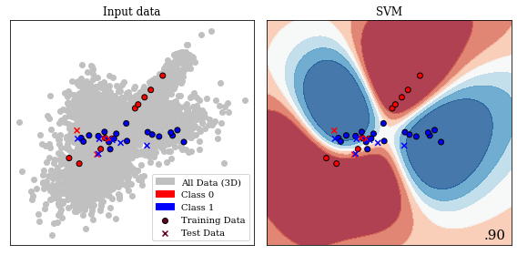
   showing the decision boundary learnt from the data. The data contains
   three informative features, the decision boundary is therefore three
   dimensional, shown is a central slice of data points in 2D. (A video
   is available at (Jesper Soeren Dramsch 2020a))
  :name: bookchapter:fig:svm

  Example of Support Vector Machine separating two classes, showing the
  decision boundary learnt from the data. The data contains three
  informative features, the decision boundary is therefore three
  dimensional, shown is a central slice of data points in 2D. (A video
  is available at (Jesper Soeren Dramsch 2020a))

Support-vector machines can be employed for each class of machine
learning problem, i.e. classification, regression, and clustering. In a
two-class problem, the algorithm considers the :math:`n`-dimensional
input and attempts to find a :math:`(n-1)`-dimensional hyperplane that
separates these input data points. The problem is trivial if the two
classes are linearly separable, also called a hard margin. The plane can
pass the two classes of data without ambiguity. For data with an
overlap, which is usually the case, the problem becomes an optimization
problem to fit the ideal hyperplane. The hinge loss provides the ideal
loss function for this problem, yielding 0 if none of the data overlap,
but a linear residual for overlapping points that can be minimized:

.. math:: \max \left( 0, (1-y_i(\vec{w}\cdot \vec{x}_i - b)) \right),

with :math:`y_i` being the current target label and
:math:`\vec{w}\cdot \vec{x}_i - b` being the hyperplane under
consideration. The hyperplane consists of :math:`w` the normal vector
and point :math:`x`, with the offset :math:`b`. This leads the algorithm
to optimize

.. math::

   \left[\frac 1 n \sum_{i=1}^n \max\left(0, 1 - y_i(w\cdot x_i - b)\right) \right] + \lambda\lVert w \rVert^2,
   \label{eq:hingeloss}

with :math:`\lambda` being a scaling factor. For small :math:`\lambda`
the loss becomes the hard margin classifier for linearly separable
problems. The nature of the algorithm dictates that only values for
:math:`\vec{x}` close to the hyperplane define the hyperplane itself;
these values are called the support vectors.

The SVM algorithm would not be as successful if it were simply a linear
classifier. Some data can become linearly separable in higher
dimensions. This, however, poses the question of how many dimensions
should be searched, because of the exponential cost in computation that
follows due to the increase of dimensionality (also known as the curse
of dimensionality). Instead, the "kernel trick" was proposed (Aizerman
1964), which defines a set of values that are applied to the input data
simply via the dot product. A common kernel is the radial basis function
(RBF), which is also the kernel we applied in the example. The kernel is
defined as:

.. math:: k\left(\vec{x}_i, \vec{x}_j \right) \rightarrow \exp\left( -\gamma \lVert \vec{x}_i - \vec{x}_j \rVert^2 \right)

This specifically defines the Gaussian Radial Basis Function of every
input data point with regard to a central point. This transformation can
be performed with other functions (or kernels), such as, polynomials or
the sigmoid function. The RBF will transform the data according to the
distance between :math:`x_i` and :math:`X_j`, this can be seen in
Figure `11.7 <#bookchapter:fig:rbf>`__. This results in the decision
surface in Figure `11.6 <#bookchapter:fig:svm>`__ consisting of various
Gaussian areas. The RBF is generally regarded as a good default, in
part, due to being translation invariant (i.e. stationary) and smoothly
varying.

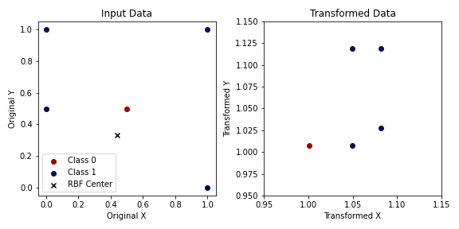
   data (left). Applying a Gaussian Radial Basis Function centered
   around :math:`(0.4, 0.33)` with :math:`\lambda = .5` results in the
   two classes being linearly separable.
  :name: bookchapter:fig:rbf

  Samples from two classes that are not linearly separable input data
  (left). Applying a Gaussian Radial Basis Function centered around
  :math:`(0.4, 0.33)` with :math:`\lambda = .5` results in the two
  classes being linearly separable.

An important topic in machine learning is explainability, which inspects
the influence of input variables on the prediction. We can employ the
utility function ``permutation_importance`` to inspect any model and how
they perform with regard to their input features (Breiman 2001). The
permutation importance evaluates how well the blackbox model performs,
when a feature is not available. Practically, a feature is replaced with
random noise. Subsequently, the score is calculated, which provides a
representation how informative a feature is compared to noise. The data
we generated in the first example contains three informative features
and two random data columns. The mean values of the calculated
importances show that three features are estimated to be three
magnitudes more important, with the second feature containing the
maximum amount of information to predict the labels.

.. code:: python

   # Calculate permutation importance of SVM model
   from sklearn.inspection import permutation_importance
   importances = permutation_importance(svm, X_train, y_train, 
                                        n_repeats=10, random_state=0)

   # Show mean value of importances and the ranking
   print(importances.importances_mean)
   print(importances.importances_mean.argsort())
   >>> [ 2.1787e-01  2.8712e-01  1.2293e-01 -1.8667e-04  7.7333e-04]
   >>> [3 4 2 0 1]

Support-vector machines were applied to seismic data analysis (J. Li and
Castagna 2004) and the automatic seismic interpretation (Yexin Liu et
al. 2015; H. Di, Shafiq, and AlRegib 2017b; Mardan, Javaherian, and
others 2017). Compared to convolutional neural networks, these
approaches usually do not perform as well, when the CNN can gain
information from adjacent samples. Seismological volcanic tremor
classification (Masotti et al. 2006, 2008) and analysis of
ground-penetrating radar (E. Pasolli, Melgani, and Donelli 2009; X. Xie
et al. 2013) were other notable applications of SVM in Geoscience. The
2016 Society of Exploration Geophysicists (SEG) machine learning
challenge was held using a SVM baseline (B. Hall 2016). Several other
authors investigated well log analysis (F. Anifowose, Ayadiuno, and
Rashedian 2017a; Antoine Caté et al. 2018; Gupta et al. 2018; Saporetti
et al. 2018), as well as seismology for event classification (Malfante
et al. 2018) and magnitude determination (Ochoa, Niño, and Vargas 2018).
These rely on SVMs being capable of regression on time-series data.
Generally, many applications in geoscience have been enabled by the
strong mathematical foundation of SVMs, such as microseismic event
classification (Z. Zhao and Gross 2017), seismic well ties (Chaki,
Routray, and Mohanty 2018), landslide susceptibility (Marjanović et al.
2011; Ballabio and Sterlacchini 2012), digital rock models (Ma et al.
2012), and lithology mapping (Cracknell and Reading 2013).

Random Forests
^^^^^^^^^^^^^^

The following example shows the application of Random Forests, to
illustrate the similarity of the API for different machine learning
algorithms in the scikit-learn library. The Random Forest classifier is
instantiated with a maximum depth of seven, and the random state is
fixed to zero again. Limiting the depth of the forest forces the random
forest to conform to a simpler model. Random forests have the capability
to become highly complex models that are very powerful predictive
models. This is not conducive to this small example dataset, but easy to
modify for the inclined reader. The classifier is then trained using the
same API of all classifiers in scikit-learn. The example shows a very
high number of hyperparameters, however, Random Forests work well
without further optimization of these.

.. code:: python

   # Define and train a Random Forest Classifier
   from sklearn.ensemble import RandomForestClassifier
   rf = RandomForestClassifier(max_depth=7, random_state=0)
   rf.fit(X_train, y_train)

   >>> RandomForestClassifier(bootstrap=True, ccp_alpha=0.0,
                   class_weight=None, criterion='gini', max_depth=7, 
                   max_features='auto', max_leaf_nodes=None, 
                   max_samples=None, min_impurity_decrease=0.0, 
                   min_impurity_split=None, min_samples_leaf=1, 
                   min_samples_split=2, min_weight_fraction_leaf=0.0, 
                   n_estimators=100, n_jobs=None, oob_score=False, 
                   random_state=0, verbose=0, warm_start=False)

The prediction of the random forest is performed in the same API call
again, also consistent with all classifiers available. The values are
slightly different from the prediction of the SVM.

.. code:: python

   # Predict on new data with trained Random Forest
   print(rf.predict([[0, 0, 0, 0, 0], 
                    [-1, -1, -1, -1, -1], 
                    [1, 1, 1, 1, 1]]))
   >>> [1 0 1]

The training score of the random forest model is 2.5 % better than the
SVM in this instance, this score however not informative. Comparing the
test scores shows only a 0.88 % difference, which is the relevant value
to evaluate, as it shows the performance of a model on data it has not
seen during the training stage. The random forest performed slightly
better on the training set than the test data set. This slight
discrepancy is usually not an indicator of an overfit model. Overfit
models "memorize" the training data and do not generalize well, which
results in poor performance on unseen data. Generally, overfitting is to
be avoided in real application, but can be seen in competitions, on
benchmarks, and show-cases of new algorithms and architectures to
oversell the improvement over state-of-the-art methods (Recht et al.
2019).

.. code:: python

   # Score Random Forest on train and test data
   print(rf.score(X_train, y_train))
   print(rf.score(X_test, y_test))
   >>> 0.9306
   >>> 0.912

Random forests have specialized methods available for introspection,
which can be used to calculate feature importance. These are based on
the decision process the random forest used to build the machine
learning model. The feature importance in Random Forests uses the same
method as permutation importance, which is dropping out features to
estimate their importance on the model performance. Random Forests use a
measure to determine the split between classes at each node of the trees
called Gini impurity. While the permutation importance uses the accuracy
score of the prediction, in Random Forests this Gini impurity can be
used to measure how informative a feature is in a model. It is important
to note that this impurity-based process can be susceptible to noise and
overestimate high number of classes in features. Using the permutation
importance instead is a valid choice. In this instance as opposed to the
permutation importance, the random forest estimates the two
non-informative features to be one magnitude less useful than the
informative features, instead of two magnitudes.

.. code:: python

   # Inspect random forest for feature importance
   print(rf.feature_importances_)
   print(rf.feature_importances_.argsort())
   >>> [0.2324 0.4877 0.2527 0.0141 0.0129]
   >>> [4 3 0 2 1]

Random forests and other tree-based methods, including gradient
boosting, a specialized version of random forests, have generally found
wider application with the implementation into scikit-learn and packages
for the statistical languages R and SPSS. Similar to neural networks,
this method is applied to ASI (Guillen et al. 2015) with limited
success, which is due to the independent treatment of samples, like
SVMs. Random forests have the ability to approximate regression problems
and time series, which made them suitable for seismological applications
including localization (Dodge and Harris 2016), event classification in
volcanic tremors (Maggi et al. 2017) and slow slip analysis (Hulbert et
al. 2018). They have also been applied to geomechanical applications in
fracture modelling (Valera et al. 2017) and fault failure prediction
(Rouet-Leduc et al. 2017, 2018), as well as, detection of reservoir
property changes from 4D seismic data (Cao and Roy 2017). Gradient
Boosted Trees were the winning models in the 2016 SEG machine learning
challenge (M. Hall and Hall 2017) for well-log analysis, propelling a
variety of publications in facies prediction (Bestagini, Lipari, and
Tubaro 2017; Blouin et al. 2017; Antoine Caté et al. 2018; Saporetti et
al. 2018).

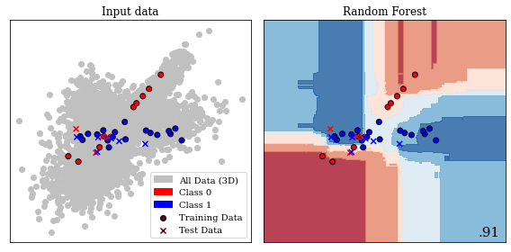
   same central slice of the 3D decision volume used in
   Figure `11.6 <#bookchapter:fig:svm>`__.
  :name: bookchapter:fig:randomforest

  Binary Decision Boundary for Random Forest in 2D. This is the same
  central slice of the 3D decision volume used in
  Figure `11.6 <#bookchapter:fig:svm>`__.

Furthermore, various methods that have been introduced into scikit-learn
have been applied to a multitude of geoscience problems. Hidden Markov
models were used on seismological event classification (Ohrnberger 2001;
Beyreuther and Wassermann 2008; Bicego, Acosta-Muñoz, and Orozco-Alzate
2013), well-log classification (Jeong et al. 2014; H. Wang et al. 2017),
and landslide detection from seismic monitoring (Dammeier et al. 2016).
These hidden Markov models are highly performant on time series and
spatially coherent problems. The "hidden" part of Markov models enables
the model to assume influences on the predictions that are not directly
represented in the input data. The K-nearest neighbours method has been
used for well-log analysis (A. Caté et al. 2017; Saporetti et al. 2018),
seismic well ties (K. Wang, Lomask, and Segovia 2017) combined with
dynamic time warping and fault extraction in seismic interpretation (D.
Hale 2013), which is highly dependent on choosing the right
hyperparameter k. The unsupervised k-NN equivalent, k-means has been
applied to seismic interpretation (H. Di, Shafiq, and AlRegib 2017a),
ground motion model validation (Khoshnevis and Taborda 2018), and
seismic velocity picking (Wei et al. 2018). These are very simple
machine learning models that are useful for baseline models. Graphical
modelling in the form of Bayesian networks has been applied to
seismology in modelling earthquake parameters (Kuehn, Riggelsen, and
others 2011), basin modelling (Martinelli et al. 2013), seismic
interpretation (Ferreira et al. 2018) and flow modelling in discrete
fracture networks (Karra et al. 2018). These graphical models are
effective in causal modelling and gained popularity in modern
applications of machine learning explainability, interpretability, and
generalization in combination with do-calculus (Pearl 2012).

.. _book:dl:

Modern Deep Learning
^^^^^^^^^^^^^^^^^^^^

The 2010s marked a renaissance of deep learning and particularly
convolutional neural networks. The convolutional neural network (CNN)
architecture AlexNet (Krizhevsky, Sutskever, and Hinton 2012c) was the
first CNN to enter the ImageNet challenge (Jia Deng et al. 2009). The
ImageNet challenge is considered a benchmark competition and database of
natural images established in the field of computer vision. This
improved the classification error rate from 25.8 % to 16.4 % (top-5
accuracy). This has propelled research in CNNs, resulting in error rates
on ImageNet of 2.25 % on top-5 accuracy in 2017 (Russakovsky et al.
2015). The Tensorflow library (Abadi et al. 2015a) was introduced for
open source deep learning models, with some different software design
compared to the Theano and Torch libraries.

The following example shows an application of deep learning to the data
presented in the previous examples. The classification data set we use
has independent samples, which leads to the use of simple densely
connected feed-forward networks. Image data or spatially correlated
datasets would ideally be fed to a convolutional neural network (CNN),
whereas time series are often best approached with recurrent neural
networks (RNN). This example is written using the Tensorflow library.
PyTorch would be an equally good library to use.

All modern deep learning libraries take a modular approach to building
deep neural networks that abstract operations into layers. These layers
can be combined into input and output configurations in highly versatile
and customizable ways. The simplest architecture, which is the one we
implement below, is a sequential model, which consists of one input and
one output layer, with a "stack" of layers. It is possible to define
more complex models with multiple inputs and outputs, as well as the
branching of layers to build very sophisticated neural network
pipelines. These models are called functional API and subclassing API,
but would not be conducive to this example.

The example model consists of Dense layers and a Dropout layer, which
are arranged in sequence. Densely connected layers contain a specified
number of neurons with an appropriate activation function, shown in the
example below. Each neuron performs the calculation outlined in
equation `[eq:perceptron] <#eq:perceptron>`__, with :math:`\sigma`
defining the activation. Modern neural networks rarely implement
``sigmoid`` and ``tanh`` activations anymore. Their activation
characteristic leads them to lose information for large positive and
negative values of the input, commonly called saturation(Hochreiter et
al. 2001). This saturation of neurons prevented good deep neural network
performance until new non-linear activation functions took their
place(Xu et al. 2015). The activation function Rectified linear unit
(ReLU) is generally credited with facilitating the development of very
deep neural networks, due to their non-saturating properties (Hahnloser
et al. 2000). It sets all negative values to zero and provides a linear
response for positive values, as seen in
equation `[eq:relu] <#eq:relu>`__. Since it’s inception, many more
rectifiers with different properties have been introduced.

.. math::

   \sigma({\color{DesatMagenta} a}) = max(0, {\color{DesatMagenta}a})
       \label{eq:relu}

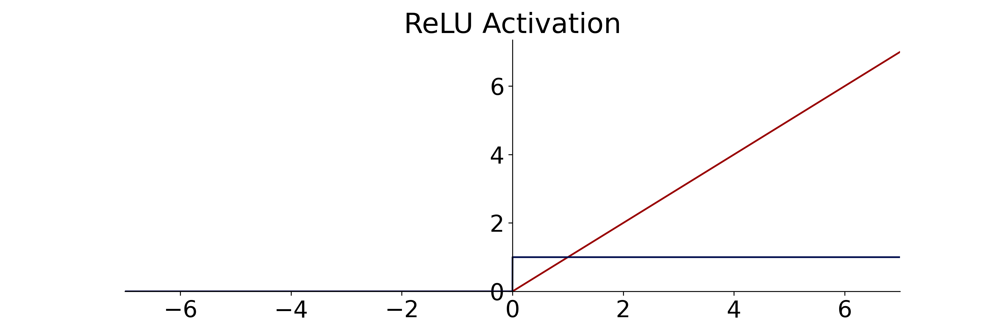

  ReLU activation (red) and derivative (blue) for efficient gradient computation.

The other activation function used in the example is the "softmax"
function on the output layer. This activation is commonly used for
classification tasks, as it normalizes all activations at all outputs to
one. It achieves this by applying the exponential function to each of
the outputs in :math:`{\color{DesatMagenta}\vec{a}}` for class :math:`C`
and dividing that value by the sum of all exponentials:

.. math::

   \sigma({\color{DesatMagenta}\vec{a}}) = \frac{e^{{\color{DesatMagenta}a_j}}}{\sum\limits_{p}^C e^{{\color{DesatMagenta}a_p}}}
   \label{eq:softmax}

The example additionally uses a Dropout layer, which is a common layer
used for regularization of the network by randomly setting a specified
percentage of nodes to zero for each iteration. Neural networks are
particularly prone to overfitting, which is counteracted by various
regularization techniques that also include input-data augmentation,
noise injection, :math:`\mathcal{L}_1` and :math:`\mathcal{L}_2`
constraints, or early-stopping of the training loop (I. Goodfellow,
Bengio, and Courville 2016a). Modern deep learning systems may even
leverage noisy student-teacher networks for regularization (Q. Xie et
al. 2019).

.. code:: python

   import tensorflow as tf
   model = tf.keras.models.Sequential([
   tf.keras.layers.Dense(32, activation='relu'),
   tf.keras.layers.Dropout(.3),
   tf.keras.layers.Dense(16, activation='relu'),
   tf.keras.layers.Dense(2, activation='softmax')])

These sequential models are also used for simple image classification
models using CNNs. Instead of Dense layers, these are built up with
convolutional layers, which are readily available in 1D, 2D, and 3D as
Conv1D, Conv2D and Conv3D respectively. A two-dimensional CNN learns a
so-called filter :math:`f` for the :math:`n\times m`-dimensional image
:math:`G`, expressed as:

.. math::

   G^{*}(x,y) = \sum_{i=1}^{n} \sum_{j=1}^{m} f(i,j)\cdot G(x-i+c,\; y-j+c),
   \label{eq:convolution}

resulting in the central result :math:`G^{*}` around the central
coordinate :math:`c`. In CNNs each layer learns several of these filters
:math:`f`, usually following by a down-sampling operation in :math:`n`
and :math:`m` to compress the spatial information. This serves as a
forcing function to learn increasingly abstract representations in
subsequent convolutional layers.

.. figure:: ../images/conv.pdf
  :alt: Three layer convolutional network. The input image (yellow) is
   convolved with several filters or kernel matrices (purple). Commonly,
   the convolution is used to downsample an image in the spatial
   dimension, while expanding the dimension of the filter response,
   hence expanding in "thickness" in the schematic. The filters are
   learned in the machine learning optimization loop. The shared weights
   within a filter improve efficiency of the network over classic dense
   networks.
  :name: bookchapter:fig:cnn

  Three layer convolutional network. The input image (yellow) is
  convolved with several filters or kernel matrices (purple). Commonly,
  the convolution is used to downsample an image in the spatial
  dimension, while expanding the dimension of the filter response,
  hence expanding in "thickness" in the schematic. The filters are
  learned in the machine learning optimization loop. The shared weights
  within a filter improve efficiency of the network over classic dense
  networks.

This sequential example model of densely connected layers with a single
input, 32, 16, and two neurons contains a total of 754 trainable
weights. Initially, each of these weights is set to a pseudo-random
value, which is often drawn from a distribution beneficial to fast
training. Consequently, the data is passed through the network, and the
result is numerically compared to the expected values. This form of
training is defined as supervised training and error-correcting
learning, which is a form of Hebbian learning. Other forms of learning
exist and are employed in machine learning, e.g. competitive learning in
self-organizing maps.

.. math::

   MAE = \lvert{y_j - \color{DesatCyan}o_{j}}\rvert \newline
       \label{eq:mae}

.. math::

   MSE = ({y_j - \color{DesatCyan}o_{j}})^2
       \label{eq:mse}

In regression problems the error is often calculated using the Mean
Absolute Error (MAE) or Mean Squared Error (MSE), the
:math:`\mathcal{L}_1` shown in equation `[eq:mae] <#eq:mae>`__ and the
:math:`\mathcal{L}_2` norm shown in equation `[eq:mse] <#eq:mse>`__
respectively. Classification problems form a special type of problem
that can leverage a different kind of loss called cross-entropy (CE).
The cross-entropy is dependent on the true label :math:`y` and the
prediction in the output layer.

.. math::

   CE = - \sum\limits^C_j y_j \log{\left({\color{DesatCyan}o_{j}}\right)}
       \label{eq:crossentropy}

Many machine learning data sets have one true label :math:`y_{true} = 1`
for class :math:`C_{j = true}`, leaving all other :math:`y_j = 0`. This
makes the sum over all labels obsolete. It is debatable how much binary
labels reflects reality, but it simplifies
equation `[eq:crossentropy] <#eq:crossentropy>`__ to minimizing the
(negative) logarithm of the neural network output
:math:`{\color{DesatCyan}o_{j}}`, also known as negative log-likelihood:

.. math::

   CE = - \log{\left({\color{DesatCyan}o_{j}}\right)}
       \label{eq:binarycrossentropy}

Technically, the data we generated is a binary classification problem,
and this means we could use the sigmoid activation function in the last
layer and optimize a binary CE. This can speed up computation, but in
this example, an approach is shown that works for many other problems
and can therefore be applied to the readers data.

.. code:: python

   model.compile(optimizer='adam', # Often 'adam' or 'sgd' are good
                 loss='sparse_categorical_crossentropy',
                 metrics=['accuracy']) # Monitor other metrics

Large neural networks can be extremely costly to train with significant
developments in 2019/2020 reporting multi-billion parameter language
models (Google, OpenAI) trained on massive hardware infrastructure for
weeks with a single epoch taking several hours. This calls for
validation on unseen data after every epoch of the training run.
Therefore, neural networks, like all machine learning models, are
commonly trained with two hold-out sets, a validation and a final test
set. The validation set can be provided or be defined as a percentage of
the training data, as shown below. In the example, 10% of the training
data are held out for validation after every epoch, reducing the
training data set from 3750 to 3375 individual samples.

.. code:: python

   model.fit(X_train, 
             y_train, 
             validation_split=.1,
             epochs=100)
   >>> [...]
       Epoch 100/100
       3375/3375 [==============================] - 0s 66us/sample
       loss: 0.1567 - accuracy: 0.9401 - 
       val_loss: 0.1731 - val_accuracy: 0.9359

Neural networks are trained with variations of stochastic gradient
descent (SGD), an incremental version of the classic steepest descent
algorithm. We use the Adam optimizer, a variation of SGD that converges
fast, but a full explanation would go beyond the scope of this chapter.
The gist of the Adam optimizer is that it maintains a per-parameter
learning rate of the first statistical moment (mean). This is beneficial
for sparse problems and the second moment (uncentered variance), which
is beneficial for noisy and non-stationary problems (Diederik P. Kingma
and Ba 2014). The main alternative to Adam is SGD with Nesterov momentum
(Sutskever et al. 2013), an optimization method that models conjugate
gradient methods (CG) without the heavy computation that comes with the
search in CG. SGD anecdotally finds a better optimal point for neural
networks than Adam but converges much slower.

In addition to the loss value, we display the accuracy metric. While
accuracy should not be the sole arbiter of model performance, it gives a
reasonable initial estimate, how many samples are predicted correctly
with a percentage between zero and one. As opposed to scikit-learn, deep
learning models are compiled after their definition to make them fit for
optimization on the available hardware. Then the neural network can be
fit like the SVM and Random Forest models before, using the ``X_train``
and ``y_train`` data. In addition, a number of epochs can be provided to
run, as well as other parameters that are left on default for the
example. The amount of epochs defines how many cycles of optimization on
the full training data set are performed. Conventional wisdom for neural
network training is that it should always learn for more epochs than
machine learning researchers estimate initially.

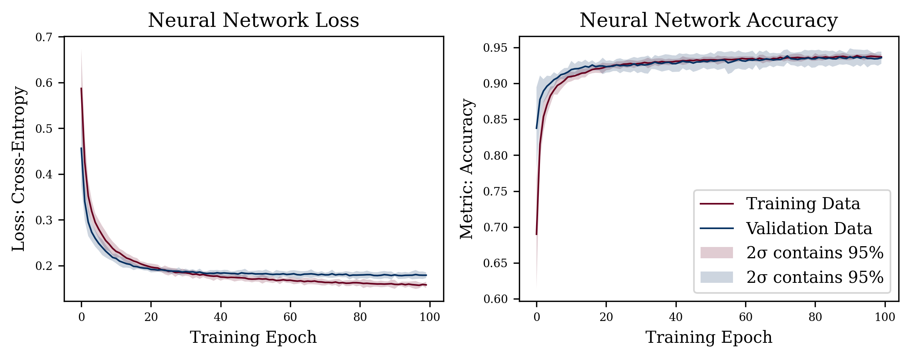
   initializations. Training for 100 epochs with the shaded area showing
   the 95% confidence intervals of the loss and metric. Analyzing loss
   curves is important to evaluate overfitting. The trining loss
   decreasing, while validation loss is close to plateauing is a sign of
   overfitting. Generally, it can be seen that the model converged and
   is only making marginal gains with the risk of overfitting.
  :name: bookchapter:fig:training_loss

  Loss and Accuracy of example neural network on ten random
  initializations. Training for 100 epochs with the shaded area showing
  the 95% confidence intervals of the loss and metric. Analyzing loss
  curves is important to evaluate overfitting. The trining loss
  decreasing, while validation loss is close to plateauing is a sign of
  overfitting. Generally, it can be seen that the model converged and
  is only making marginal gains with the risk of overfitting.

It can be difficult to fix all sources of randomness and stochasticity
in neural networks, to make both research and examples reproducible.
This example does not fix these so-called random seeds as it would
detract from the example. That implies that the results for loss and
accuracy will differ from the printed examples. In research fixing the
seed is very important to ensure reproducibility of claims. Moreover, to
avoid bad practices or so-called "lucky seeds", a statistical analysis
of multiple fixed seeds is good practice to report results in any
machine learning model.

.. code:: python

   model.evaluate(X_test, y_test)
   >>> 1250/1250 [==============================] - 0s 93us/sample
       loss: 0.1998 - accuracy: 0.9360
       [0.19976349686831235, 0.936]

In the example before, the SVM and Random Forest classifier were scored
on unseen data. This is equally important for neural networks. Neural
networks are prone to overfit, which we try to circumvent by
regularizing the weights and by evaluating the final network on an
unseen test set. The prediction on the test set is very close to the
last epoch in the training loop, which is a good indicator that this
neural network generalizes to unseen data. Moreover, the loss curves in
figure `11.11 <#bookchapter:fig:training_loss>`__ do not converge too
fast, while converging. However, it appears that the network would
overfit if we let training continue. The exemplary decision boundary in
figure `11.12 <#bookchapter:fig:dnndecision>`__ very closely models the
local distribution of the data, which is true for the entire decision
volume (Jesper Soeren Dramsch 2020a).

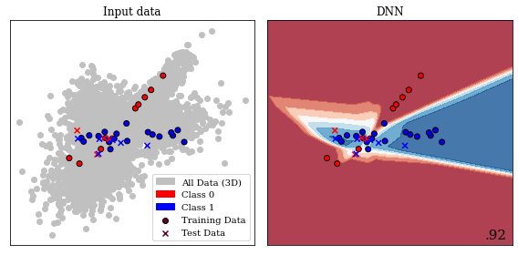
   trained on data with 3 informative features. The 3D volume is
   available in (Jesper Soeren Dramsch 2020a).
  :name: bookchapter:fig:dnndecision

  Central 2D slice of decision Boundary of deep neural network in
  trained on data with 3 informative features. The 3D volume is
  available in (Jesper Soeren Dramsch 2020a).

These examples illustrate the open source revolution in machine learning
software. The consolidated API and utility functions make it seem
trivial to apply various machine learning algorithms to scientific data.
This can be seen in the recent explosion of publications of applied
machine learning in geoscience. The need to be able to implement
algorithms has been replaced by merely installing a package and calling
``model.fit(X, y)``. These developments call for strong validation
requirements of models to ensure valid, reproducible, and scientific
results. Without this careful validation these modern day tools can be
severely misused to oversell results and even come to incorrect
conclusions.

In aggregate, modern-day neural networks benefit from the development of
non-saturating non-linear activation functions. The advancements of
stochastic gradient descent with Nesterov momentum and the Adam
optimizer (following AdaGrad and RMSProp) was essential faster training
of deep neural networks. The leverage of graphics hardware available in
most high-end desktop computers that is specialized for linear algebra
computation, further reduced training times. Finally, open-source
software that is well-maintained, tested, and documented with a
consistent API made both shallow and deep machine learning accessible to
non-experts.

Neural Network Architectures
^^^^^^^^^^^^^^^^^^^^^^^^^^^^

In deep learning, implementation of models is commonly more complicated
than understanding the underlying algorithm. Modern deep learning makes
use of various recent developments that can be beneficial to the data
set it is applied to, without specific implementation details results
are often not reproducible. However, the machine learning community has
a firm grounding in openness and sharing, which is seen in both
publications and code. New developments are commonly published alongside
their open-source code, and frequently with the trained networks on
standard benchmark data sets. This facilitates thorough inspection and
transferring the new insights to applied tasks such as geoscience. In
the following, some relevant neural network architectures and their
application are explored.

.. _ssec:cnnarch:

Convolutional Neural Network Architectures
^^^^^^^^^^^^^^^^^^^^^^^^^^^^^^^^^^^^^^^^^^

.. figure:: ../images/vgg16.pdf
  :alt: Schematic of a VGG16 network for ImageNet. The input data is
   convolved and down-sampled repeatedly. The final image classification
   is performed by flattening the image and feeding it to a classic
   feed-forward densely connected neural network. The 1000 output nodes
   for the 1000 ImageNet classes are normalized by a final softmax layer
   (cf. equation `[eq:softmax] <#eq:softmax>`__). Visualization library
   (Iqbal 2018)
  :name: bookchapter:fig:vgg16

  Schematic of a VGG16 network for ImageNet. The input data is
  convolved and down-sampled repeatedly. The final image classification
  is performed by flattening the image and feeding it to a classic
  feed-forward densely connected neural network. The 1000 output nodes
  for the 1000 ImageNet classes are normalized by a final softmax layer
  (cf. equation `[eq:softmax] <#eq:softmax>`__). Visualization library
  (Iqbal 2018)

The first model to discuss is the VGG-16 model, a 16-layer deep
convolutional neural network (Simonyan and Zisserman 2014a) represented
in figure `11.13 <#bookchapter:fig:vgg16>`__. This network was an
attempt at building even deeper networks and uses small :math:`3\times3`
convolutional filters in the network, called :math:`f` in
equation `[eq:convolution] <#eq:convolution>`__. This small filter-size
was sufficient to build powerful models that abstract the information
from layer to deeper layer, which is easy to visualize and generalize
well. The trained model on natural images also transfers well to other
domains like seismic interpretation (Jesper Sören Dramsch and Lüthje
2018b). Later, the concept of Network-in-Network was introduced, which
suggested defined sub-networks or blocks in the larger network structure
(M. Lin, Chen, and Yan 2013). The ResNet architecture uses this concept
of blocks to define residual blocks. These use a shortcut around a
convolutional block (K. He et al. 2016) to achieve neural networks with
up to 152 layers that still generalize well. ResNets and residual
blocks, in particular, are very popular in modern architectures
including the shortcuts or skip connections they popularized, to address
the following problem:

   When deeper networks start converging, a degradation problem has been
   exposed: with the network depth increasing, accuracy gets saturated
   (which might be unsurprising) and then degrades rapidly.
   Unexpectedly, such degradation is not caused by overfitting, and
   adding more layers to a suitably deep model leads to higher training
   error.

   K. He et al. (2016)

.. figure:: ../images/resnet.pdf
  :alt: Schematic of a ResNet block. The block contains a
   :math:`1\times1`, :math:`3\times3`, and :math:`1\times1` convolution
   with ReLU activation. The output is concatenated with the input and
   passed through another ReLU activation function.
  :name: bookchapter:fig:resnet

  Schematic of a ResNet block. The block contains a :math:`1\times1`,
  :math:`3\times3`, and :math:`1\times1` convolution with ReLU
  activation. The output is concatenated with the input and passed
  through another ReLU activation function.

The developments and successes in image classification on benchmark
competitions like ImageNet and Pascal-VOC inspired applications in
automatic seismic interpretation. These networks are usually single
image classifiers using convolutional neural networks (CNNs). The first
application of a convolutional neural network to seismic data used a
relatively small deep CNN for salt identification (A. U. Waldeland and
Solberg 2017). The open source software "MaLenoV" implemented a single
image classification network, which was the earliest freely available
implementation of deep learning for seismic interpretation (Ildstad and
Bormann 2017). Jesper Sören Dramsch and Lüthje (2018b) applied
pre-trained VGG-16 and ResNet50 single image seismic interpretation.
Recent succesful applications build upon pre-trained pre-built
architectures to implement into more sophisticated deep learning
systems, e.g. semantic segmentation. Semantic segmentation is important
in seismic interpretation. This is already a narrow field of application
of machine learning and it can be observed that many early applications
focus on sub-subsections of seismic interpretation utilizing these
pre-built architectures such as salt detection (A. Waldeland et al.
2018; H. Di, Wang, and AlRegib 2018a; Gramstad and Nickel 2018), fault
interpretation (M. Araya-Polo et al. 2017; A. Guitton 2018; S. Purves,
Alaei, and Larsen 2018), facies classification (Chevitarese et al. 2018;
Jesper Sören Dramsch and Lüthje 2018b), and horizon picking (Wu and
Zhang 2018). In comparison, this is however, already a broader
application than prior machine learning approaches for seismic
interpretation that utilized very specific seismic attributes as input
to self-organizing maps (SOM) for e.g. sweet spot identification (Guo et
al. 2017; T. Zhao, Li, and Marfurt 2017; R. Roden and Chen 2017).

In geoscience single image classification, as presented in the ImageNet
challenge, is less relevant than other applications like image
segmentation and time series classification. The developments and
insights resulting from the ImageNet challenge were, however,
transferred to network architectures that have relevance in machine
learning for science. Fully convolutional networks are a way to better
achieve image segmentation. A particularly useful implementation, the
U-net, was first introduced in biomedical image segmentation, a
discipline notorious for small datasets (Ronneberger, Fischer, and Brox
2015a). The U-net architecture shown in
Figure `11.15 <#bookchapter:fig:unet>`__ utilizes several shortcuts in
an encoder-decoder architecture to achieve stable segmentation results.
Shortcuts (or skip connections) are a way in neural networks to combine
the original information and the processed information, usually through
concatenation or addition. In ResNet blocks this concept is extended to
an extreme, where every block in the architecture contains a shortcut
between the input and output, as seen in
Figure `11.14 <#bookchapter:fig:resnet>`__. These blocks are universally
used in many architectures to implement deeper networks, i.e. ResNet-152
with 60 million parameters, with fewer parameters than previous
architectures like VGG-16 with 138 million parameters. Essentially,
enabling models that are ten times as deep with less than half the
parameters, and significantly better accuracy on image benchmark
problems.

.. figure:: ../images/unet.pdf
  :alt: Schematic of Unet architecture. Convolutional layers are
   followed by a downsampling operation in the encoder. The central
   bottleneck contains a compressed representation of the input data.
   The decoder contains upsampling operations followed by convolutions.
   The last layer is commonly a softmax layer to provide classes.
   Equally sized layers are connected via shortcut connections.
  :name: bookchapter:fig:unet

  Schematic of Unet architecture. Convolutional layers are followed by
  a downsampling operation in the encoder. The central bottleneck
  contains a compressed representation of the input data. The decoder
  contains upsampling operations followed by convolutions. The last
  layer is commonly a softmax layer to provide classes. Equally sized
  layers are connected via shortcut connections.

In 2018 the seismic contractor TGS made a seismic interpretation
challenge available on the data science competition platform Kaggle.
Successful participants in the competition combined ResNet architectures
with the Unet architecture as their base architecture and modified these
with state-of-the-art image segmentation applications (Babakhin,
Sanakoyeu, and Kitamura 2019a). Moreover, Jesper Sören Dramsch and
Lüthje (2018b) showed that transferring networks trained on large bodies
of natural images to seismic data yields good results on small datasets,
which was further confirmed in this competition. The learnings from the
TGS Salt Identification challenge have been incorporated in production
scale models that perform human-like salt interpretation (Sen et al.
2020). In broader geoscience, U-nets have been used to model global
water storage using GRAVE satellite data (A. Y. Sun et al. 2019),
landslide prediction (Hajimoradlou, Roberti, and Poole 2019), and
earthquake arrival time picking (W. Zhu and Beroza 2018). A more
classical approach identifies subsea scale worms in hydrothermal vents
(Shashidhara, Scott, and Marburg 2020), whereas Jesper Sören Dramsch,
Christensen, et al. (2019) includes a U-net in a larger system for
unsupervised 3D timeshift extraction from 4D seismic.

This modularity of neural networks can be seen all throughout the
research and application of deep learning. New insights can be
incorporated into existing architectures to enhance their predictive
power. This can be in the form of swapping out the activation function
:math:`\sigma` or including new layers for improvements e.g.
regularization with batch normalization (Ioffe and Szegedy 2015). The
U-net architecture originally is relatively shallow, but was modified to
contain a modified ResNet for the Kaggle salt identification challenge
instead (Babakhin, Sanakoyeu, and Kitamura 2019a). Overall, serving as
examples for the flexibility of neural networks.

Generative Adversarial Networks
^^^^^^^^^^^^^^^^^^^^^^^^^^^^^^^

Generative adversarial networks (GAN) take composition of neural network
to another level, where two networks are trained in aggregate to get a
desired result. In GANs, a generator network :math:`G` and a
discriminator network :math:`D` work against each other in the training
loop (I. Goodfellow et al. 2014a). The generator :math:`G` is set up to
generate samples from an input, these were often natural images in early
GANs, but has now progressed to anything from time series (Engel et al.
2019) to high-energy physics simulation (Paganini, Oliveira, and Nachman
2018). The discriminator network :math:`D` attempts to distinguish
whether the sample is generated from :math:`G` i.e. fake or a real image
from the training data. Mathematically, this defines a min max game for
the value function :math:`V` of :math:`G` and :math:`D`

.. math:: \min_G \max_D V (D, G) = \mathbb{E}_{x\sim p_{data}(x)} [\log D(x)] + \mathbb{E}_{z\sim p_z(z)} [\log(1 - D(G(z)))],

with :math:`x` representing the data, :math:`z` is the latent space
:math:`G` draws samples from, and :math:`p` represents the respective
probability distributions. Eventually reaching a Nash equlibrium (Nash
1951), where neither the generator network :math:`G` can produce better
outputs, nor the discriminator network :math:`D` can improve its
capability to discern between fake and real samples.

Despite how versatile U-nets are, they still need an appropriate defined
loss function and labels to build a discriminative model. GANs however,
build a generative model that approximates the training sample
distribution in the Generator and a discriminative model of the
Discriminator modeled dynamically through adversarial training. The
Discriminator effectively providing an adversarial loss in a GAN. In
addition to providing two models that serve different purposes, learning
the training sample distribution with an adversarial loss makes GANs one
of the most versatile models currently discovered. Lukas Mosser,
Dubrule, and Blunt (2017) were applied GANs early on to geoscience,
modeling 3D porous media at the pore scale with a deep convolutional
GAN. The authors extended this approach to conditional simulations of
oolithic digital rock (Lukas Mosser, Dubrule, and Blunt 2018a). Early
applications of GANs also included approximating the problem of velocity
inversion of seismic data (Lukas Mosser, Kimman, Dramsch, Purves, De la
Fuente Briceño, et al. 2018) and generating seismograms (Krischer and
Fichtner 2017). Richardson (2018) integrate the Generator of the GAN
into full waveform inversion of the scalar wavefield. Alternatively, a
Bayesian inversion using the Generator as prior for velocity inversion
was introduced in Lukas Mosser, Dubrule, and Blunt (2018b). In
geomodeling, generation of geological channel models was presented (Chan
and Elsheikh 2017), which was subsequently extended with the capability
to be conditioned on physical measurements (Dupont et al. 2018).
Naturally, GANs were applied to the growing field of automatic seismic
interpretation (P. Lu et al. 2018).

Recurrent Neural Network Architectures
^^^^^^^^^^^^^^^^^^^^^^^^^^^^^^^^^^^^^^

The final type of architecture applied in geoscience is recurrent neural
networks (RNN). In contrast to all previous architectures, recurrent
neural networks feed back into themselves. There are many types of RNNs,
Hopfield networks being one that were applied to seismic source wavelet
prediction (L. X. Wang and Mendel 1992) early on. However, LSTMs
(Hochreiter and Schmidhuber 1997) are the main application in geoscience
and wider machine learning. This type of network achieves
state-of-the-art performance on sequential data like language tasks and
time series applications. LSTMs solve some common problems of RNNs by
implementing specific gates that regulate information flow in an LSTM
cell, namely, input gate, forget gate, and output gate, visualized in
Figure `11.16 <#bookchapter:fig:lstm>`__. The input gate feeds input
values to the internal cell. The forget gate overwrites the previous
state. Finally, the output gate regulates the direct contribution of the
input value to the output value combined with the internal state of the
cell. Additionally, a peephole functionality helps with the training
that serves as a shortcut between inputs and gates.

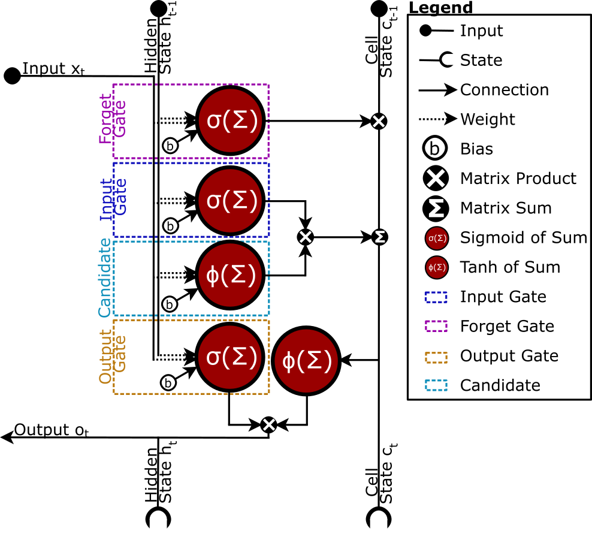
   together with the hidden state and cell state. The LSTM avoid the
   exploding gradient problem by implemented a input, forget, and output
   gate.
  :name: bookchapter:fig:lstm

  Schematic of LSTM architecture. The input data is processed together
  with the hidden state and cell state. The LSTM avoid the exploding
  gradient problem by implemented a input, forget, and output gate.

A classic application of LSTMs is text analysis and natural language
understanding, which has been applied to geological relation extraction
from unstructured text documents (Luo et al. 2017; Blondelle et al.
2017). Due to the nature of LSTMs being suited for time series data, it
is has been applied to seismological event classification of volcanic
activity (Titos et al. 2018), multi-factor landslide displacement
prediction (P. Xie, Zhou, and Chai 2019), and hydrological modelling
(Kratzert et al. 2019). Talarico, Leäo, and Grana (2019) applied LSTM to
model sedimentological sequences and compared the model to baseline
Hidden Markov Model (HMM), concluding that RNNs outperform HMMs based on
first-order Markov chains, while higher order Markov chains were too
complex to calibrate satisfactorily. Gated Recurrent Unit (GRU) (K. Cho
et al. 2014) is another RNN developed based on the insights into LSTM,
which was applied to predict petrophysical properties from seismic data
(Alfarraj and AlRegib 2019).

The scope of this review only allowed for a broad overview of types of
networks, that were successfully applied to geoscience. Many more
specific architectures exist and are in development that provide
different advantages. Siamese networks for one-shot image analysis
(Koch, Zemel, and Salakhutdinov 2015), transformer networks that largely
replaced LSTM and GRU in language modelling (Vaswani et al. 2017), or
attention as a general mechanism in deep neural networks (H. Zheng et
al. 2017).

Neural network architectures have been modified and applied to diverse
problems in geoscience. Every architecture type is particularly suited
to certain data types that are present in each field of geoscience.
However, fields with data present in machine-readable format experienced
accelerated adoption of machine learning tools and applications. For
example, Z. E. Ross, Meier, and Hauksson (2018) were able to
successfully apply CNNs to seismological phase detection, relying on an
extensive catalogue of hand-picked data (Z. E. Ross, Meier, and Hauksson
2018) and consequently generalize this work (Zachary E. Ross et al.
2018b). It has to be noted that synthetic or specifically sampled data
can introduce an implicit bias into the network (Wirgin 2004; Kim et al.
2019). Nevertheless, particularly this blackbox property of machine
learning model makes them versatile and powerful tools that were
leveraged in every subdiscipline of the Earth sciences.

The State of ML on Geoscience
^^^^^^^^^^^^^^^^^^^^^^^^^^^^^

Overall, geoscience and especially geophysics has followed developments
in machine learning closely. Across disciplines, machine learning
methods have been applied to various problems that can generally be
categorized into three subsections:

#. Build a surrogate ML model of a well-understood process. This model
   usually provides an advantage in computational cost.

#. Build an ML model of a task previously only possible with human
   interaction, interpretation, or knowledge and experience.

#. Build a novel ML model that performs a task that was previously not
   possible.

Granulometry on SEM images is an example of an application in category
I, where previously sediments were hand-measured in images (Jesper Sören
Dramsch, Amour, and Lüthje 2018). Applying large deformation
diffeomorphic mapping of seismic data was computationally infeasible for
matching 4D seismic data, however, made feasible by applying a U-net
architecture to the problem of category II (Jesper Sören Dramsch,
Christensen, et al. 2019). The problem of earthquake magnitude
prediction falls into category III due to the complexity of the system
but was nevertheless approached with neural networks (Panakkat and Adeli
2007).

The accessibility of tools, knowledge, and compute make this cycle of
machine learning enthusiasm unique, with regard to previous decades.
This unprecedented access to tools makes the application of machine
learning algorithms to any problem possible, where data is available.
The bibliometrics of machine learning in geoscience, shown in
figure `11.17 <#bookchapter:fig:number-papers>`__ serve as a proxy for
increased access. These papers include varying degrees of depth in
application and model validation. One of the primary influences for the
current increase in publications are new fields such as automatic
seismic interpretation, as well as, publications soliciting and
encouraging machine learning publications. Computer vision models were
relatively straight forward to transfer to seismic interpretation tasks,
with papers in this sub-sub-field ranging from single 2D line salt
identification models with limited validation to 3D multi-facies
interpretation with validation on a separate geographic area.

Geoscientific publishing can be challenging to navigate with respect to
machine learning. While papers investigating the theoretical
fundamentals of machine learning in geoscience exist, it is clear that
the overwhelming majority of papers present applications of ML to
geoscientific problems. It is complex to evaluate whether a paper is a
case study or a methodological paper with an exemplary application to a
specific data set. Despite the difficulty of most thorough applications
of ML, "idea papers" exist that simply present an established algorithm
to a problem in geoscience without a specific implementation or
addressing the possible caveats. On the flip-side, some papers apply
machine learning algorithms as pure regression models without the aim to
generalize the model to other data. Unfortunately, this makes
meta-analysis articles difficult to impossible. This kind of
meta-analysis article, is commonly done in medicine and considered a
gold-standard study, and would greatly benefit the geoscientific
community to determine the efficacy of algorithms on sets of similar
problems.

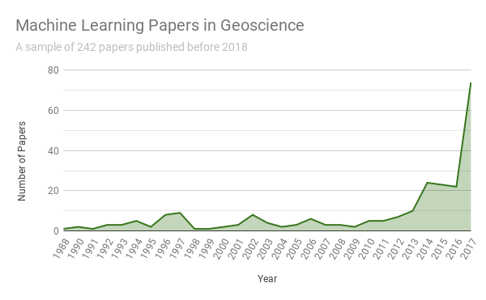
   per year. Search terms include variations of machine learning terms
   and geoscientific subdisciplines but exclude remote sensing and
   kriging.
  :name: bookchapter:fig:number-papers

  Bibliometry of 242 papers in Machine Learning for Geoscience per
  year. Search terms include variations of machine learning terms and
  geoscientific subdisciplines but exclude remote sensing and kriging.

Analogous to the medical field, obtaining accurate ground truth data, is
often impossible and usually expensive. Geological ground truth data for
seismic data is usually obtained through expert interpreters.
Quantifying the uncertainty of these interpretations is an active field
of research, which suggest a broader set of experiences and a diverse
set of sources of information for interpretation facilitate correct
geological interpretation between interpreters (Bond et al. 2007).
Radiologists tasked to interpret x-ray images showed similar decreases
in both inter- and intra-interpreter error rate with more diverse data
sources (Jewett et al. 1992). These uncertainties in the training labels
are commonly known as "label noise" and can be a detriment to building
accurate and generalizable machine learning models. A significant
portion of data in geoscience, however, is not machine learning ready.
Actual ground truth data from drilling reports is often locked away in
running text reports, sometimes in scanned PDFs. Data is often siloed
and most likely proprietary. Sometimes the amount of samples to process
is so large that many insights are yet to be made from samples in core
stores or the storage rooms of museums. Benchmark models are either
non-existent or made by consortia that only provide access to their
members. Academic data is usually only available within academic groups
for competitive advantage, respect for the amount of work, and fear of
being exposed to legal and public repercussions. These problems are
currently addressed by a culture change. Nevertheless, liberating data
will be a significant investment, regardless of who will work on it and
a slow culture change can be observed already.

Generally, machine learning has seen the fastest successes in domains
where decisions are cheap (e.g. click advertising), data is readily
available (e.g. online shops), and the environment is simple (e.g.
games) or unconstrained (e.g. image generation). Geoscience generally is
at the opposite of this spectrum. Decisions are expensive, be it
drilling new wells or assessing geohazards. Data is expensive, sparse,
and noisy. The environment is heterogeneous and constrained by physical
limitations. Therefore, solving problems like automatic seismic
interpretation see a surge of activity having fewer constraints
initially. Problems like inversion have solutions that are verifiably
wrong due to physics. These constraints do not prohibit machine learning
applications in geoscience. However, most successes are seen in close
collaboration with subject matter experts. Moreover, model
explainability becomes essential in the geoscience domain. While not
being a strict equivalency, simpler models are usually easier to
interpret, especially regarding failure modes.

A prominent example of "excessive" (Mignan and Broccardo 2019a) model
complexity was presented in P. M. DeVries et al. (2018) applying deep
learning to aftershock prediction. Independent data scientists
identified methodological errors, including data leakage from the train
set to the test set used to present results (Shah and Innig 2019).
Moreover, Mignan and Broccardo (2019b) showed that using the central
physical interpretation of the deep learning model, using the von Mises
yield criterion, could be used to build a surrogate logistic regression.
The resulting surrogate or baseline model outperforms the deep network
and overfits less. Moreover, replacing the ~13,000 parameter model with
the two-parameter baseline model increases calculation speed, which is
essential in aftershock forecasting and disaster response [3]_. More
generally, this is an example where data science practices such as model
validation, baseline models, and preventing data leakage and overfitting
become increasingly important when the tools of applying machine
learning become readily available.

Despite potential setbacks and the field of deep learning and data
science being relatively young, they can rely on mathematical and
statistical foundations and make significant contributions to science
and society. Machine learning systems have contributed to modelling the
protein structure of the current pandemic virus COVID-19 (Jumper et al.
2020). A deep learning computer vision system was built to stabilize
food safety by identifying Cassava plant disease on offline mobile
devices (Ramcharan et al. 2017, 2019). Self-driving cars have become a
possibility (Bojarski et al. 2016) and natural language understanding
has progressed significantly (Devlin et al. 2018).

Geoscience is slower in the adoption of machine learning, compared to
other disciplines. To be able to adapt the progress in machine learning
research, many valuable data sources have to be made machine-readable.
There has already been a change in making computer code open source,
which has lead to collaborations and accelerating scientific progress.
While specific open benchmark data sets have been tantamount to the
progress in machine learning, it is questionable whether these would be
beneficial to machine learning in geoscience. The problems are often
very complex with non-unique explanations and solutions, which
historically has lead to disagreements over geophysical benchmark data
sets. Open data and open-source software, however, have and will play a
significant role in advancing the field. Examples of this include basic
utility function to load geoscientific data (Kvalsvik and Contributors
2019) or more specifically cross-validation functions tailored to
geoscience (Uieda 2018).

Moreover, machine learning is fundamentally conservative, training on
available data. This bias of data collection will influence the ability
to generate new insights in all areas of geoscience. Machine learning in
geoscience may be able to generate insights and establish relationships
in existing data. Entirely new insights from previously unseen or
analysis of particularly complex models will still be a task performed
by trained geoscientists. Transfer learning is an active field of
machine learning research, that geoscience can significantly benefit
from. However, no significant headway has been made to transfer trained
machine learning models to out-of-distribution data, i.e. data that is
conceptually similar but explicitly different from the training data
set. The fields of self-supervised learning, including reinforcement
learning that can learn by exploration, may be able to approach some of
these problems. They are, however, notoriously hard to set up and train,
necessitating significant expertise in machine learning.

Large portions of publications are concerned with weakly or
unconstrained predictions such as seismic interpretation and other
applications that perform image recognition on SEM or core photography.
These methods will continue to improve by implementing algorithmic
improvements from machine learning research, specialized data
augmentation strategies, and more diverse training data being available.
New techniques such as multi-task learning (Kendall, Gal, and Cipolla
2018) which improved computer vision and computer linguistic models,
deep bayesian networks (L. Mosser, Oliveira, and Steventon 2019) to
obtain uncertainties, noisy teacher-student networks (Q. Xie et al.
2019) to improve training, and transformer networks (Graves 2012) for
time series processing, will significantly improve applications in
geoscience. For example, automated seismic interpretation may advance to
provide reliable outputs for relatively difficult geological regimes
beyond existing solutions. Success will be reliant on interdisciplinary
teams that can discern why geologically specific faults are important to
interpret, while others would be ignored in manual interpretations, to
encode geological understanding in automatic interpretation systems.

Currently, the most successful applications of machine learning and deep
learning, tie into existing workflows to automate sub-tasks in a grander
system. These models are highly specific, and their predictive
capability does not resemble an artificial intelligence or attempt to do
so. Mathematical constraints and existing theory in other applied
fields, especially neuroscience, were able to generate insights into
deep learning and geoscience has the opportunity to develop significant
contributions to the area of machine learning, considering their unique
problem set of heterogeneity, varying scales and non-unique solutions.
This has already taken place with the wider adoption of "kriging" or
more generally Gaussian processes into machine learning. Moreover, known
applications of signal theory and information theory employed in
geophysics are equally applicable in machine learning, with examples
utilizing complex-valued neural networks (Trabelsi et al. 2017), deep
Kalman filters (Krishnan, Shalit, and Sontag 2015), and Fourier analysis
(Tancik et al. 2020). Therefore, possibly enabling additional insights,
particularly when integrated with deep learning, due to its modularity
and versatility.

Previous reservations about neural networks included the difficulty of
implementation and susceptibility to noise in addition to computational
costs. Research into updating trained models and saving the optimizer
state with the model has in part alleviated the cost of re-training
existing models. Moreover, fine-tuning pre-trained large complex models
to specific problems has proven successful in several domains.
Regularization techniques and noise modelling, as well as data cleaning
pipelines, can be implemented to lessen the impact of noise on machine
learning models. Specific types of noise can be attenuated or even used
as an additional source of information. The aforementioned concerns have
mainly transitioned into a critique about overly complex models that
overfit the training data and are not interpretable. Modern software
makes very sophisticated machine learning models, and data pipelines
available to researchers, which has, in turn, increased the importance
to control for data leakage and perform thorough model validation.

Currently, machine learning for science primarily relies on the emerging
field of explainability (Lundberg et al. 2018). These provide primarily
post-hoc explanations for predictions from models. This field is
particularly important to evaluate which inputs from the data have the
strongest influence on the prediction result. The major point of
critique regarding post-hoc explanations is that these methods attempt
to explain how the algorithm reached a wrong prediction with equal
confidence. Bayesian neural networks intend to address this issue by
providing confidence intervals for the prediction based on prior
beliefs. These neural networks intend to incorporate prior expert
knowledge into neural networks, which can be beneficial in geoscientific
applications, where strong priors can be necessary. Machine learning
interpretability attempts to impose constraints on the machine learning
models to make the model itself explainable. Closely related to these
topics is the statistics field of causal inference. Causal inference
attempts to model the cause of variable, instead of correlative
prediction. Some methods exist that can perform causal machine learning,
i.e. causal trees (Athey and Imbens 2016). These three fields will be
necessary to glean verifiable scientific insights from machine learning
in geoscience. They are active fields of research and more involved to
correctly apply, which often makes cooperation with a statistician
necessary.

In conclusion, machine learning has had a long history in geoscience.
Kriging has progressed into more general machine learning methods, and
geoscience has made significant progress applying deep learning.
Applying deep convolutional networks to automatic seismic interpretation
has progressed these methods beyond what was possible, albeit still
being an active field of research. Using modern tools, composing custom
neural networks, and conventional machine learning pipelines has become
increasingly trivial, enabling wide-spread applications in every
sub-field of geoscience. Nevertheless, it is important to acknowledge
the limitations of machine learning in geoscience. Machine learning
methods are often cutting-edge technology, yet properly validated models
take time to develop, which is often perceived as inconvenient when
working in a hot scientific field. Despite being cutting edge, it is
important to acknowledge that none of these applications are fully
automated, as would be suggested by the lure of artificial intelligence.
Nevertheless, within applied geoscience, significant new insights have
been presented. Applications in geoscience are using machine learning as
a utility for data pre-processing, implementing previous insights beyond
the theory and synthetic cases, or the model itself enabling
unprecedented applications in geoscience. Overall, applied machine
learning has matured into an established tool in computational
geoscience and has the potential to provide further insights into the
theory of geoscience itself.

Contributions of this Study
---------------------------

This chapter provides the basic principles in 4D seismic and an overview
of ml in geoscience in the last 70 years. This lays the foundation for
the applications outlined in the following chapters that use cnns on
seismic data, as well as dnns on seismic maps. Specialized theory and
methods are introduced in their respective chapters. The work in this
chapter resulted in a review book chapter (Jesper Sören Dramsch 2020c)
with the code available in (Jesper Sören Dramsch 2020a).

.. [1]
   The author of this manuscript has a background in geophysics,
   exploration geoscience, and active source 4D seismic. While this
   skews the expertise, they attempt to give a full overview over
   developments in all of geoscience with the minimum amount of bias
   possible.

.. [2]
   Deprecated 2019

.. [3]
   All authors point out the potential in deep and machine learning
   research in geoscience regardless and do not wish to stifle such
   research.(Shah and Innig 2019; Mignan and Broccardo 2019b)